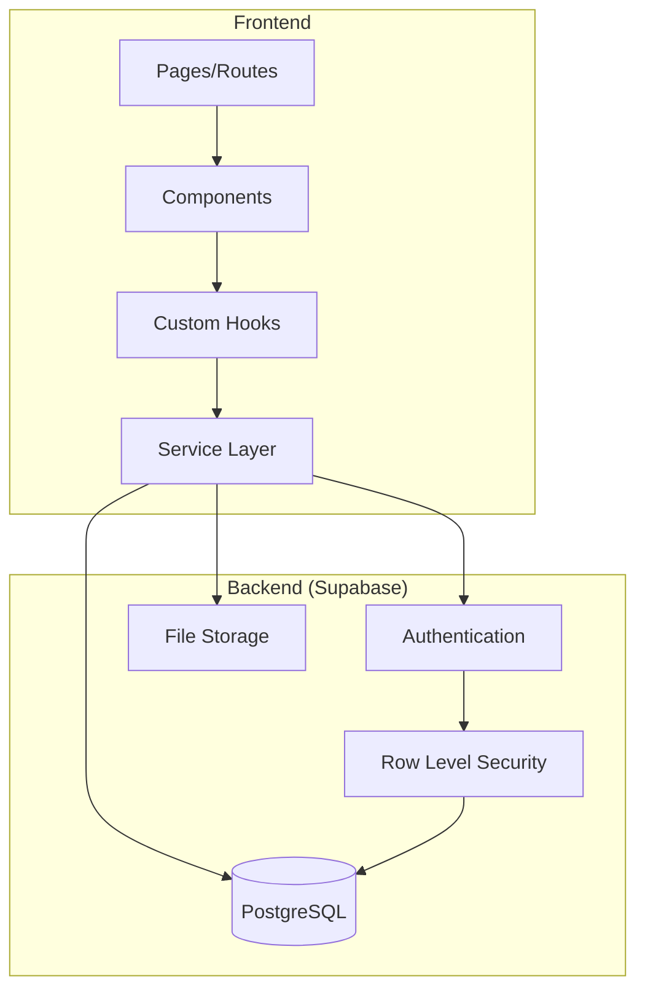

# Change Influence MVP Dashboard - Documentation Hub

Welcome to the comprehensive documentation for the Change Influence MVP Dashboard. This documentation is organized to help developers quickly understand and work with the codebase.

## 📚 Documentation Structure

### Core Guides

All technical guides are organized in the `guides/` folder:

1. **[Developer Guide](./guides/DEVELOPER_GUIDE.md)** - Start here!
   - Project overview and architecture
   - Quick reference for all major systems
   - Development workflow and commands
   - Testing and deployment guidelines

2. **[Service Layer Guide](./guides/SERVICE_LAYER_GUIDE.md)**
   - Complete API reference for all services
   - Service patterns and best practices
   - Error handling and data transformation
   - Migration roadmap and testing strategies

3. **[Database Schema Guide](./guides/DATABASE_SCHEMA_GUIDE.md)**
   - Full schema documentation with ERD diagrams
   - Table structures and relationships
   - JSONB field specifications
   - Query patterns and optimization tips

4. **[Component Architecture Guide](./guides/COMPONENT_ARCHITECTURE_GUIDE.md)**
   - Component organization and patterns
   - UI component library reference
   - Best practices for React components
   - Performance optimization techniques

5. **[Authentication & Security Guide](./guides/AUTHENTICATION_SECURITY_GUIDE.md)**
   - Auth flow and implementation
   - Security patterns and RLS policies
   - Input validation and XSS prevention
   - Security checklist and incident response

6. **[State Management Guide](./guides/STATE_MANAGEMENT_GUIDE.md)**
   - Hybrid state management approach
   - React Query patterns and caching
   - Context API usage guidelines
   - Form state and URL state management

7. **[API Patterns & Data Flow Guide](./guides/API_PATTERNS_DATA_FLOW_GUIDE.md)**
   - Request/response flow architecture
   - Caching and performance strategies
   - Error handling patterns
   - Testing API integrations

## 🚀 Quick Start

### For New Developers

1. Read the [Developer Guide](./guides/DEVELOPER_GUIDE.md) overview section
2. Set up your development environment:
   ```bash
   yarn install
   cp .env.example .env.local
   yarn dev
   ```
3. Review the [Component Architecture](./guides/COMPONENT_ARCHITECTURE_GUIDE.md) to understand the UI structure
4. Check [CLAUDE.md](../CLAUDE.md) for AI assistant instructions and project-specific guidance

### For Backend Work

1. Start with [Database Schema Guide](./guides/DATABASE_SCHEMA_GUIDE.md)
2. Review [Service Layer Guide](./guides/SERVICE_LAYER_GUIDE.md) for API patterns
3. Understand [Authentication & Security](./guides/AUTHENTICATION_SECURITY_GUIDE.md)

### For Frontend Work

1. Read [Component Architecture Guide](./guides/COMPONENT_ARCHITECTURE_GUIDE.md)
2. Study [State Management Guide](./guides/STATE_MANAGEMENT_GUIDE.md)
3. Review [API Patterns & Data Flow](./guides/API_PATTERNS_DATA_FLOW_GUIDE.md)

## 🏗️ Architecture Overview



## 📋 Common Tasks

### Adding a New Feature

1. **Database**: Add tables/columns if needed (see [Database Schema Guide](./guides/DATABASE_SCHEMA_GUIDE.md))
2. **Service**: Create service methods (see [Service Layer Guide](./guides/SERVICE_LAYER_GUIDE.md))
3. **Hook**: Create custom hook for the feature (see [Developer Guide](./guides/DEVELOPER_GUIDE.md#hooks-documentation))
4. **Component**: Build UI components (see [Component Architecture Guide](./guides/COMPONENT_ARCHITECTURE_GUIDE.md))
5. **Route**: Add page and navigation (see [Developer Guide](./guides/DEVELOPER_GUIDE.md#common-tasks))

### Debugging Issues

1. **Data not loading**: Check [Database Schema Guide](./guides/DATABASE_SCHEMA_GUIDE.md#common-data-loading-issue)
2. **Auth problems**: See [Authentication Guide](./guides/AUTHENTICATION_SECURITY_GUIDE.md#error-handling)
3. **State issues**: Review [State Management Guide](./guides/STATE_MANAGEMENT_GUIDE.md#common-pitfalls)
4. **API errors**: Check [API Patterns Guide](./guides/API_PATTERNS_DATA_FLOW_GUIDE.md#error-handling)

## 🔧 Technology Stack

- **Frontend**: React 19 + TypeScript + Vite
- **UI**: Tailwind CSS v4 + shadcn/ui
- **State**: TanStack Query + React Context
- **Backend**: Supabase (PostgreSQL + Auth + Storage)
- **Forms**: React Hook Form + Zod
- **Routing**: React Router v6

## 🚨 Important Notes

### Service Layer Isolation
**Critical for Azure Migration**: All database operations MUST go through the service layer. Never import Supabase client outside of service files. See [CLAUDE.md](../CLAUDE.md#service-layer-isolation-critical-for-azure-migration) for details.

### Known Issues

1. **Campaign Dashboard**: Several components have unconnected UI elements. See [CLAUDE.md](../CLAUDE.md#campaign-dashboard-analysis--required-fixes) for details.

2. **Large Components**: Some components exceed 300 lines and need refactoring:
   - `MarketingCampaigns.tsx` (1420 lines)
   - `CustomerAnalysis.tsx` (1274 lines)
   - `StrategicObjectives.tsx` (889 lines)

3. **Type Safety**: Ongoing effort to replace `any` types with proper interfaces.

## 📖 Additional Resources

### Internal Documentation
- [CLAUDE.md](../CLAUDE.md) - AI assistant instructions and project context
- [.cursorrules](../.cursorrules) - Editor configuration and coding standards

### External Documentation
- [Supabase Docs](https://supabase.io/docs)
- [React Query Docs](https://tanstack.com/query/latest)
- [shadcn/ui Components](https://ui.shadcn.com)
- [Tailwind CSS](https://tailwindcss.com/docs)

## 🤝 Contributing

1. Follow the patterns documented in these guides
2. Run `yarn lint` before committing
3. Update documentation when adding new patterns
4. Use conventional commits for clear history

## 📝 Documentation Maintenance

This documentation is a living resource. When you:
- Add new features → Update relevant guides
- Discover gotchas → Add to troubleshooting sections  
- Improve patterns → Document the new approach
- Fix bugs → Update known issues

## 🎯 Next Steps

Based on your role:

- **Full-Stack Developer**: Start with [Developer Guide](./guides/DEVELOPER_GUIDE.md)
- **Frontend Developer**: Focus on [Component Architecture](./guides/COMPONENT_ARCHITECTURE_GUIDE.md) and [State Management](./guides/STATE_MANAGEMENT_GUIDE.md)
- **Backend Developer**: Dive into [Database Schema](./guides/DATABASE_SCHEMA_GUIDE.md) and [Service Layer](./guides/SERVICE_LAYER_GUIDE.md)
- **DevOps/Security**: Review [Authentication & Security](./guides/AUTHENTICATION_SECURITY_GUIDE.md)

Remember: Good documentation helps everyone move faster. Keep it updated! 🚀