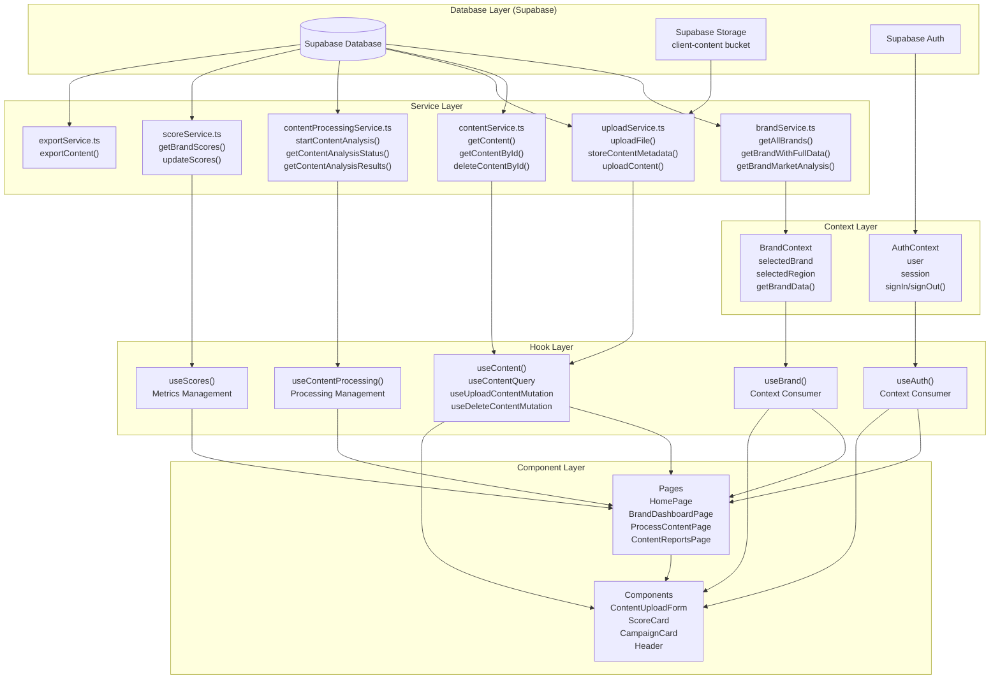
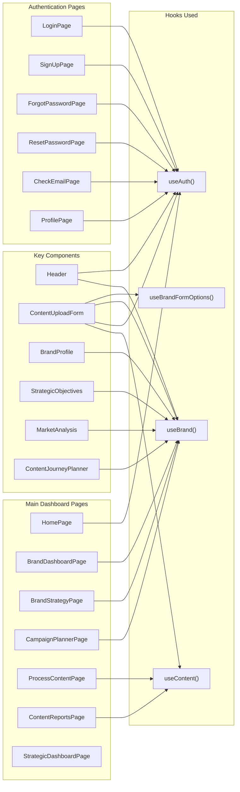
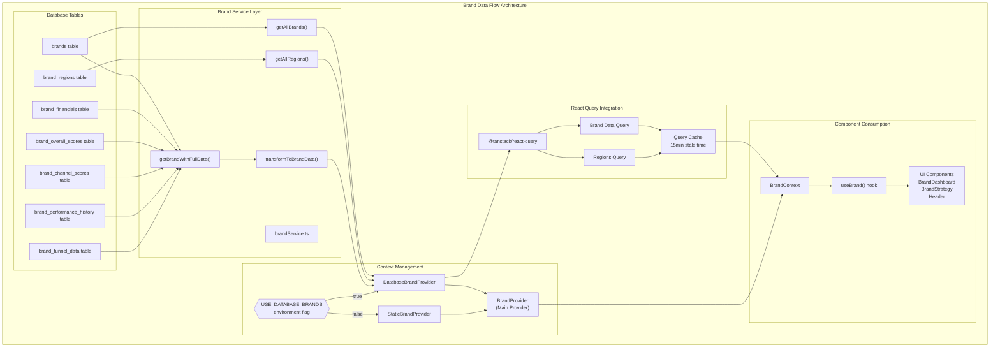
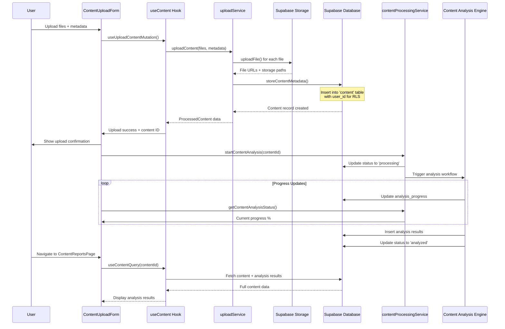
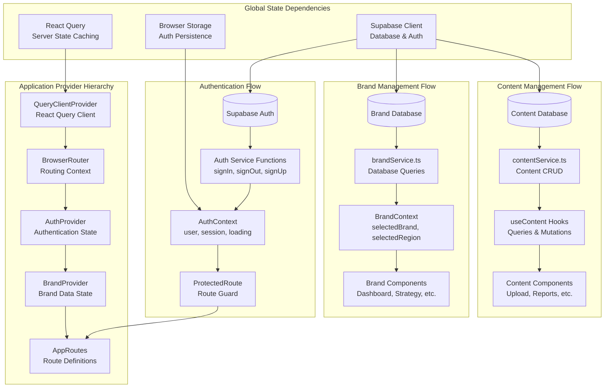

# Change Influence MVP Dashboard - Data Architecture Analysis

## Overview

This document provides a comprehensive analysis of the **Change Influence MVP Dashboard** data architecture, examining how data flows through the application, hook usage patterns, context creation from services, and content processing workflows.

The Change Influence MVP Dashboard is a sophisticated **brand marketing effectiveness platform** that helps companies:
- **Analyze brand performance** across multiple channels and regions
- **Process and analyze marketing content** for effectiveness scoring¹
- **Track campaign performance** and strategic alignment
- **Manage brand strategies** and customer engagement metrics

## Architecture Overview

The application follows a **modern React pattern** with:
- **Supabase** as the backend (database + authentication + file storage)
- **React Query** for server state management and caching
- **Context API** for global state management
- **Custom hooks** for data fetching and business logic

## Data Layer Architecture

### Overall System Architecture



### Service Layer Components

The **Service Layer** (`src/services/`) handles all database operations and provides a clean interface between the application and Supabase:

#### 1. **brandService.ts** (23.3KB, 782+ lines)³
- **Core Functions:**
  - `getAllBrands()` - Fetch available brands for selection
  - `getAllRegions()` - Fetch available regions
  - `getBrandWithFullData()` - Comprehensive brand data with all relations
  - `getBrandMarketAnalysis()` - Market analysis data
  - `createBrand()`, `updateBrand()` - Brand management operations

- **Data Transformation:**
  - `transformToBrandData()` - Converts database records to UI-friendly format
  - Parallel data fetching for performance optimization
  - Complex relational data assembly from multiple tables

#### 2. **contentService.ts** (8.6KB, 289 lines)⁴
- **Content CRUD Operations:**
  - `getContent()` - List all content with filtering
  - `getContentById()` - Single content item retrieval
  - `deleteContentById()` - Content deletion with cleanup

#### 3. **uploadService.ts** (21KB, 576 lines)
- **File Management:**
  - `uploadFile()` - Supabase Storage integration
  - `storeContentMetadata()` - Database record creation
  - `uploadContent()` - Complete upload workflow
  - RLS (Row Level Security) policy integration

#### 4. **contentProcessingService.ts** (5.3KB, 192 lines)
- **Content Analysis Workflow:**
  - `startContentAnalysis()` - Initiate processing pipeline
  - `getContentAnalysisStatus()` - Progress monitoring
  - `getContentAnalysisResults()` - Analysis results retrieval
  - Simulated progress tracking system

#### 5. **scoreService.ts** (5.0KB, 157 lines)
- **Metrics Management:**
  - Brand effectiveness scoring
  - Performance metrics calculation
  - Score aggregation and reporting

#### 6. **exportService.ts** (10KB, 300 lines)
- **Data Export Functionality:**
  - Content export in various formats
  - Report generation
  - Data serialization

## Hook Usage Across Pages

### Hook Distribution Pattern⁵



### Hook Usage Patterns

#### **Authentication-Related Pages**
All authentication pages use **`useAuth()`** for:
- **User session management** - Track login state and user data
- **Sign-in/sign-out operations** - Handle authentication flows
- **Email verification status** - Track account verification
- **Password reset functionality** - Manage password recovery

**Pages using `useAuth()`:**
- `LoginPage.tsx`
- `SignUpPage.tsx`
- `ForgotPasswordPage.tsx`
- `ResetPasswordPage.tsx`
- `CheckEmailPage.tsx`
- `ProfilePage.tsx`
- `HomePage.tsx`

#### **Brand-Related Pages**
Pages focused on brand management use **`useBrand()`** for:
- **Selected brand context** (eco-solutions, tech-nova, vital-wellness)
- **Regional data filtering** (North America, Europe, Asia-Pacific)
- **Brand performance metrics** and strategic data
- **Real-time brand data synchronization**

**Pages using `useBrand()`:**
- `BrandDashboardPage.tsx`
- `BrandStrategyPage.tsx`
- `CampaignPlannerPage.tsx`
- `Header.tsx` (for brand/region selection)

#### **Content-Related Pages**
Content management pages use **`useContent()`** for:
- **Content upload management** with progress tracking
- **Content analysis status** monitoring
- **Content CRUD operations** with optimistic updates
- **Content listing and filtering**

**Pages using `useContent()`:**
- `ProcessContentPage.tsx`
- `ContentReportsPage.tsx`
- `ContentUploadForm.tsx`
- `DashboardOverview.tsx`

## Context Creation from Services

### Brand Context Architecture



### BrandContext Features

The `BrandContext` (`src/contexts/BrandContext.tsx`) implements a **sophisticated dual-provider system**⁶:

#### **1. DatabaseBrandProvider**
- Uses **React Query** to fetch real brand data from Supabase
- **15-minute stale time** for efficient caching
- **Automatic retry logic** with exponential backoff
- **Error handling** with graceful degradation

#### **2. StaticBrandProvider**
- Falls back to **hardcoded brand data** for development
- Useful for **offline development** and testing
- **Consistent interface** with database provider

#### **3. Feature Flag Control**
- **Environment variable** `VITE_USE_DATABASE_BRANDS` determines provider
- **Seamless switching** between data sources
- **Development flexibility** without code changes

### AuthContext Integration

The `AuthContext` (`src/hooks/useAuth.tsx`) provides:

#### **Authentication State Management**
```typescript
interface AuthContextType {
  session: Session | null;
  user: User | null;
  loading: boolean;
  emailVerified: boolean;
  signOut: () => Promise<{ error: AuthError | null }>;
  signInWithPassword: (credentials: SignInWithPasswordCredentials) => Promise<{ error: AuthError | null }>;
  signUp: (email: string, password: string, firstName: string, lastName: string) => Promise<{ error: AuthError | null, data: any }>;
  resetPassword: (email: string) => Promise<{ error: AuthError | null }>;
  updatePassword: (password: string) => Promise<{ error: AuthError | null }>;
}
```

#### **Key Features**
- **Session persistence** with PKCE flow for security
- **Auto-refresh tokens** for seamless user experience
- **Email verification tracking**
- **Row Level Security (RLS)** integration for data access control

## Content Processing Workflow

### Upload to Analysis Pipeline⁷



### Content Processing Stages

#### **1. File Upload Stage**
- User selects files through `ContentUploadForm`
- Files uploaded to **Supabase Storage** (`client-content` bucket)
- **RLS policies** ensure users can only access their own content
- **File type validation** and size restrictions applied

#### **2. Metadata Storage**
- Content metadata stored in `content` table
- **Brand association** and categorization
- **User ID tracking** for ownership
- **Campaign and audience linking**

#### **3. Analysis Initiation**
- `startContentAnalysis()` triggers processing workflow
- Status updated to 'processing' with progress tracking
- **Simulated analysis engine** (would integrate with AI services in production)
- **Background job scheduling** for scalability

#### **4. Progress Monitoring**
- Real-time progress updates via `getContentAnalysisStatus()`
- **Progressive UI updates** showing analysis stages
- **Error handling** for failed analysis
- **Cancellation support** for long-running processes

#### **5. Results Storage**
- Analysis results stored in `content_analysis` table
- **Effectiveness scores** calculated across multiple dimensions:
  - Overall effectiveness score
  - Strategic alignment score
  - Customer resonance score
  - Content execution score
- **Recommendations and insights** generated
- **Strengths and improvement areas** identified

## Application State Management

### Global Provider Hierarchy



### State Management Layers

#### **1. Server State (React Query)**
- **Caching strategy** with configurable stale times
- **Background refetching** for data freshness
- **Optimistic updates** for better UX
- **Error handling and retry logic**

#### **2. Global Context State**
- **Authentication state** - User session and permissions
- **Brand context** - Selected brand and region preferences
- **Theme and UI preferences** (if implemented)

#### **3. Local Component State**
- **Form states** and validation
- **UI interaction states** (modals, dropdowns, etc.)
- **Temporary data** before submission

## Key Architectural Patterns

### **1. Separation of Concerns**
- **Services** handle database operations and external API calls
- **Hooks** manage component state and side effects
- **Context** provides global state management
- **Components** focus purely on UI rendering and user interaction

### **2. Error Handling Strategy**

#### **Service Level**
```typescript
// Example from brandService.ts
async getAllBrands(): Promise<DatabaseBrand[]> {
  const { data, error } = await supabase
    .from('brands')
    .select('id, slug, name, business_area, created_at, updated_at')
    .order('name');

  if (error) {
    console.error('Error fetching brands:', error);
    throw new Error(`Failed to fetch brands: ${error.message}`);
  }

  return data || [];
}
```

#### **Hook Level**
- **Query error states** with React Query
- **Retry logic** with exponential backoff
- **Fallback data** for graceful degradation

#### **Component Level**
- **User-friendly error messages**
- **Error boundaries** for crash prevention
- **Loading states** and skeletons

### **3. Performance Optimizations**

#### **React Query Caching**⁸
```typescript
// Brand data caching configuration
const { data: brandData, isLoading, error } = useQuery({
  queryKey: ['brand', selectedBrand],
  queryFn: () => brandService.getBrandWithFullData(selectedBrand),
  staleTime: 5 * 60 * 1000,  // 5 minutes
  gcTime: 10 * 60 * 1000,    // 10 minutes
  enabled: !!selectedBrand,
  retry: 3,
  retryDelay: 1000,
});
```

#### **Code Splitting**
```typescript
// Lazy loading of page components
const BrandDashboardPage = React.lazy(() => import('./pages/BrandDashboardPage.tsx'));
const ContentReportsPage = React.lazy(() => import('./pages/ContentReportsPage.tsx'));
```

#### **Optimistic Updates**
- **Immediate UI updates** before server confirmation
- **Rollback capability** on failure
- **Conflict resolution** for concurrent updates

### **4. Security Considerations**

#### **Row Level Security (RLS)**
- **User-based data isolation** in Supabase
- **Automatic access control** based on authentication
- **Multi-tenant data separation**

#### **Authentication Flow**
- **PKCE flow** for enhanced security
- **Token refresh** handling
- **Session persistence** with secure storage

## Database Schema Overview⁹

### **Core Tables**

#### **Brand Management**
- `brands` - Core brand information
- `brand_regions` - Brand-region associations
- `brand_financials` - Financial data and targets
- `brand_overall_scores` - Effectiveness metrics
- `brand_channel_scores` - Channel-specific performance
- `brand_performance_history` - Historical data tracking

#### **Content Management**
- `content` - Content metadata and files
- `content_analysis` - Analysis results and scores
- `content_files` - File storage references

#### **User Management**
- Built-in Supabase Auth tables
- Custom user profiles and preferences

## Future Enhancements

### **Potential Improvements**
1. **Real-time subscriptions** using Supabase Realtime
2. **Advanced caching strategies** with service workers
3. **Offline support** with progressive web app features
4. **Enhanced error monitoring** with tools like Sentry
5. **Performance monitoring** and analytics
6. **A/B testing framework** integration
7. **Advanced content analysis** with AI/ML services

### **Scalability Considerations**
1. **Database optimization** with proper indexing
2. **CDN integration** for file storage
3. **Background job processing** for heavy operations
4. **Rate limiting** and API throttling
5. **Monitoring and alerting** systems

## Conclusion

The Change Influence MVP Dashboard demonstrates a **well-architected React application** with:

- **Clear separation of concerns** across layers
- **Efficient data management** with React Query
- **Scalable authentication** and authorization
- **Robust error handling** throughout the stack
- **Performance optimizations** for user experience
- **Security best practices** implementation

This architecture provides a **solid foundation** for a complex brand analytics platform while maintaining excellent user experience through efficient data management and real-time updates. The modular design allows for easy extension and maintenance as the platform evolves.

---

## Implementation Notes & Details

### ¹ Content Processing Implementation Status
The content analysis feature is currently implemented as a **simulation** for development purposes:
- Progress updates occur in 10% increments every 1.5 seconds
- Mock analysis results are generated with randomized scores
- Production implementation would integrate with actual AI/ML services

### ² Service Layer - Additional Services
The service layer includes additional functionality beyond what's shown in the diagram:
- Authentication operations integrated into the `useAuth` hook
- Various utility services embedded within main service files

### ³ brandService.ts - Complete Function Listing
**brandService.ts** includes 30+ functions:
```typescript
// Brand CRUD Operations
getAllBrands(), getBrandBySlug(), createBrand(), updateBrand(), deleteBrand()

// Brand Analytics
getBrandWithFullData(), getBrandMarketAnalysis(), getBrandCompetitors()
getBrandSWOT(), getBrandCustomerSegments(), getBrandPersonas()
getBrandPerformanceHistory(), getBrandFunnelData()

// Brand Content Management
getBrandMessages(), getBrandObjectives(), getBrandStrategies()
getBrandCampaigns(), getBrandAudiences(), getBrandVoiceAttributes()

// Utility Functions
transformToBrandData() (private), various update functions for each entity type
```

### ⁴ contentService.ts - Complete Function Listing
**contentService.ts** includes 14+ functions:
```typescript
// Content CRUD
getContent(), getContentById(), deleteContentById()

// Foreign Key Lookups (for name-to-ID resolution)
getBrandIdByName(), getCampaignIdByName(), getAudienceIdByName()
getStrategyIdByName(), getAgencyIdByName(), getFormatIdByName()
getTypeIdByName()

// Utility Functions
Various helper methods for data transformation
```

### ⁵ Additional Hooks Available
Beyond the core hooks shown in diagrams:
```typescript
// Utility Hooks
useContentProcessing() - Manages content processing workflows
useScores() - Score calculation and management
useCheckDetails() - Validation check details
useBrandFormOptions() - Dynamic form options based on brand data
use-mobile() - Responsive design detection
use-toast() - Toast notification system
```

Additional pages not shown in the diagram:
- `ContentProcessingPage.tsx` - Separate content processing view
- `AIMarketResearch.tsx` - AI-powered market research tool
- `AIMessageTesting.tsx` - AI message testing interface
- `NotFound.tsx` - 404 error page

### ⁶ Environment Configuration
The dual-provider system is controlled by:
```bash
# .env.local
VITE_USE_DATABASE_BRANDS=true  # Current setting uses database mode
```

When `false`, the system falls back to static data for offline development.

### ⁷ Content Analysis Mock Implementation
Current implementation details:
- Uses `setTimeout` to simulate processing delays
- Generates random scores between 60-95
- Creates placeholder recommendations
- Stores results in `content_analysis` table
- Would be replaced with actual API calls to analysis services

### ⁸ React Query Configuration Issues
**Current State**: Using default QueryClient configuration
**Recommended Implementation**:
```typescript
// In App.tsx
const queryClient = new QueryClient({
  defaultOptions: {
    queries: {
      staleTime: 5 * 60 * 1000,    // 5 minutes
      gcTime: 10 * 60 * 1000,      // 10 minutes (formerly cacheTime)
      retry: 3,
      retryDelay: attemptIndex => Math.min(1000 * 2 ** attemptIndex, 30000),
    },
  },
});
```

### ⁹ Database Schema Completeness
**Type Definition Status**:
- `src/types/supabase.ts` - Contains only content-related tables
- `src/types/supabase-generated.ts` - Currently empty
- Missing type definitions for 20+ brand-related tables

**Complete Brand Tables List**:
- `brands`, `brand_regions`, `brand_financials`
- `brand_voice_attributes`, `brand_objectives`, `brand_messages`
- `brand_audiences`, `brand_strategies`, `brand_campaigns`
- `brand_overall_scores`, `brand_channel_scores`, `brand_performance_history`
- `brand_funnel_data`, `brand_content`, `brand_market_analysis`
- `brand_competitors`, `brand_swot`, `brand_customer_segments`
- `brand_customer_journey`, `brand_personas`

**To regenerate types**:
```bash
npx supabase gen types typescript --project-id [your-project-id] > src/types/supabase-generated.ts
```

### Additional Implementation Considerations

1. **Security**: All content operations include user_id checks for RLS compliance
2. **File Storage**: Uses `client-content` bucket with user-scoped paths (`userId/fileName`)
3. **Error Handling**: Specific handling for RLS violations (error code 42501)
4. **Migration Status**: Recent migration added foreign key relationships between content and brand tables
5. **Brand Data View**: Uses `brand_full_data` view for efficient querying of complete brand information

---

**Document Version**: 1.1  
**Last Updated**: January 2025  
**Next Review**: When React Query configuration is implemented