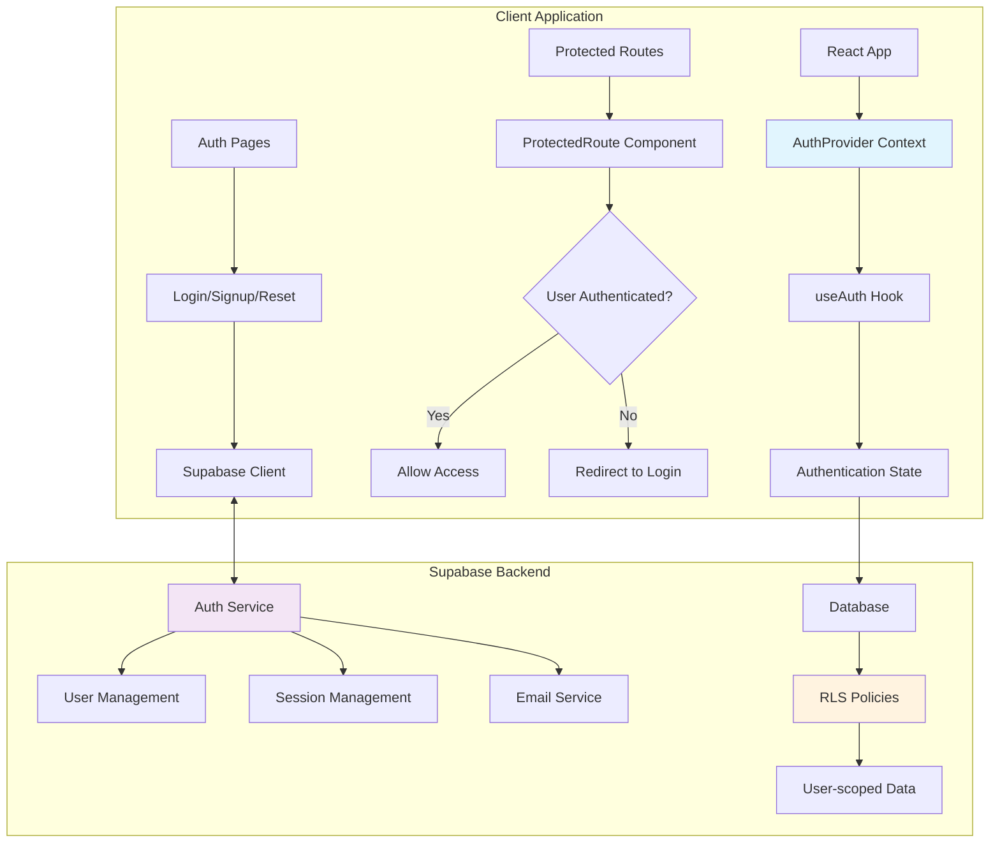
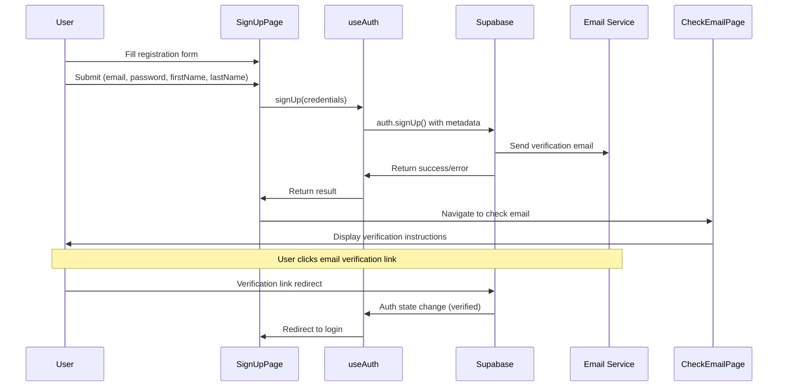
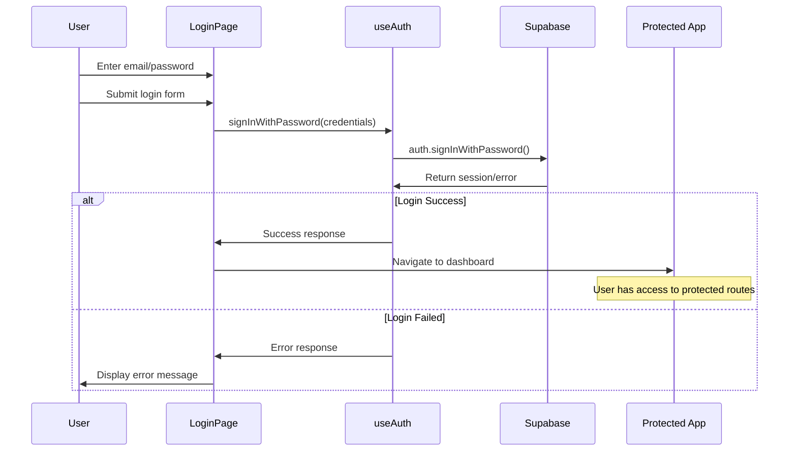
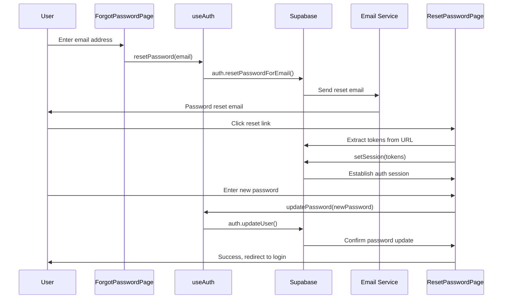
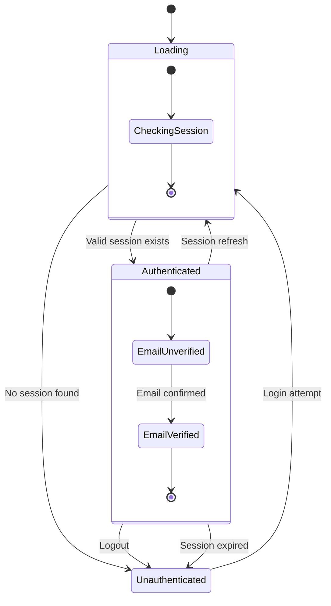
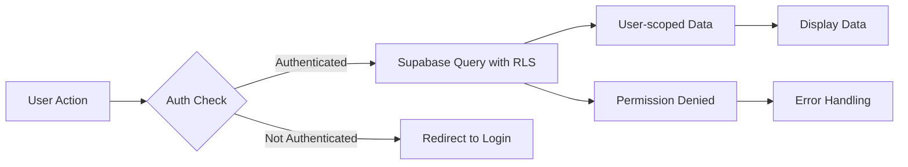

# Authentication System Documentation

## Overview

The CIMVP Dashboard uses **Supabase** as its authentication backend, implementing a comprehensive auth system with email-based registration, password authentication, email verification, password reset, and secure session management. The system is deeply integrated into the application's routing, data access, and user interface.

## Architecture Overview



## Core Authentication Components

### 1. AuthProvider & useAuth Hook (`src/hooks/useAuth.tsx`)

**Purpose**: Central authentication state management and API interface.

**Key Responsibilities**:
- Manages user session, loading states, and email verification status
- Provides authentication methods (`signIn`, `signUp`, `signOut`, `resetPassword`)
- Listens to Supabase auth state changes
- Handles session persistence and auto-refresh

**Critical Implementation Details**:
```typescript
interface AuthContextType {
  session: Session | null;
  user: User | null;
  loading: boolean;
  emailVerified: boolean;
  signInWithPassword: (credentials) => Promise<{error}>;
  signOut: () => Promise<{error}>;
  signUp: (email, password, firstName, lastName) => Promise<{error, data}>;
  resetPassword: (email) => Promise<{error}>;
  updatePassword: (password) => Promise<{error}>;
}
```

### 2. Supabase Client Configuration (`src/lib/supabaseClient.ts`)

**Purpose**: Configures and exports the Supabase client with auth-specific settings.

**Security Configuration**:
- **Session Persistence**: `persistSession: true`
- **Storage Key**: `'change-influence-auth'`
- **Auto Refresh**: `autoRefreshToken: true`
- **PKCE Flow**: Enhanced security for auth code flow
- **URL Detection**: `detectSessionInUrl: true` for email link handling

### 3. Route Protection (`src/App.tsx`)

**Purpose**: Enforces authentication requirements across the application.

**ProtectedRoute Logic**:
```typescript
function ProtectedRoute({ children }) {
  const { session, loading, emailVerified } = useAuth();
  
  if (loading) return <LoadingSpinner />;
  if (!session) return <Navigate to="/login" />;
  if (!emailVerified) return <Navigate to="/check-email" />;
  
  return <>{children}</>;
}
```

## Authentication Flows

### User Registration Flow



### Login Flow



### Password Reset Flow



### Session Management Flow



## File Structure & Responsibilities

### Authentication Core Files
```
src/
├── hooks/
│   └── useAuth.tsx              # 🔑 Primary auth hook & context
├── lib/
│   └── supabaseClient.ts        # 🔧 Supabase client configuration
└── App.tsx                      # 🛡️ Route protection & app structure
```

### Authentication Pages
```
src/pages/
├── LoginPage.tsx               # 🔐 User login interface
├── SignUpPage.tsx              # 📝 User registration
├── ForgotPasswordPage.tsx      # 🔄 Password reset request
├── ResetPasswordPage.tsx       # 🔄 Password reset completion
├── CheckEmailPage.tsx          # 📧 Email verification guidance
└── ProfilePage.tsx             # 👤 User profile management
```

### Integration Files
```
src/
├── components/layout/
│   └── Header.tsx              # 🧭 Auth status display & logout
├── services/
│   ├── uploadService.ts        # 📁 Auth-required file operations
│   ├── contentService.ts       # 📊 User-scoped data access
│   └── contentProcessingService.ts
├── utils/
│   └── updateExistingUsers.ts  # 👤 User metadata management
└── types/
    └── supabase.ts            # 📋 Type definitions
```

## Environment Setup

### Required Environment Variables
```bash
# .env.local
VITE_SUPABASE_URL=your-supabase-project-url
VITE_SUPABASE_ANON_KEY=your-supabase-anon-key
```

### Supabase Configuration Requirements
1. **Email Authentication**: Enabled in Supabase Auth settings
2. **Email Templates**: Configured for verification and password reset
3. **RLS Policies**: Row Level Security for user-scoped data access
4. **Storage Policies**: User-specific file access controls

## Key Authentication Patterns

### 1. Using Authentication in Components
```typescript
import { useAuth } from '../hooks/useAuth';

function MyComponent() {
  const { user, session, loading, signOut } = useAuth();
  
  if (loading) return <LoadingSpinner />;
  if (!session) return <Navigate to="/login" />;
  
  // Component logic for authenticated users
  return <div>Welcome {user?.email}</div>;
}
```

### 2. Protecting API Calls
```typescript
import { supabase } from '../lib/supabaseClient';

async function secureApiCall() {
  // Verify session exists
  const { data: { session } } = await supabase.auth.getSession();
  if (!session) throw new Error('Authentication required');
  
  // Make authenticated request
  const { data, error } = await supabase
    .from('protected_table')
    .select('*');
    
  return { data, error };
}
```

### 3. User Metadata Management
```typescript
// Access user metadata
const { user } = useAuth();
const userName = user?.user_metadata?.full_name || user?.email;

// Update user metadata
await supabase.auth.updateUser({
  data: {
    first_name: 'John',
    last_name: 'Doe',
    full_name: 'John Doe'
  }
});
```

## Security Considerations

### Row Level Security (RLS)
- All database tables implement RLS policies
- Policies ensure users can only access their own data
- Auth user ID (`auth.uid()`) is used for data scoping

### Session Security
- PKCE flow prevents authorization code interception
- Auto-refresh prevents session expiration
- Secure storage prevents XSS attacks on tokens

### Email Security
- Email verification required for account activation
- Password reset links expire after 24 hours
- Reset tokens are single-use only

## Common Troubleshooting

### Authentication Issues

**"Auth session missing" errors**:
```typescript
// Always check session before authenticated operations
const { data: { session } } = await supabase.auth.getSession();
if (!session) {
  // Handle unauthenticated state
  navigate('/login');
  return;
}
```

**Email verification not working**:
- Check email templates in Supabase dashboard
- Verify redirect URLs match application domains
- Ensure `detectSessionInUrl: true` in client config

**RLS policy failures**:
- Confirm `auth.uid()` matches the user ID in policies
- Verify user is authenticated before database operations
- Check policy definitions in Supabase dashboard

### Development Workflow

**Local Development Setup**:
1. Copy `env.example` to `.env.local`
2. Add Supabase project credentials
3. Run `npm run dev` to start development server
4. Test authentication flows in browser

**Testing Authentication**:
1. Create test accounts through signup flow
2. Verify email confirmation process
3. Test password reset functionality
4. Confirm logout clears all session data

## Integration with Application Features

### Data Access Pattern
All application data follows this authentication-aware pattern:



### File Upload Security
- Files are organized by user ID: `userId/filename`
- Storage policies restrict access to user's own files
- Authentication required for all upload/download operations

This authentication system provides a secure, scalable foundation for the CIMVP Dashboard application, ensuring user data privacy and secure access control throughout the application. 