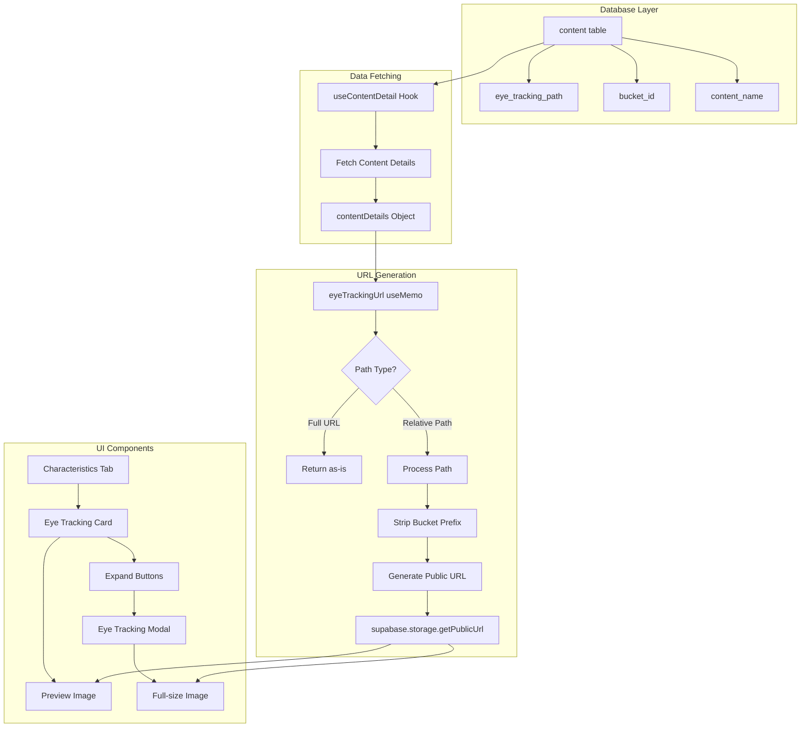
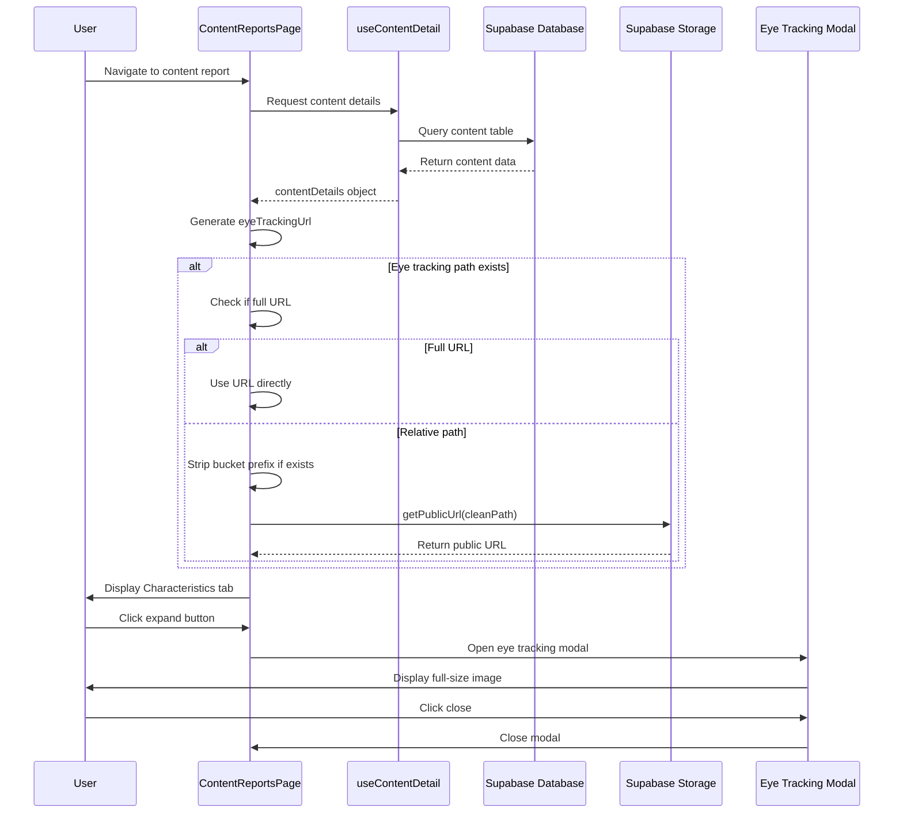
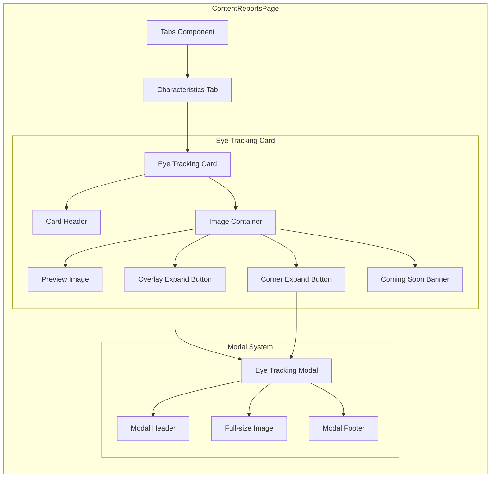
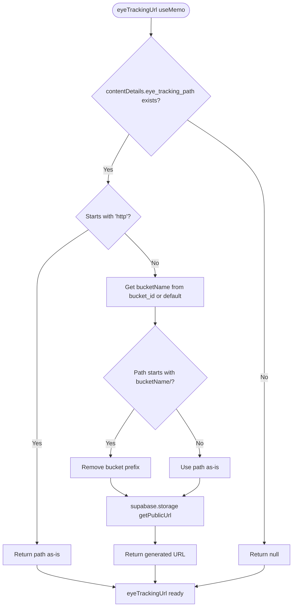
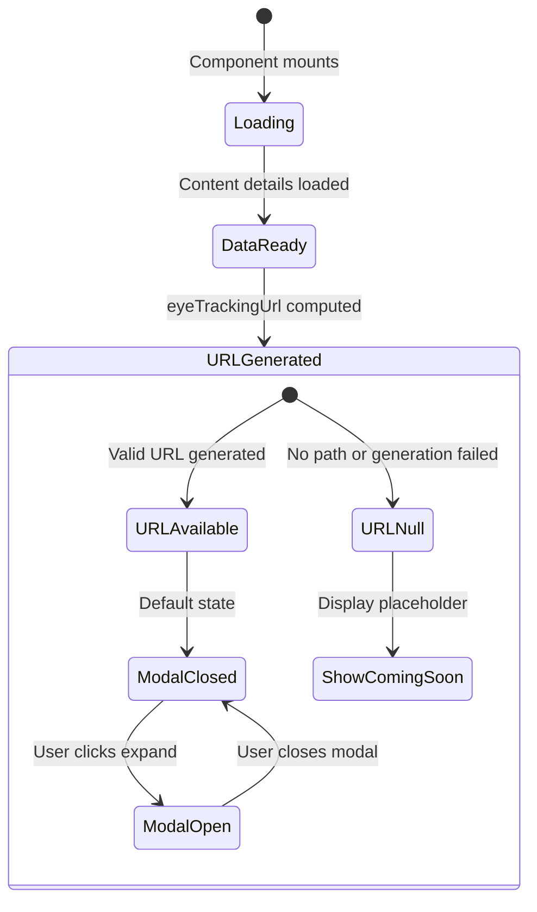
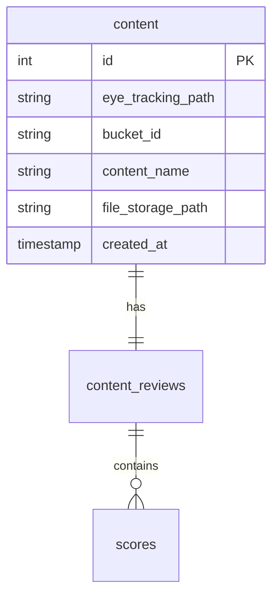
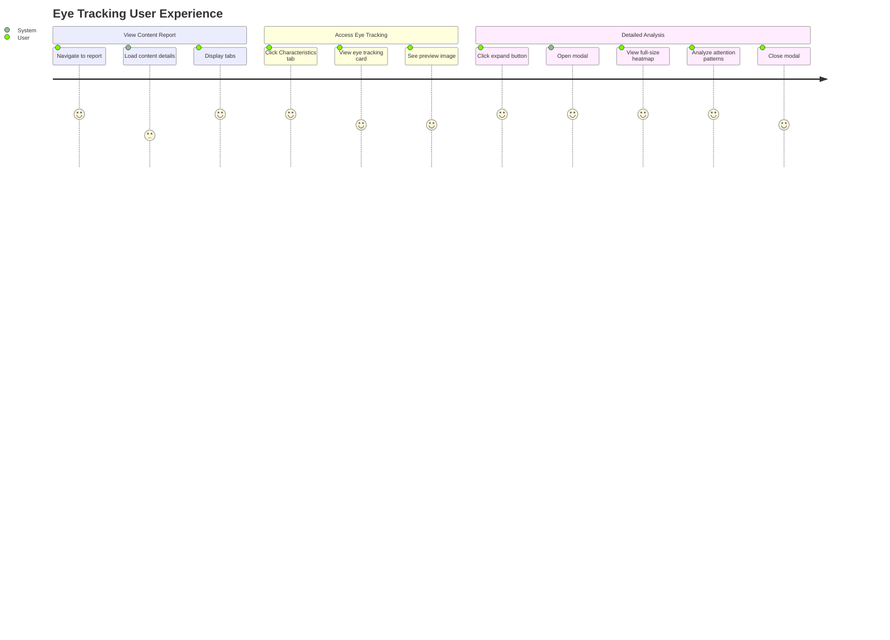
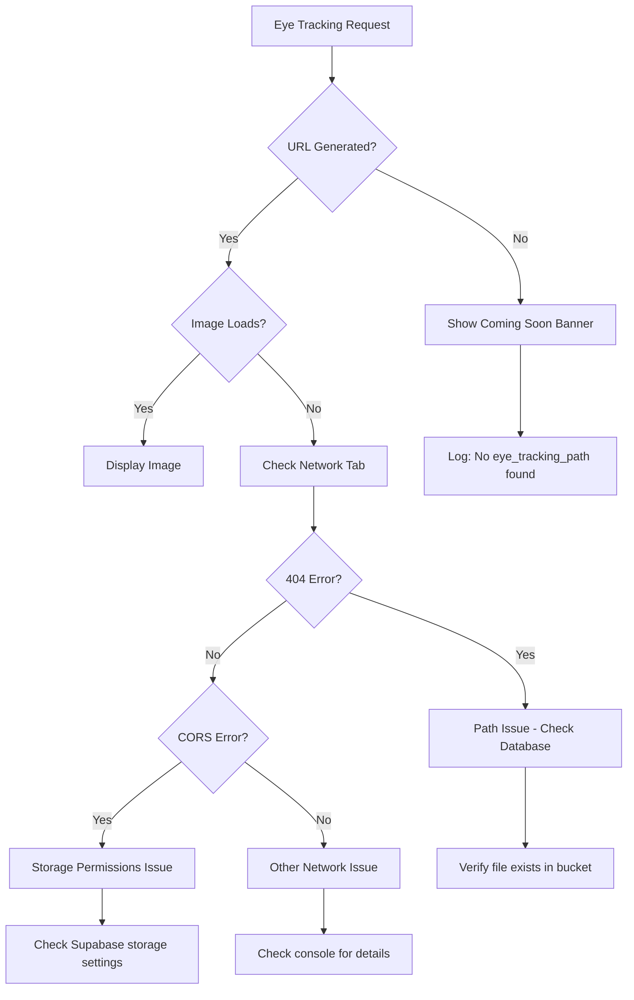

# Eye Tracking Feature Documentation

## Overview
The eye tracking feature provides visual heatmap analysis showing where users focus their attention when viewing content. This feature is integrated into the ContentReportsPage and displays eye tracking visualizations with expand functionality for detailed analysis.

## Architecture Overview




## Data Flow Sequence



## Component Structure



## URL Generation Logic



## State Management



## Key Features

### 1. Dynamic Bucket Support
The system uses the `bucket_id` field from the database to support multiple storage buckets:

```typescript
const bucketName = contentDetails.bucket_id || 'client-content';
```

### 2. Backwards Compatibility
Handles paths with and without bucket prefixes:

```typescript
if (cleanPath.startsWith(`${bucketName}/`)) {
  cleanPath = cleanPath.replace(`${bucketName}/`, '');
}
```

### 3. URL Type Detection
Supports both relative paths and full URLs:

```typescript
if (contentDetails.eye_tracking_path.startsWith('http')) {
  return contentDetails.eye_tracking_path;
}
```

### 4. Conditional UI Elements
- **Coming Soon Banner**: Displayed when no eye tracking URL is available
- **Expand Buttons**: Only functional when valid URL exists
- **Modal**: Opens with full-size image for detailed analysis

## Database Schema



### Relevant Fields
- `eye_tracking_path`: File path to eye tracking image (with or without bucket prefix)
- `bucket_id`: Supabase storage bucket identifier
- `file_storage_path`: Main content file path

## User Interface Flow



## Error Handling



## Console Logging

The system provides comprehensive logging for debugging:

1. **Path Detection**: `"Generating eye tracking URL for path:"`
2. **Bucket Selection**: `"Using bucket:"`
3. **Path Cleaning**: `"Stripped bucket prefix, clean path:"`
4. **URL Generation**: `"Generated eye tracking URL:"`
5. **Missing Data**: `"No eye_tracking_path found for content"`

## Integration Points

### With n8n Workflow
- Eye tracking images uploaded via automated workflow
- Paths stored in `eye_tracking_path` column
- Recent workflow updates include bucket prefixes

### With Supabase Storage
- Images stored in configurable buckets
- Public URLs generated dynamically
- Supports multiple bucket configurations

### With Content Analysis
- Eye tracking complements performance scores
- Provides visual attention data
- Enhances content effectiveness insights

## Best Practices

### For Developers
1. **Always check console logs** when debugging display issues
2. **Test with different bucket configurations** 
3. **Verify URLs in Network tab** for loading issues
4. **Handle both old and new path formats** for compatibility

### For Content Management
1. **Store relative paths** in database (without bucket prefix)
2. **Use bucket_id field** to specify storage location
3. **Validate file uploads** before saving paths
4. **Test URL generation** after n8n workflow changes

## Testing Scenarios

1. **Happy Path**: Valid eye tracking path generates working URL
2. **Missing Path**: Graceful handling with Coming Soon banner
3. **Invalid Path**: Error logging and fallback behavior
4. **Different Buckets**: Dynamic bucket selection works
5. **Full URLs**: Direct URLs pass through unchanged
6. **Modal Functionality**: Expand buttons and modal work correctly

## Future Enhancements

- **Multiple Eye Tracking Views**: Support for different analysis types
- **Interactive Heatmaps**: Clickable attention zones
- **Comparison Tools**: Side-by-side eye tracking analysis
- **Analytics Integration**: Eye tracking metrics in performance scores 