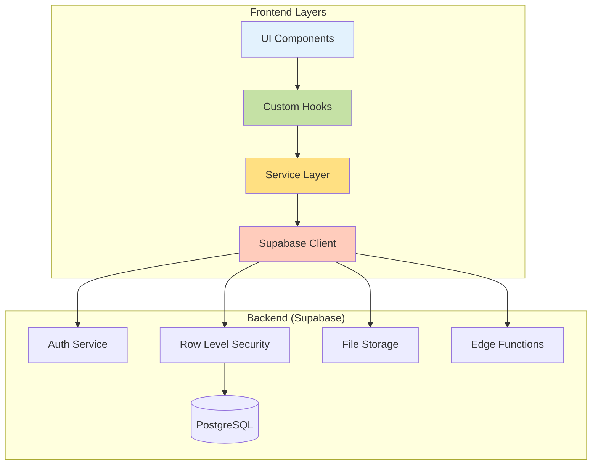
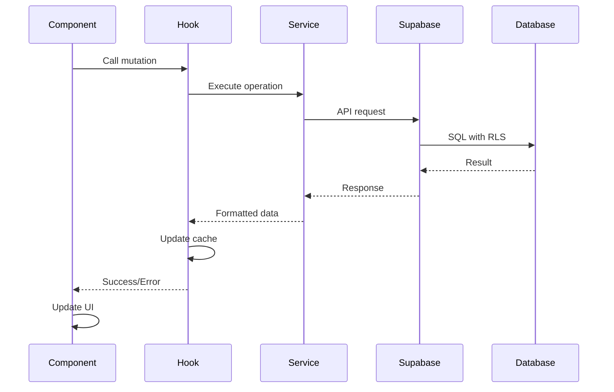
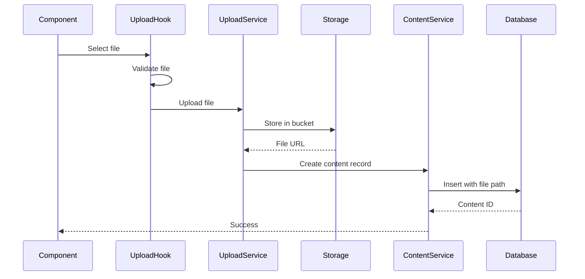
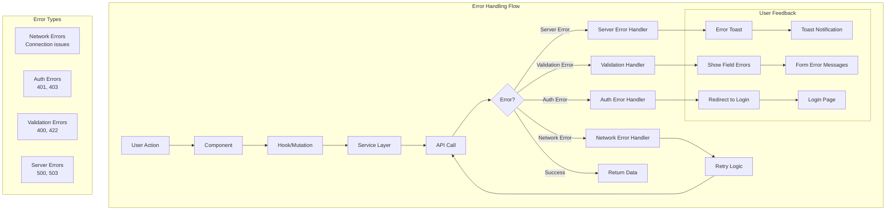

# API Patterns & Data Flow Guide

## Overview

This guide documents the API patterns, data flow architecture, and best practices for the Change Influence MVP Dashboard. The application uses a layered architecture with clear separation between UI, business logic, and data access layers.

## Architecture Overview



## Data Flow Patterns

### 1. Standard CRUD Flow



### Implementation Example

```typescript
// 1. Component initiates action
function BrandObjective({ objective }) {
  const updateObjective = useUpdateBrandObjective();
  
  const handleSave = (updates: ObjectiveUpdate) => {
    updateObjective.mutate({
      objectiveId: objective.id,
      updates
    });
  };
  
  return <ObjectiveForm onSave={handleSave} />;
}

// 2. Hook manages state and side effects
export function useUpdateBrandObjective() {
  const queryClient = useQueryClient();
  
  return useMutation({
    // 3. Service handles business logic
    mutationFn: ({ objectiveId, updates }) =>
      brandService.updateBrandObjective(objectiveId, updates),
    
    onSuccess: (data, variables) => {
      // 4. Update cache
      queryClient.invalidateQueries(['brand']);
      toast({ title: "Objective updated" });
    },
    
    onError: (error) => {
      toast({ 
        title: "Update failed", 
        variant: "destructive" 
      });
    }
  });
}

// 5. Service executes database operation
async updateBrandObjective(
  objectiveId: string, 
  updates: Partial<BrandObjective>
): Promise<void> {
  const { error } = await supabase
    .from('brand_objectives')
    .update(updates)
    .eq('id', objectiveId);
    
  if (error) throw error;
}
```

### 2. Complex Query Flow

For operations requiring multiple data sources:

```typescript
// Service method combining multiple queries
async getBrandDashboardData(brandId: string): Promise<DashboardData> {
  // Parallel queries for performance
  const [brand, metrics, competitors, performance] = await Promise.all([
    this.getBrand(brandId),
    this.getBrandMetrics(brandId),
    this.getBrandCompetitors(brandId),
    this.getBrandPerformanceHistory(brandId)
  ]);
  
  // Transform and combine data
  return {
    brand: transformBrandData(brand),
    metrics: calculateMetrics(metrics),
    competitors: competitors.slice(0, 5), // Top 5
    performance: aggregatePerformance(performance)
  };
}

// Hook with dependent queries
function useBrandDashboard(brandId: string) {
  // Primary query
  const brandQuery = useQuery({
    queryKey: ['brand', brandId],
    queryFn: () => brandService.getBrand(brandId),
  });
  
  // Dependent queries
  const metricsQuery = useQuery({
    queryKey: ['brand', brandId, 'metrics'],
    queryFn: () => brandService.getBrandMetrics(brandId),
    enabled: !!brandQuery.data, // Only run after brand loads
  });
  
  return {
    brand: brandQuery.data,
    metrics: metricsQuery.data,
    isLoading: brandQuery.isLoading || metricsQuery.isLoading,
    error: brandQuery.error || metricsQuery.error,
  };
}
```

### 3. File Upload Flow



Implementation:

```typescript
// Upload hook with progress tracking
export function useContentUpload() {
  const queryClient = useQueryClient();
  const [progress, setProgress] = useState(0);
  
  const mutation = useMutation({
    mutationFn: async ({ file, metadata }: UploadParams) => {
      // 1. Upload file
      const { path, url } = await uploadService.uploadFile(file, {
        onProgress: setProgress,
      });
      
      // 2. Create content record
      const content = await contentService.createContent({
        ...metadata,
        file_storage_path: path,
        file_url: url,
      });
      
      return content;
    },
    
    onSuccess: () => {
      queryClient.invalidateQueries(['content']);
      setProgress(0);
    },
  });
  
  return { ...mutation, progress };
}
```

### 4. Real-time Subscription Flow

```typescript
// Real-time updates for collaborative features
function useRealtimeBrand(brandId: string) {
  const queryClient = useQueryClient();
  
  useEffect(() => {
    const subscription = supabase
      .channel(`brand:${brandId}`)
      .on(
        'postgres_changes',
        {
          event: '*',
          schema: 'public',
          table: 'brands',
          filter: `id=eq.${brandId}`,
        },
        (payload) => {
          // Update cache with real-time data
          queryClient.setQueryData(
            ['brand', brandId],
            payload.new
          );
        }
      )
      .subscribe();
    
    return () => {
      subscription.unsubscribe();
    };
  }, [brandId, queryClient]);
}
```

## Service Layer Patterns

### 1. Service Organization

```typescript
// services/brandService.ts
class BrandService {
  // Group related operations
  
  // Core CRUD
  async createBrand(data: CreateBrandDto): Promise<Brand> { }
  async getBrand(id: string): Promise<Brand> { }
  async updateBrand(id: string, data: UpdateBrandDto): Promise<void> { }
  async deleteBrand(id: string): Promise<void> { }
  
  // Feature-specific operations
  async getBrandMetrics(id: string): Promise<BrandMetrics> { }
  async getBrandCompetitors(id: string): Promise<Competitor[]> { }
  
  // Batch operations
  async batchUpdateObjectives(brandId: string, objectives: Objective[]): Promise<void> { }
}

export const brandService = new BrandService();
```

### 2. Error Handling Pattern

```typescript
// Consistent error handling across services
class BaseService {
  protected async executeQuery<T>(
    operation: () => Promise<{ data: T; error: any }>
  ): Promise<T> {
    try {
      const { data, error } = await operation();
      
      if (error) {
        // Log for debugging
        console.error('Database error:', error);
        
        // Throw user-friendly error
        throw this.mapError(error);
      }
      
      return data;
    } catch (error) {
      // Handle unexpected errors
      console.error('Unexpected error:', error);
      throw new Error('An unexpected error occurred');
    }
  }
  
  private mapError(error: any): Error {
    // Map database errors to user-friendly messages
    if (error.code === '23505') {
      return new Error('This item already exists');
    }
    
    if (error.code === '23503') {
      return new Error('Cannot delete - item is in use');
    }
    
    return new Error(error.message || 'Operation failed');
  }
}
```

### 3. Data Transformation Pattern

```typescript
// Transform database models to frontend models
export function transformBrandData(dbBrand: DatabaseBrand): BrandData {
  return {
    id: dbBrand.id,
    name: dbBrand.name,
    slug: dbBrand.slug,
    
    // Transform nested JSONB data
    personas: dbBrand.personas?.map(transformPersona) || [],
    customerSegments: dbBrand.customer_segments?.map(transformSegment) || [],
    
    // Compute derived fields
    completionStatus: calculateCompletionStatus(dbBrand),
    lastUpdated: new Date(dbBrand.updated_at).toLocaleDateString(),
    
    // Flatten nested relations
    objectives: dbBrand.brand_objectives || [],
    messages: dbBrand.brand_messages || [],
  };
}

// Inverse transformation for updates
export function prepareBrandUpdate(brandData: Partial<BrandData>): DatabaseBrandUpdate {
  const update: DatabaseBrandUpdate = {};
  
  if (brandData.name !== undefined) {
    update.name = brandData.name;
  }
  
  if (brandData.personas !== undefined) {
    update.personas = brandData.personas.map(preparePersona);
  }
  
  return update;
}
```

### 4. Pagination Pattern

```typescript
interface PaginationParams {
  page: number;
  limit: number;
  sort?: string;
  order?: 'asc' | 'desc';
}

interface PaginatedResponse<T> {
  data: T[];
  total: number;
  page: number;
  totalPages: number;
}

async getPaginatedContent(
  params: PaginationParams
): Promise<PaginatedResponse<Content>> {
  const { page, limit, sort = 'created_at', order = 'desc' } = params;
  const offset = (page - 1) * limit;
  
  // Get total count
  const { count } = await supabase
    .from('content')
    .select('*', { count: 'exact', head: true });
  
  // Get paginated data
  const { data, error } = await supabase
    .from('content')
    .select('*')
    .order(sort, { ascending: order === 'asc' })
    .range(offset, offset + limit - 1);
  
  if (error) throw error;
  
  return {
    data,
    total: count || 0,
    page,
    totalPages: Math.ceil((count || 0) / limit),
  };
}
```

## API Security Patterns

### 1. Input Validation

```typescript
// Validate at service layer
import { z } from 'zod';

const createBrandSchema = z.object({
  name: z.string().min(1).max(100),
  businessArea: z.string().optional(),
  region: z.string().optional(),
});

async createBrand(input: unknown): Promise<Brand> {
  // Validate input
  const validated = createBrandSchema.parse(input);
  
  // Sanitize if needed
  const sanitized = {
    ...validated,
    name: sanitizeString(validated.name),
  };
  
  // Execute query
  return this.executeQuery(() =>
    supabase.from('brands').insert(sanitized).single()
  );
}
```

### 2. Row Level Security

```sql
-- Ensure all operations respect user context
CREATE POLICY "Users manage own brands"
ON brands FOR ALL
USING (client_id = auth.uid())
WITH CHECK (client_id = auth.uid());

-- Cascade security to related tables
CREATE POLICY "Users manage brand content"
ON brand_content FOR ALL
USING (
  brand_id IN (
    SELECT id FROM brands 
    WHERE client_id = auth.uid()
  )
);
```

### 3. API Rate Limiting

```typescript
// Client-side rate limiting
class RateLimiter {
  private attempts = new Map<string, number[]>();
  
  canMakeRequest(key: string, maxAttempts: number, windowMs: number): boolean {
    const now = Date.now();
    const attempts = this.attempts.get(key) || [];
    
    // Remove old attempts
    const validAttempts = attempts.filter(
      time => now - time < windowMs
    );
    
    if (validAttempts.length >= maxAttempts) {
      return false;
    }
    
    validAttempts.push(now);
    this.attempts.set(key, validAttempts);
    
    return true;
  }
}

const rateLimiter = new RateLimiter();

// Use in service
async createContent(data: CreateContentDto): Promise<Content> {
  if (!rateLimiter.canMakeRequest('createContent', 10, 60000)) {
    throw new Error('Rate limit exceeded. Please try again later.');
  }
  
  return this.executeQuery(() =>
    supabase.from('content').insert(data).single()
  );
}
```

## Caching Strategies

### 1. Query Cache Configuration

```typescript
// Configure stale times based on data volatility
const queryClient = new QueryClient({
  defaultOptions: {
    queries: {
      staleTime: 5 * 60 * 1000, // 5 minutes default
      cacheTime: 10 * 60 * 1000, // 10 minutes in cache
    },
  },
});

// Override for specific queries
useQuery({
  queryKey: ['static-data'],
  queryFn: fetchStaticData,
  staleTime: Infinity, // Never stale
});

useQuery({
  queryKey: ['real-time-metrics'],
  queryFn: fetchMetrics,
  staleTime: 0, // Always stale
  refetchInterval: 5000, // Poll every 5 seconds
});
```

### 2. Optimistic Updates

```typescript
const updateBrandName = useMutation({
  mutationFn: ({ brandId, name }) =>
    brandService.updateBrand(brandId, { name }),
    
  onMutate: async ({ brandId, name }) => {
    // Cancel in-flight queries
    await queryClient.cancelQueries(['brand', brandId]);
    
    // Snapshot previous value
    const previousBrand = queryClient.getQueryData(['brand', brandId]);
    
    // Optimistically update
    queryClient.setQueryData(['brand', brandId], old => ({
      ...old,
      name,
    }));
    
    return { previousBrand };
  },
  
  onError: (err, variables, context) => {
    // Rollback on error
    if (context?.previousBrand) {
      queryClient.setQueryData(
        ['brand', variables.brandId],
        context.previousBrand
      );
    }
  },
  
  onSettled: (data, error, variables) => {
    // Always refetch to ensure consistency
    queryClient.invalidateQueries(['brand', variables.brandId]);
  },
});
```

### 3. Cache Invalidation Patterns

```typescript
// Hierarchical invalidation
const invalidateBrandData = (brandId: string) => {
  queryClient.invalidateQueries(['brand', brandId]);
};

const invalidateAllBrands = () => {
  queryClient.invalidateQueries(['brand']);
};

// Precise invalidation
const invalidateBrandObjectives = (brandId: string) => {
  queryClient.invalidateQueries(['brand', brandId, 'objectives']);
};

// Pattern-based invalidation
const invalidateContentByType = (type: string) => {
  queryClient.invalidateQueries({
    predicate: (query) =>
      query.queryKey[0] === 'content' &&
      query.queryKey[2] === type,
  });
};
```

## Performance Optimization

### 1. Request Deduplication

React Query automatically deduplicates identical requests:

```typescript
// Multiple components requesting same data
function ComponentA() {
  const { data } = useQuery(['brand', '123'], fetchBrand);
}

function ComponentB() {
  const { data } = useQuery(['brand', '123'], fetchBrand);
}

// Only one network request is made
```

### 2. Prefetching

```typescript
// Prefetch on route navigation
function BrandList() {
  const queryClient = useQueryClient();
  const navigate = useNavigate();
  
  const handleBrandClick = async (brandId: string) => {
    // Start fetching before navigation
    await queryClient.prefetchQuery(
      ['brand', brandId],
      () => brandService.getBrand(brandId)
    );
    
    navigate(`/brands/${brandId}`);
  };
}

// Prefetch on hover
function BrandLink({ brand }) {
  const queryClient = useQueryClient();
  
  return (
    <Link
      to={`/brands/${brand.id}`}
      onMouseEnter={() => {
        queryClient.prefetchQuery(
          ['brand', brand.id],
          () => brandService.getBrand(brand.id),
          { staleTime: 10 * 1000 } // Only if older than 10s
        );
      }}
    >
      {brand.name}
    </Link>
  );
}
```

### 3. Lazy Queries

```typescript
// Only fetch when needed
function ConditionalData({ shouldFetch }) {
  const { data } = useQuery({
    queryKey: ['expensive-data'],
    queryFn: fetchExpensiveData,
    enabled: shouldFetch, // Conditional fetching
  });
}

// Manual query execution
function SearchResults() {
  const [query, setQuery] = useState('');
  
  const { data, refetch } = useQuery({
    queryKey: ['search', query],
    queryFn: () => searchService.search(query),
    enabled: false, // Don't run automatically
  });
  
  const handleSearch = () => {
    if (query.length > 2) {
      refetch();
    }
  };
}
```

### 4. Infinite Queries

```typescript
// For paginated lists
function InfiniteContentList() {
  const {
    data,
    fetchNextPage,
    hasNextPage,
    isFetchingNextPage,
  } = useInfiniteQuery({
    queryKey: ['content', 'infinite'],
    queryFn: ({ pageParam = 1 }) =>
      contentService.getPaginatedContent({ 
        page: pageParam, 
        limit: 20 
      }),
    getNextPageParam: (lastPage) =>
      lastPage.page < lastPage.totalPages 
        ? lastPage.page + 1 
        : undefined,
  });
  
  return (
    <InfiniteScroll
      dataLength={data?.pages.flatMap(p => p.data).length || 0}
      next={fetchNextPage}
      hasMore={hasNextPage}
      loader={<LoadingSpinner />}
    >
      {data?.pages.flatMap(page =>
        page.data.map(item => (
          <ContentCard key={item.id} content={item} />
        ))
      )}
    </InfiniteScroll>
  );
}
```

## Error Handling



### 1. Global Error Boundary

```typescript
// Error boundary for API errors
class ApiErrorBoundary extends Component<Props, State> {
  state = { hasError: false, error: null };
  
  static getDerivedStateFromError(error: Error) {
    return { hasError: true, error };
  }
  
  componentDidCatch(error: Error, errorInfo: ErrorInfo) {
    // Log to error reporting service
    console.error('API Error:', error, errorInfo);
    
    // Show user-friendly message
    if (error.message.includes('Network')) {
      toast({
        title: 'Connection Error',
        description: 'Please check your internet connection',
        variant: 'destructive',
      });
    }
  }
  
  render() {
    if (this.state.hasError) {
      return (
        <ErrorFallback
          error={this.state.error}
          reset={() => this.setState({ hasError: false })}
        />
      );
    }
    
    return this.props.children;
  }
}
```

### 2. Query Error Handling

```typescript
// Component-level error handling
function BrandDetails({ brandId }) {
  const { data, error, refetch } = useQuery({
    queryKey: ['brand', brandId],
    queryFn: () => brandService.getBrand(brandId),
    retry: (failureCount, error) => {
      // Don't retry on 404
      if (error.status === 404) return false;
      // Retry up to 3 times for other errors
      return failureCount < 3;
    },
  });
  
  if (error) {
    return (
      <ErrorDisplay
        error={error}
        action={
          <Button onClick={() => refetch()}>
            Try Again
          </Button>
        }
      />
    );
  }
  
  return <BrandInfo brand={data} />;
}
```

### 3. Mutation Error Recovery

```typescript
// Graceful error recovery
const createBrand = useMutation({
  mutationFn: brandService.createBrand,
  
  onError: (error, variables, context) => {
    // Log error details
    console.error('Failed to create brand:', {
      error,
      attempted: variables,
    });
    
    // User-friendly notification
    toast({
      title: 'Failed to create brand',
      description: getErrorMessage(error),
      variant: 'destructive',
      action: (
        <ToastAction
          altText="Try again"
          onClick={() => createBrand.mutate(variables)}
        >
          Try again
        </ToastAction>
      ),
    });
  },
});
```

## Testing API Integrations

### 1. Service Layer Tests

```typescript
// Mock Supabase client
jest.mock('@/lib/supabase', () => ({
  supabase: {
    from: jest.fn(() => ({
      select: jest.fn(() => ({
        eq: jest.fn(() => ({
          single: jest.fn(() => Promise.resolve({
            data: mockBrand,
            error: null,
          })),
        })),
      })),
    })),
  },
}));

describe('BrandService', () => {
  it('fetches brand by ID', async () => {
    const brand = await brandService.getBrand('123');
    
    expect(brand).toEqual(mockBrand);
    expect(supabase.from).toHaveBeenCalledWith('brands');
  });
  
  it('handles errors gracefully', async () => {
    supabase.from.mockImplementationOnce(() => ({
      select: () => ({
        eq: () => ({
          single: () => Promise.resolve({
            data: null,
            error: new Error('Not found'),
          }),
        }),
      }),
    }));
    
    await expect(brandService.getBrand('123'))
      .rejects.toThrow('Not found');
  });
});
```

### 2. Hook Tests

```typescript
// Test React Query hooks
import { renderHook, waitFor } from '@testing-library/react';
import { QueryClient, QueryClientProvider } from '@tanstack/react-query';

const createWrapper = () => {
  const queryClient = new QueryClient({
    defaultOptions: {
      queries: { retry: false },
    },
  });
  
  return ({ children }) => (
    <QueryClientProvider client={queryClient}>
      {children}
    </QueryClientProvider>
  );
};

describe('useBrandData', () => {
  it('fetches and transforms brand data', async () => {
    const { result } = renderHook(
      () => useBrandData('123'),
      { wrapper: createWrapper() }
    );
    
    // Initial loading state
    expect(result.current.isLoading).toBe(true);
    expect(result.current.data).toBeUndefined();
    
    // Wait for success
    await waitFor(() => {
      expect(result.current.isSuccess).toBe(true);
    });
    
    // Verify transformed data
    expect(result.current.data).toEqual({
      id: '123',
      name: 'Test Brand',
      completionStatus: 'incomplete',
    });
  });
});
```

## Migration Guide (Supabase to Azure)

Since the service layer isolates database operations, migrating to Azure requires changes only in service files:

### 1. Current Supabase Pattern
```typescript
// services/brandService.ts
async getBrand(id: string): Promise<Brand> {
  const { data, error } = await supabase
    .from('brands')
    .select('*')
    .eq('id', id)
    .single();
    
  if (error) throw error;
  return transformBrandData(data);
}
```

### 2. Future Azure Pattern
```typescript
// services/brandService.ts
async getBrand(id: string): Promise<Brand> {
  // Use Azure SDK instead
  const response = await azureClient
    .database('brands')
    .container('brands')
    .item(id)
    .read();
    
  if (!response.resource) {
    throw new Error('Brand not found');
  }
  
  return transformBrandData(response.resource);
}
```

### 3. Migration Strategy
1. Create Azure service implementations
2. Use feature flags to switch between Supabase/Azure
3. Run both in parallel during transition
4. Gradually migrate by feature
5. Remove Supabase code after full migration

## Best Practices Summary

1. **Always use the service layer** - Never import Supabase directly in components
2. **Handle errors gracefully** - Provide meaningful error messages
3. **Optimize queries** - Use appropriate stale times and caching
4. **Validate inputs** - Use Zod schemas for type safety
5. **Transform data consistently** - Separate DB models from UI models
6. **Test thoroughly** - Mock at the service boundary
7. **Monitor performance** - Use React Query DevTools
8. **Document patterns** - Keep this guide updated