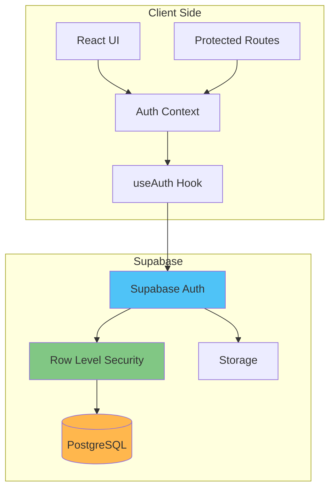
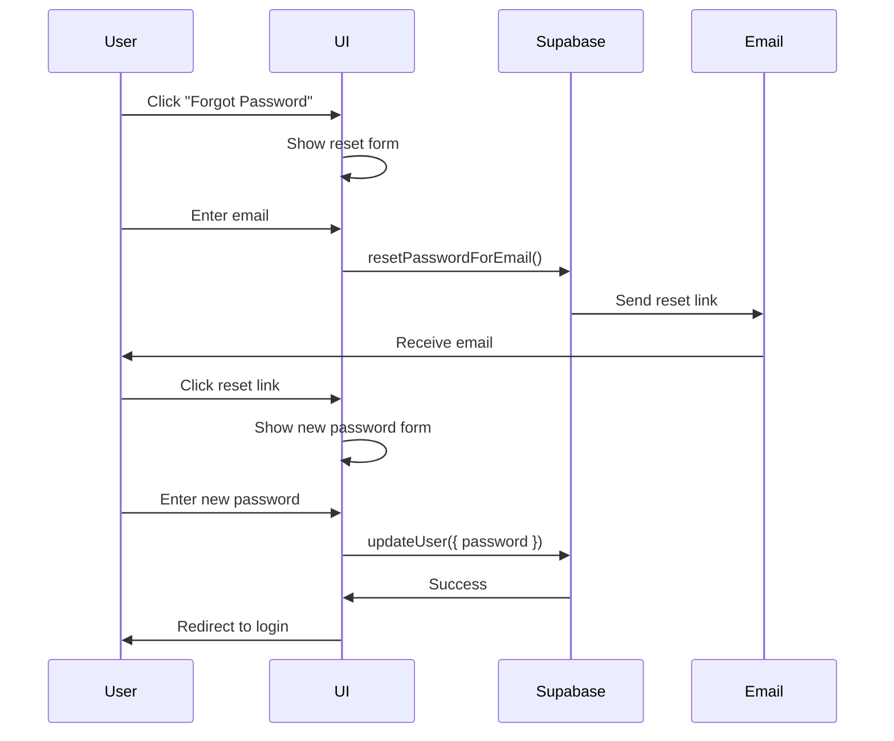

# Authentication & Security Guide

## Overview

This guide documents the authentication flow, security patterns, and best practices implemented in the Change Influence MVP Dashboard. The application uses Supabase Auth with Row Level Security (RLS) to ensure data protection at multiple levels.

## Architecture Overview



## Authentication Flow

### 1. Initial Setup

#### Supabase Client Configuration
```typescript
// lib/supabase.ts
import { createClient } from '@supabase/supabase-js';
import type { Database } from '@/types/supabase';

const supabaseUrl = import.meta.env.VITE_SUPABASE_URL;
const supabaseAnonKey = import.meta.env.VITE_SUPABASE_ANON_KEY;

if (!supabaseUrl || !supabaseAnonKey) {
  throw new Error('Missing Supabase environment variables');
}

export const supabase = createClient<Database>(
  supabaseUrl, 
  supabaseAnonKey,
  {
    auth: {
      autoRefreshToken: true,
      persistSession: true,
      detectSessionInUrl: true
    }
  }
);
```

### 2. Auth Context Provider

```typescript
// contexts/AuthContext.tsx
interface AuthContextValue {
  session: Session | null;
  user: User | null;
  loading: boolean;
  emailVerified: boolean;
  signOut: () => Promise<void>;
  signInWithPassword: (email: string, password: string) => Promise<AuthResponse>;
  signUp: (email: string, password: string) => Promise<AuthResponse>;
  resetPassword: (email: string) => Promise<void>;
  updatePassword: (newPassword: string) => Promise<void>;
}

export function AuthProvider({ children }: { children: ReactNode }) {
  const [session, setSession] = useState<Session | null>(null);
  const [loading, setLoading] = useState(true);

  useEffect(() => {
    // Get initial session
    supabase.auth.getSession().then(({ data: { session } }) => {
      setSession(session);
      setLoading(false);
    });

    // Listen for auth changes
    const { data: { subscription } } = supabase.auth.onAuthStateChange(
      (_event, session) => {
        setSession(session);
      }
    );

    return () => subscription.unsubscribe();
  }, []);

  const signInWithPassword = async (email: string, password: string) => {
    const response = await supabase.auth.signInWithPassword({
      email,
      password,
    });
    
    if (response.error) {
      throw response.error;
    }
    
    return response;
  };

  // ... other auth methods

  return (
    <AuthContext.Provider value={{ 
      session, 
      user: session?.user ?? null,
      loading,
      emailVerified: session?.user?.email_confirmed_at != null,
      signInWithPassword,
      // ... other methods
    }}>
      {children}
    </AuthContext.Provider>
  );
}
```

### 3. Protected Routes

```typescript
// components/ProtectedRoute.tsx
export function ProtectedRoute({ children }: { children: ReactNode }) {
  const { user, loading, emailVerified } = useAuth();
  const location = useLocation();

  if (loading) {
    return (
      <div className="flex items-center justify-center min-h-screen">
        <LoadingSpinner size="lg" />
      </div>
    );
  }

  if (!user) {
    // Save attempted location for redirect after login
    return <Navigate to="/login" state={{ from: location }} replace />;
  }

  if (!emailVerified) {
    return <Navigate to="/verify-email" replace />;
  }

  return <>{children}</>;
}

// Usage in App.tsx
<Route element={<ProtectedRoute><DashboardLayout /></ProtectedRoute>}>
  <Route path="/" element={<StrategicDashboard />} />
  <Route path="/brand-dashboard" element={<BrandDashboard />} />
  {/* Other protected routes */}
</Route>
```

### 4. Authentication Pages

#### Login Page
```typescript
function LoginPage() {
  const navigate = useNavigate();
  const location = useLocation();
  const { signInWithPassword } = useAuth();
  const [isLoading, setIsLoading] = useState(false);

  const form = useForm<LoginFormData>({
    resolver: zodResolver(loginSchema),
    defaultValues: {
      email: "",
      password: "",
    },
  });

  const onSubmit = async (data: LoginFormData) => {
    setIsLoading(true);
    try {
      await signInWithPassword(data.email, data.password);
      
      // Redirect to attempted page or dashboard
      const from = location.state?.from?.pathname || "/";
      navigate(from, { replace: true });
      
      toast({ title: "Welcome back!" });
    } catch (error) {
      toast({
        title: "Login failed",
        description: error.message,
        variant: "destructive",
      });
    } finally {
      setIsLoading(false);
    }
  };

  return (
    <Form {...form}>
      <form onSubmit={form.handleSubmit(onSubmit)} className="space-y-4">
        <FormField
          control={form.control}
          name="email"
          render={({ field }) => (
            <FormItem>
              <FormLabel>Email</FormLabel>
              <FormControl>
                <Input type="email" {...field} />
              </FormControl>
              <FormMessage />
            </FormItem>
          )}
        />
        {/* Password field */}
        <Button type="submit" disabled={isLoading}>
          {isLoading ? <LoadingSpinner /> : "Sign In"}
        </Button>
      </form>
    </Form>
  );
}
```

#### Sign Up Page
```typescript
const signUpSchema = z.object({
  email: z.string().email("Invalid email address"),
  password: z.string()
    .min(8, "Password must be at least 8 characters")
    .regex(/[A-Z]/, "Password must contain an uppercase letter")
    .regex(/[a-z]/, "Password must contain a lowercase letter")
    .regex(/[0-9]/, "Password must contain a number"),
  confirmPassword: z.string(),
}).refine((data) => data.password === data.confirmPassword, {
  message: "Passwords don't match",
  path: ["confirmPassword"],
});
```

## Security Patterns

### 1. Row Level Security (RLS)

RLS ensures users can only access their own data at the database level.

#### Basic RLS Policies
```sql
-- Enable RLS on all tables
ALTER TABLE brands ENABLE ROW LEVEL SECURITY;

-- Policy: Users can only see their own brands
CREATE POLICY "Users can view own brands" 
ON brands FOR SELECT 
USING (client_id = auth.uid());

-- Policy: Users can only insert brands for themselves
CREATE POLICY "Users can insert own brands" 
ON brands FOR INSERT 
WITH CHECK (client_id = auth.uid());

-- Policy: Users can only update their own brands
CREATE POLICY "Users can update own brands" 
ON brands FOR UPDATE 
USING (client_id = auth.uid());

-- Policy: Users can only delete their own brands
CREATE POLICY "Users can delete own brands" 
ON brands FOR DELETE 
USING (client_id = auth.uid());
```

#### Cascading RLS for Related Tables
```sql
-- Policy for brand objectives (cascade from brands)
CREATE POLICY "Users can manage brand objectives"
ON brand_objectives FOR ALL
USING (
  brand_id IN (
    SELECT id FROM brands WHERE client_id = auth.uid()
  )
);

-- Policy for brand content (double cascade)
CREATE POLICY "Users can manage brand content"
ON brand_content FOR ALL
USING (
  brand_id IN (
    SELECT id FROM brands WHERE client_id = auth.uid()
  )
);
```

### 2. Input Validation

All user inputs are validated using Zod schemas.

```typescript
// types/validation.ts
import { z } from 'zod';

// Brand validation schema
export const brandSchema = z.object({
  name: z.string()
    .min(1, "Brand name is required")
    .max(100, "Brand name too long")
    .regex(/^[a-zA-Z0-9\s\-&]+$/, "Invalid characters in brand name"),
  
  businessArea: z.string()
    .max(255, "Business area too long")
    .optional(),
  
  region: z.string()
    .max(100, "Region too long")
    .optional(),
});

// Content validation
export const contentSchema = z.object({
  title: z.string()
    .min(1, "Title is required")
    .max(255, "Title too long"),
  
  type: z.enum(["article", "video", "infographic", "social"]),
  
  file: z.instanceof(File)
    .refine(file => file.size <= 10_000_000, "File too large (max 10MB)")
    .refine(
      file => ALLOWED_TYPES.includes(file.type),
      "Invalid file type"
    ),
});

// Usage in components
const form = useForm<BrandFormData>({
  resolver: zodResolver(brandSchema),
});
```

### 3. XSS Prevention

Content sanitization for user-generated content.

```typescript
// utils/sanitize.ts
import DOMPurify from 'isomorphic-dompurify';

export function sanitizeHtml(dirty: string): string {
  return DOMPurify.sanitize(dirty, {
    ALLOWED_TAGS: ['b', 'i', 'em', 'strong', 'a', 'p', 'br'],
    ALLOWED_ATTR: ['href', 'target', 'rel'],
  });
}

// Usage in components
function UserContent({ content }: { content: string }) {
  return (
    <div 
      dangerouslySetInnerHTML={{ 
        __html: sanitizeHtml(content) 
      }} 
    />
  );
}
```

### 4. API Security

#### Environment Variables
```env
# .env.local (safe to commit structure)
VITE_SUPABASE_URL=your_project_url
VITE_SUPABASE_ANON_KEY=your_anon_key  # Safe to expose

# .env.production (never commit)
SUPABASE_SERVICE_KEY=your_service_key  # Server-side only
```

#### Secure Headers
```typescript
// For server-side operations (if needed)
const secureHeaders = {
  'Content-Security-Policy': "default-src 'self'",
  'X-Frame-Options': 'DENY',
  'X-Content-Type-Options': 'nosniff',
  'Referrer-Policy': 'strict-origin-when-cross-origin',
  'Permissions-Policy': 'camera=(), microphone=(), geolocation=()',
};
```

### 5. File Upload Security

```typescript
// services/uploadService.ts
const ALLOWED_FILE_TYPES = [
  'image/jpeg',
  'image/png',
  'image/gif',
  'application/pdf',
  'application/vnd.ms-powerpoint',
  'application/vnd.openxmlformats-officedocument.presentationml.presentation',
];

const MAX_FILE_SIZE = 10 * 1024 * 1024; // 10MB

export async function uploadFile(file: File, bucket: string = 'content') {
  // Validate file type
  if (!ALLOWED_FILE_TYPES.includes(file.type)) {
    throw new Error('Invalid file type');
  }
  
  // Validate file size
  if (file.size > MAX_FILE_SIZE) {
    throw new Error('File too large');
  }
  
  // Generate secure filename
  const fileExt = file.name.split('.').pop();
  const fileName = `${crypto.randomUUID()}.${fileExt}`;
  const filePath = `${auth.user.id}/${fileName}`;
  
  // Upload with RLS
  const { data, error } = await supabase.storage
    .from(bucket)
    .upload(filePath, file, {
      cacheControl: '3600',
      upsert: false, // Prevent overwriting
    });
    
  if (error) throw error;
  
  return data;
}
```

## Authentication Flows

### 1. Password Reset Flow



Implementation:
```typescript
// Password reset request
async function requestPasswordReset(email: string) {
  const { error } = await supabase.auth.resetPasswordForEmail(email, {
    redirectTo: `${window.location.origin}/reset-password`,
  });
  
  if (error) throw error;
  
  toast({
    title: "Check your email",
    description: "We've sent you a password reset link.",
  });
}

// Password update (after clicking link)
async function updatePassword(newPassword: string) {
  const { error } = await supabase.auth.updateUser({
    password: newPassword,
  });
  
  if (error) throw error;
  
  toast({ title: "Password updated successfully" });
  navigate('/login');
}
```

### 2. Email Verification Flow

```typescript
// After signup
async function signUp(email: string, password: string) {
  const { data, error } = await supabase.auth.signUp({
    email,
    password,
    options: {
      emailRedirectTo: `${window.location.origin}/verify-email-success`,
    },
  });
  
  if (error) throw error;
  
  // Redirect to verification pending page
  navigate('/verify-email');
}

// Verification pending page
function VerifyEmailPage() {
  const { user } = useAuth();
  
  const resendVerification = async () => {
    const { error } = await supabase.auth.resend({
      type: 'signup',
      email: user?.email!,
    });
    
    if (!error) {
      toast({ title: "Verification email resent" });
    }
  };
  
  return (
    <div className="text-center">
      <h1>Verify Your Email</h1>
      <p>We've sent a verification link to {user?.email}</p>
      <Button onClick={resendVerification}>
        Resend Email
      </Button>
    </div>
  );
}
```

### 3. Session Management

```typescript
// Auto-refresh tokens
supabase.auth.onAuthStateChange((event, session) => {
  if (event === 'TOKEN_REFRESHED') {
    console.log('Token refreshed successfully');
  }
  
  if (event === 'SIGNED_OUT') {
    // Clear any app state
    queryClient.clear();
    navigate('/login');
  }
});

// Manual session refresh
async function refreshSession() {
  const { data, error } = await supabase.auth.refreshSession();
  if (error) {
    // Session expired, redirect to login
    await signOut();
  }
  return data.session;
}
```

## Security Best Practices

### 1. Never Trust Client Input
```typescript
// Bad - Trusting client ID
async function updateBrand(brandId: string, data: any) {
  // User could modify brandId
  return supabase.from('brands').update(data).eq('id', brandId);
}

// Good - Verify ownership
async function updateBrand(brandId: string, data: BrandUpdate) {
  // RLS ensures user owns the brand
  const validatedData = brandSchema.parse(data);
  return supabase
    .from('brands')
    .update(validatedData)
    .eq('id', brandId)
    .eq('client_id', user.id); // Extra safety
}
```

### 2. Secure State Management
```typescript
// Don't store sensitive data in localStorage
// Bad
localStorage.setItem('apiKey', secretKey);

// Good - Use secure session storage
// Supabase handles this automatically
```

### 3. Rate Limiting
```typescript
// Implement client-side rate limiting
const rateLimiter = {
  attempts: new Map<string, number>(),
  
  check(key: string, maxAttempts: number = 5): boolean {
    const attempts = this.attempts.get(key) || 0;
    if (attempts >= maxAttempts) {
      return false;
    }
    this.attempts.set(key, attempts + 1);
    
    // Reset after timeout
    setTimeout(() => {
      this.attempts.delete(key);
    }, 60000); // 1 minute
    
    return true;
  }
};

// Usage
async function login(email: string, password: string) {
  if (!rateLimiter.check(`login:${email}`)) {
    throw new Error('Too many attempts. Please try again later.');
  }
  
  return signInWithPassword(email, password);
}
```

### 4. Content Security Policy
```html
<!-- index.html -->
<meta 
  http-equiv="Content-Security-Policy" 
  content="
    default-src 'self';
    script-src 'self' 'unsafe-inline' https://cdn.jsdelivr.net;
    style-src 'self' 'unsafe-inline';
    img-src 'self' data: https:;
    connect-src 'self' https://*.supabase.co;
    font-src 'self';
  "
/>
```

## Error Handling

### Authentication Errors
```typescript
function handleAuthError(error: AuthError) {
  switch (error.message) {
    case 'Invalid login credentials':
      return 'Invalid email or password';
    
    case 'Email not confirmed':
      return 'Please verify your email before logging in';
    
    case 'User already registered':
      return 'An account with this email already exists';
    
    default:
      console.error('Auth error:', error);
      return 'An error occurred. Please try again.';
  }
}
```

### Security Error Boundaries
```typescript
class SecurityErrorBoundary extends Component<Props, State> {
  state = { hasError: false, error: null };
  
  static getDerivedStateFromError(error: Error) {
    // Check if it's a security-related error
    if (error.message.includes('unauthorized') || 
        error.message.includes('forbidden')) {
      // Log security incident
      logSecurityIncident(error);
      
      // Clear auth and redirect
      supabase.auth.signOut();
      window.location.href = '/login';
    }
    
    return { hasError: true, error };
  }
  
  render() {
    if (this.state.hasError) {
      return <ErrorFallback error={this.state.error} />;
    }
    
    return this.props.children;
  }
}
```

## Testing Security

### Unit Tests
```typescript
describe('Authentication', () => {
  it('validates password requirements', () => {
    const weakPassword = 'password';
    const strongPassword = 'StrongP@ssw0rd';
    
    expect(passwordSchema.safeParse(weakPassword).success).toBe(false);
    expect(passwordSchema.safeParse(strongPassword).success).toBe(true);
  });
  
  it('sanitizes user input', () => {
    const malicious = '<script>alert("XSS")</script>';
    const sanitized = sanitizeHtml(malicious);
    
    expect(sanitized).not.toContain('<script>');
  });
});
```

### Integration Tests
```typescript
describe('Protected Routes', () => {
  it('redirects unauthenticated users to login', async () => {
    render(
      <MemoryRouter initialEntries={['/dashboard']}>
        <App />
      </MemoryRouter>
    );
    
    await waitFor(() => {
      expect(screen.getByText(/login/i)).toBeInTheDocument();
    });
  });
  
  it('allows authenticated users to access protected routes', async () => {
    // Mock authenticated user
    mockSupabaseAuth({ user: testUser });
    
    render(
      <MemoryRouter initialEntries={['/dashboard']}>
        <App />
      </MemoryRouter>
    );
    
    await waitFor(() => {
      expect(screen.getByText(/dashboard/i)).toBeInTheDocument();
    });
  });
});
```

## Security Checklist

### Development
- [ ] Environment variables properly configured
- [ ] RLS policies enabled on all tables
- [ ] Input validation on all forms
- [ ] XSS protection for user content
- [ ] CSRF protection enabled
- [ ] Secure headers configured

### Pre-Production
- [ ] Security audit completed
- [ ] Penetration testing performed
- [ ] Rate limiting implemented
- [ ] Error messages don't leak sensitive info
- [ ] Logging doesn't contain passwords/tokens
- [ ] Dependencies updated and scanned

### Production
- [ ] HTTPS enforced
- [ ] Secrets rotated regularly
- [ ] Monitoring for security events
- [ ] Incident response plan ready
- [ ] Regular security updates applied
- [ ] Backup and recovery tested

## Incident Response

### Security Breach Protocol
1. **Immediate Actions**
   - Revoke compromised credentials
   - Enable emergency mode (disable features)
   - Notify affected users

2. **Investigation**
   - Review logs for breach timeline
   - Identify affected data
   - Determine attack vector

3. **Remediation**
   - Patch vulnerabilities
   - Reset all user sessions
   - Force password resets if needed

4. **Communication**
   - Notify users within 72 hours
   - Provide clear action steps
   - Document lessons learned

## Future Enhancements

### 1. Multi-Factor Authentication
```typescript
// Future MFA implementation
async function enableMFA() {
  const { data, error } = await supabase.auth.mfa.enroll({
    factorType: 'totp',
  });
  
  // Show QR code for authenticator app
  return data.qr;
}
```

### 2. OAuth Providers
```typescript
// Social login support
async function signInWithGoogle() {
  const { data, error } = await supabase.auth.signInWithOAuth({
    provider: 'google',
    options: {
      redirectTo: `${window.location.origin}/auth/callback`,
    },
  });
}
```

### 3. Advanced Session Management
- Device tracking
- Session timeout configuration
- Concurrent session limits
- Remember me functionality

### 4. Enhanced Monitoring
- Failed login tracking
- Suspicious activity detection
- Real-time security alerts
- Audit trail for sensitive operations