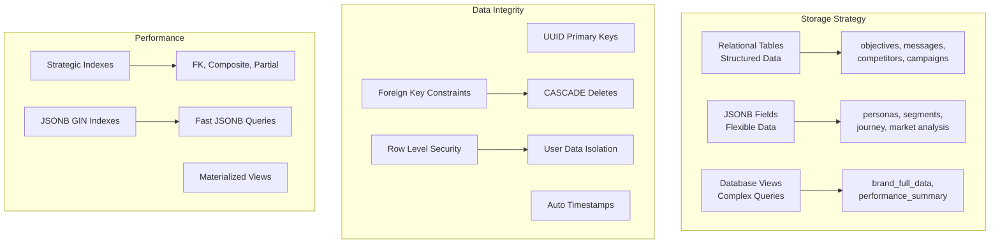
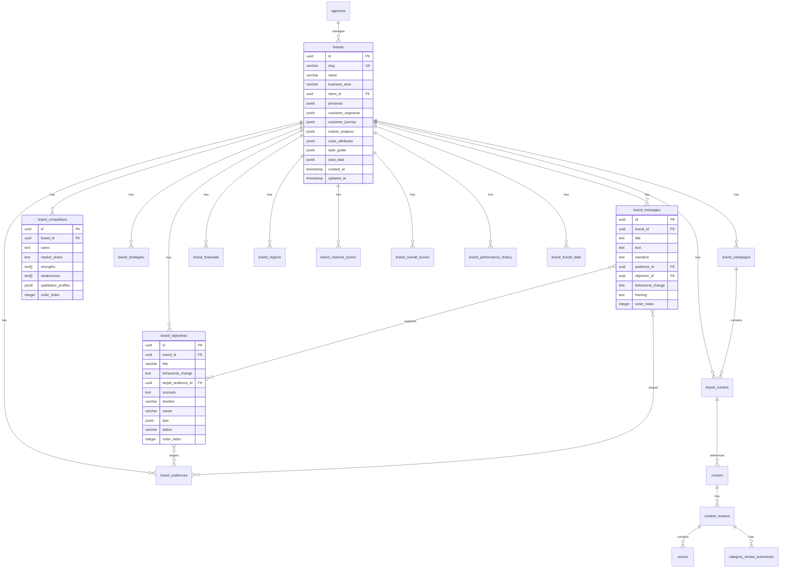
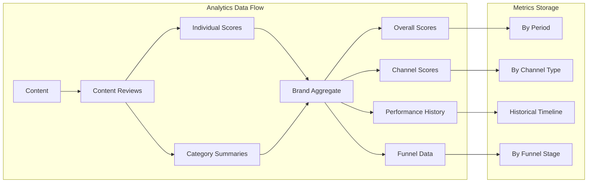
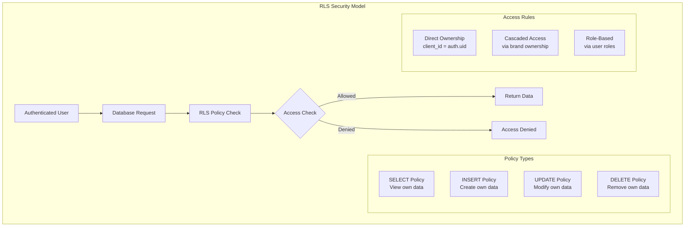

# Database Schema Documentation

## Overview

The Change Influence MVP uses PostgreSQL (via Supabase) with a hybrid approach combining relational tables and JSONB fields for flexibility. This guide documents the complete database schema, relationships, and best practices.

## Schema Design Philosophy



### 1. Hybrid Storage Approach
- **Relational Tables**: For structured data with clear relationships (objectives, messages, competitors)
- **JSONB Fields**: For flexible, nested data structures (personas, segments, market analysis)
- **Views**: For optimized complex queries combining multiple tables

### 2. Data Integrity
- UUID primary keys for all tables
- Foreign key constraints with CASCADE deletes
- Row Level Security (RLS) on all tables
- Automatic timestamps (created_at, updated_at)

### 3. Performance Optimization
- Indexes on foreign keys and commonly queried fields
- Database views for complex joins
- JSONB GIN indexes for efficient queries

## Entity Relationship Diagram



## Core Tables

### 1. `brands` - Central Brand Entity

The main table storing core brand information with JSONB fields for flexible data.

```sql
CREATE TABLE brands (
  -- Primary identification
  id UUID PRIMARY KEY DEFAULT gen_random_uuid(),
  slug VARCHAR(255) NOT NULL UNIQUE,
  name VARCHAR(255) NOT NULL,
  business_area VARCHAR(255),
  client_id UUID REFERENCES auth.users(id),
  
  -- JSONB fields for flexible data structures
  personas JSONB DEFAULT '[]'::jsonb,
  customer_segments JSONB DEFAULT '[]'::jsonb,
  customer_journey JSONB DEFAULT '[]'::jsonb,
  market_analysis JSONB DEFAULT '{}'::jsonb,
  voice_attributes JSONB DEFAULT '[]'::jsonb,
  style_guide JSONB DEFAULT '{}'::jsonb,
  swot_data JSONB DEFAULT '{}'::jsonb,
  
  -- Legacy JSONB fields (being migrated)
  messages JSONB DEFAULT '[]'::jsonb,
  objectives JSONB DEFAULT '[]'::jsonb,
  
  -- Timestamps
  created_at TIMESTAMPTZ DEFAULT NOW(),
  updated_at TIMESTAMPTZ DEFAULT NOW()
);

-- Indexes
CREATE INDEX idx_brands_slug ON brands(slug);
CREATE INDEX idx_brands_client_id ON brands(client_id);
CREATE INDEX idx_brands_personas ON brands USING GIN (personas);
CREATE INDEX idx_brands_customer_segments ON brands USING GIN (customer_segments);
```

#### JSONB Field Structures

##### personas
```typescript
interface Persona {
  id: string;
  name: string;
  description: string;
  goals: string[];
  painPoints: string[];
  decisionCriteria: string[];
  messageReceptivity: number; // 1-10
  behavioralTriggers: string[];
}
```

##### customer_segments
```typescript
interface CustomerSegment {
  id: string;
  name: string;
  size: string;
  growth: string;
  description: string;
  needs: string[];
  behaviors: string[];
  demographics: {
    ageRange: string;
    income: string;
    education: string;
    location: string;
  };
}
```

##### customer_journey
```typescript
interface JourneyStage {
  id: string;
  stage: string;
  touchpoints: string[];
  painPoints: string[];
  opportunities: string[];
  content_needs: string[];
  emotions: string[];
}
```

##### market_analysis
```typescript
interface MarketAnalysis {
  market_size: string;
  growth_rate: string;
  key_trends: string[];
  opportunities: string[];
  threats: string[];
  regulations: string[];
}
```

### 2. Brand Strategy Tables

#### `brand_objectives`
Strategic objectives with audience targeting.

```sql
CREATE TABLE brand_objectives (
  id UUID PRIMARY KEY DEFAULT gen_random_uuid(),
  brand_id UUID REFERENCES brands(id) ON DELETE CASCADE,
  title VARCHAR(255) NOT NULL,
  behavioral_change TEXT,
  target_audience_id UUID REFERENCES brand_audiences(id),
  scenario TEXT,
  timeline VARCHAR(50),
  owner VARCHAR(255),
  kpis JSONB DEFAULT '[]'::jsonb,
  status VARCHAR(50) DEFAULT 'active',
  order_index INTEGER DEFAULT 0,
  created_at TIMESTAMPTZ DEFAULT NOW(),
  updated_at TIMESTAMPTZ DEFAULT NOW()
);
```

#### `brand_messages`
Key brand messages linked to objectives and audiences.

```sql
CREATE TABLE brand_messages (
  id UUID PRIMARY KEY DEFAULT gen_random_uuid(),
  brand_id UUID REFERENCES brands(id) ON DELETE CASCADE,
  title TEXT NOT NULL,
  text TEXT NOT NULL,
  narrative TEXT,
  audience_id UUID REFERENCES brand_audiences(id),
  objective_id UUID REFERENCES brand_objectives(id),
  behavioral_change TEXT,
  framing TEXT,
  order_index INTEGER DEFAULT 0,
  created_at TIMESTAMPTZ DEFAULT NOW(),
  updated_at TIMESTAMPTZ DEFAULT NOW()
);
```

#### `brand_strategies`
High-level strategic approaches.

```sql
CREATE TABLE brand_strategies (
  id UUID PRIMARY KEY DEFAULT gen_random_uuid(),
  brand_id UUID REFERENCES brands(id) ON DELETE CASCADE,
  name VARCHAR(255) NOT NULL,
  description TEXT,
  type VARCHAR(100),
  objectives TEXT[],
  tactics TEXT[],
  metrics JSONB,
  order_index INTEGER DEFAULT 0,
  created_at TIMESTAMPTZ DEFAULT NOW(),
  updated_at TIMESTAMPTZ DEFAULT NOW()
);
```

### 3. Market & Competition Tables

#### `brand_competitors`
Competitor analysis with qualitative profiles.

```sql
CREATE TABLE brand_competitors (
  id UUID PRIMARY KEY DEFAULT gen_random_uuid(),
  brand_id UUID REFERENCES brands(id) ON DELETE CASCADE,
  name TEXT NOT NULL,
  market_share TEXT,
  strengths TEXT[],
  weaknesses TEXT[],
  qualitative_profiles JSONB DEFAULT '{}'::jsonb,
  order_index INTEGER DEFAULT 0,
  created_at TIMESTAMPTZ DEFAULT NOW(),
  updated_at TIMESTAMPTZ DEFAULT NOW()
);
```

#### `brand_audiences`
Target audience definitions.

```sql
CREATE TABLE brand_audiences (
  id UUID PRIMARY KEY DEFAULT gen_random_uuid(),
  brand_id UUID REFERENCES brands(id) ON DELETE CASCADE,
  name VARCHAR(255) NOT NULL,
  description TEXT,
  size VARCHAR(100),
  characteristics JSONB,
  order_index INTEGER DEFAULT 0,
  created_at TIMESTAMPTZ DEFAULT NOW(),
  updated_at TIMESTAMPTZ DEFAULT NOW()
);
```

### 4. Campaign & Content Tables

#### `brand_campaigns`
Marketing campaign management.

```sql
CREATE TABLE brand_campaigns (
  id UUID PRIMARY KEY DEFAULT gen_random_uuid(),
  brand_id UUID REFERENCES brands(id) ON DELETE CASCADE,
  name VARCHAR(255) NOT NULL,
  description TEXT,
  start_date DATE,
  end_date DATE,
  budget DECIMAL(12,2),
  objectives TEXT[],
  channels TEXT[],
  status VARCHAR(50) DEFAULT 'planning',
  created_at TIMESTAMPTZ DEFAULT NOW(),
  updated_at TIMESTAMPTZ DEFAULT NOW()
);
```

#### `brand_content`
Content linked to campaigns.

```sql
CREATE TABLE brand_content (
  id UUID PRIMARY KEY DEFAULT gen_random_uuid(),
  brand_id UUID REFERENCES brands(id) ON DELETE CASCADE,
  campaign_id UUID REFERENCES brand_campaigns(id),
  content_id INTEGER REFERENCES content(id),
  type VARCHAR(100),
  status VARCHAR(50),
  created_at TIMESTAMPTZ DEFAULT NOW()
);
```

#### `content`
Core content repository.

```sql
CREATE TABLE content (
  id SERIAL PRIMARY KEY,
  content_name VARCHAR(255) NOT NULL,
  client_id UUID,
  agency VARCHAR(255),
  type VARCHAR(100),
  format VARCHAR(100),
  audience TEXT,
  campaign_aligned_to TEXT,
  strategy_aligned_to TEXT,
  content_objectives TEXT,
  funnel_alignment VARCHAR(100),
  file_storage_path TEXT,
  bucket_id VARCHAR(255),
  eye_tracking_path TEXT,
  status VARCHAR(50),
  expiry_date DATE,
  created_at TIMESTAMPTZ DEFAULT NOW(),
  updated_at TIMESTAMPTZ DEFAULT NOW()
);
```

### 5. Analytics & Performance Tables



#### `brand_overall_scores`
Aggregate brand performance metrics.

```sql
CREATE TABLE brand_overall_scores (
  id UUID PRIMARY KEY DEFAULT gen_random_uuid(),
  brand_id UUID REFERENCES brands(id) ON DELETE CASCADE,
  score DECIMAL(5,2),
  period DATE,
  metrics JSONB,
  created_at TIMESTAMPTZ DEFAULT NOW()
);
```

#### `brand_channel_scores`
Channel-specific performance.

```sql
CREATE TABLE brand_channel_scores (
  id UUID PRIMARY KEY DEFAULT gen_random_uuid(),
  brand_id UUID REFERENCES brands(id) ON DELETE CASCADE,
  channel VARCHAR(100),
  score DECIMAL(5,2),
  engagement_rate DECIMAL(5,2),
  conversion_rate DECIMAL(5,2),
  reach INTEGER,
  impressions INTEGER,
  created_at TIMESTAMPTZ DEFAULT NOW()
);
```

#### `brand_performance_history`
Historical performance tracking.

```sql
CREATE TABLE brand_performance_history (
  id UUID PRIMARY KEY DEFAULT gen_random_uuid(),
  brand_id UUID REFERENCES brands(id) ON DELETE CASCADE,
  metric_name VARCHAR(255),
  metric_value DECIMAL(10,2),
  period_type VARCHAR(50), -- 'daily', 'weekly', 'monthly'
  period_date DATE,
  category VARCHAR(100),
  metadata JSONB,
  created_at TIMESTAMPTZ DEFAULT NOW()
);
```

#### `brand_funnel_data`
Conversion funnel metrics.

```sql
CREATE TABLE brand_funnel_data (
  id UUID PRIMARY KEY DEFAULT gen_random_uuid(),
  brand_id UUID REFERENCES brands(id) ON DELETE CASCADE,
  stage VARCHAR(100),
  value INTEGER,
  conversion_rate DECIMAL(5,2),
  drop_off_rate DECIMAL(5,2),
  average_time_in_stage INTERVAL,
  created_at TIMESTAMPTZ DEFAULT NOW()
);
```

### 6. Financial & Regional Tables

#### `brand_financials`
Financial metrics and targets.

```sql
CREATE TABLE brand_financials (
  id UUID PRIMARY KEY DEFAULT gen_random_uuid(),
  brand_id UUID REFERENCES brands(id) ON DELETE CASCADE UNIQUE,
  annual_sales DECIMAL(15,2),
  target_sales DECIMAL(15,2),
  growth_percentage DECIMAL(5,2),
  market_cap DECIMAL(15,2),
  fiscal_year INTEGER,
  created_at TIMESTAMPTZ DEFAULT NOW(),
  updated_at TIMESTAMPTZ DEFAULT NOW()
);
```

#### `brand_regions`
Regional presence and data.

```sql
CREATE TABLE brand_regions (
  id UUID PRIMARY KEY DEFAULT gen_random_uuid(),
  brand_id UUID REFERENCES brands(id) ON DELETE CASCADE,
  region VARCHAR(100) NOT NULL,
  is_primary BOOLEAN DEFAULT FALSE,
  market_share DECIMAL(5,2),
  created_at TIMESTAMPTZ DEFAULT NOW()
);
```

### 7. Content Review & Scoring Tables

#### `content_reviews`
Review metadata for content pieces.

```sql
CREATE TABLE content_reviews (
  id SERIAL PRIMARY KEY,
  content_id INTEGER REFERENCES content(id),
  client_id UUID,
  reviewer_stage VARCHAR(100),
  overall_score DECIMAL(3,1),
  confidence INTEGER,
  overall_comments TEXT,
  notes TEXT,
  reviewed_at TIMESTAMPTZ DEFAULT NOW(),
  updated_at TIMESTAMPTZ DEFAULT NOW()
);
```

#### `scores`
Individual check scores.

```sql
CREATE TABLE scores (
  id SERIAL PRIMARY KEY,
  content_review_id INTEGER REFERENCES content_reviews(id),
  check_id INTEGER REFERENCES checks(check_id),
  check_name VARCHAR(255),
  score_value DECIMAL(3,1),
  confidence INTEGER,
  comments TEXT,
  fix_recommendation TEXT,
  client_id UUID,
  created_at TIMESTAMPTZ DEFAULT NOW(),
  updated_at TIMESTAMPTZ DEFAULT NOW()
);
```

#### `category_review_summaries`
Aggregated scores by category.

```sql
CREATE TABLE category_review_summaries (
  id SERIAL PRIMARY KEY,
  content_review_id INTEGER REFERENCES content_reviews(id),
  category_name VARCHAR(255),
  num_checks INTEGER,
  check_details TEXT,
  summary_comment TEXT,
  client_id UUID,
  created_at TIMESTAMPTZ DEFAULT NOW(),
  updated_at TIMESTAMPTZ DEFAULT NOW()
);
```

### 8. Supporting Tables

#### `agencies`
Agency management.

```sql
CREATE TABLE agencies (
  id UUID PRIMARY KEY DEFAULT gen_random_uuid(),
  name VARCHAR(255) NOT NULL UNIQUE,
  contact_email VARCHAR(255),
  contact_phone VARCHAR(50),
  website VARCHAR(255),
  created_at TIMESTAMPTZ DEFAULT NOW()
);
```

#### `content_formats`
Available content formats.

```sql
CREATE TABLE content_formats (
  id UUID PRIMARY KEY DEFAULT gen_random_uuid(),
  name VARCHAR(100) NOT NULL UNIQUE,
  category VARCHAR(100),
  description TEXT,
  created_at TIMESTAMPTZ DEFAULT NOW()
);
```

#### `content_types`
Content type definitions.

```sql
CREATE TABLE content_types (
  id UUID PRIMARY KEY DEFAULT gen_random_uuid(),
  name VARCHAR(100) NOT NULL UNIQUE,
  description TEXT,
  created_at TIMESTAMPTZ DEFAULT NOW()
);
```

## Database Views

### `brand_full_data`
Comprehensive view combining all brand-related data.

```sql
CREATE VIEW brand_full_data AS
SELECT 
  b.*,
  -- Aggregate related data
  COALESCE(
    json_agg(DISTINCT 
      jsonb_build_object(
        'id', bo.id,
        'title', bo.title,
        'behavioral_change', bo.behavioral_change,
        'target_audience_id', bo.target_audience_id,
        'status', bo.status
      )
    ) FILTER (WHERE bo.id IS NOT NULL), 
    '[]'::json
  ) as objectives,
  
  COALESCE(
    json_agg(DISTINCT 
      jsonb_build_object(
        'id', bm.id,
        'title', bm.title,
        'text', bm.text,
        'audience_id', bm.audience_id,
        'objective_id', bm.objective_id
      )
    ) FILTER (WHERE bm.id IS NOT NULL), 
    '[]'::json
  ) as messages,
  
  COALESCE(
    json_agg(DISTINCT 
      jsonb_build_object(
        'id', bc.id,
        'name', bc.name,
        'market_share', bc.market_share,
        'strengths', bc.strengths,
        'weaknesses', bc.weaknesses
      )
    ) FILTER (WHERE bc.id IS NOT NULL), 
    '[]'::json
  ) as competitors,
  
  -- Latest scores
  bos.score as overall_score,
  bos.period as score_period
  
FROM brands b
LEFT JOIN brand_objectives bo ON b.id = bo.brand_id
LEFT JOIN brand_messages bm ON b.id = bm.brand_id
LEFT JOIN brand_competitors bc ON b.id = bc.brand_id
LEFT JOIN LATERAL (
  SELECT score, period 
  FROM brand_overall_scores 
  WHERE brand_id = b.id 
  ORDER BY period DESC 
  LIMIT 1
) bos ON true
GROUP BY b.id, bos.score, bos.period;
```

## Row Level Security (RLS)



### RLS Policies

All tables implement RLS to ensure users can only access their own data.

```sql
-- Enable RLS on all tables
ALTER TABLE brands ENABLE ROW LEVEL SECURITY;
ALTER TABLE brand_objectives ENABLE ROW LEVEL SECURITY;
-- ... (all other tables)

-- Brands table policies
CREATE POLICY "Users can view own brands" ON brands
  FOR SELECT USING (client_id = auth.uid());

CREATE POLICY "Users can insert own brands" ON brands
  FOR INSERT WITH CHECK (client_id = auth.uid());

CREATE POLICY "Users can update own brands" ON brands
  FOR UPDATE USING (client_id = auth.uid());

CREATE POLICY "Users can delete own brands" ON brands
  FOR DELETE USING (client_id = auth.uid());

-- Cascade policies for related tables
CREATE POLICY "Users can manage brand objectives" ON brand_objectives
  FOR ALL USING (
    brand_id IN (
      SELECT id FROM brands WHERE client_id = auth.uid()
    )
  );
```

## Migration Best Practices

### 1. Schema Changes
```sql
-- Always use migrations for schema changes
-- Example: Adding a new column
ALTER TABLE brands 
ADD COLUMN IF NOT EXISTS industry VARCHAR(255);

-- Add comment for documentation
COMMENT ON COLUMN brands.industry IS 'Primary industry classification';
```

### 2. Data Migrations
```sql
-- Use transactions for data migrations
BEGIN;
  -- Migrate data from JSONB to relational table
  INSERT INTO brand_objectives (brand_id, title, behavioral_change)
  SELECT 
    id as brand_id,
    obj->>'title' as title,
    obj->>'behavioralChange' as behavioral_change
  FROM brands, 
  LATERAL jsonb_array_elements(objectives) as obj
  WHERE objectives IS NOT NULL;
  
  -- Clear JSONB field after migration
  UPDATE brands SET objectives = '[]'::jsonb;
COMMIT;
```

### 3. Index Management
```sql
-- Create indexes for performance
CREATE INDEX CONCURRENTLY idx_brand_messages_brand_id 
  ON brand_messages(brand_id);

-- Partial indexes for filtered queries
CREATE INDEX idx_active_objectives 
  ON brand_objectives(brand_id) 
  WHERE status = 'active';
```

## Query Patterns

### 1. Fetching Brand with Related Data
```sql
-- Using the view
SELECT * FROM brand_full_data WHERE id = $1;

-- Manual joins (more control)
SELECT 
  b.*,
  array_agg(DISTINCT bo.*) as objectives,
  array_agg(DISTINCT bm.*) as messages
FROM brands b
LEFT JOIN brand_objectives bo ON b.id = bo.brand_id
LEFT JOIN brand_messages bm ON b.id = bm.brand_id
WHERE b.id = $1
GROUP BY b.id;
```

### 2. JSONB Queries
```sql
-- Query personas by characteristics
SELECT * FROM brands
WHERE personas @> '[{"messageReceptivity": 8}]';

-- Extract specific fields
SELECT 
  id,
  name,
  jsonb_array_elements(personas)->>'name' as persona_name
FROM brands;
```

### 3. Performance Queries
```sql
-- Get latest performance across channels
SELECT 
  b.name,
  bcs.channel,
  bcs.score,
  bcs.engagement_rate
FROM brands b
JOIN brand_channel_scores bcs ON b.id = bcs.brand_id
WHERE b.id = $1
ORDER BY bcs.created_at DESC;
```

## Performance Optimization

### 1. Indexing Strategy
- Primary keys automatically indexed
- Foreign keys should be indexed
- JSONB fields use GIN indexes
- Composite indexes for common query patterns

### 2. Query Optimization
- Use views for complex repeated queries
- Leverage LATERAL joins for correlated subqueries
- Use CTEs for readability in complex queries
- Monitor slow queries with pg_stat_statements

### 3. Data Archival
- Partition large tables by date (performance_history)
- Archive old data to separate tables
- Use table inheritance for partitioning

## Backup & Recovery

### 1. Backup Strategy
- Supabase handles automatic backups
- Point-in-time recovery available
- Regular exports for critical data

### 2. Data Validation
```sql
-- Ensure data integrity
ALTER TABLE brand_objectives
ADD CONSTRAINT chk_timeline CHECK (
  timeline IN ('short-term', 'medium-term', 'long-term')
);

-- Validate JSONB structure
ALTER TABLE brands
ADD CONSTRAINT chk_personas_structure CHECK (
  jsonb_typeof(personas) = 'array'
);
```

## Future Considerations

### 1. Planned Migrations
- Move remaining JSONB fields to relational tables where appropriate
- Implement soft deletes with `deleted_at` timestamps
- Add audit trails for compliance

### 2. Performance Enhancements
- Materialized views for complex aggregations
- Redis caching layer for frequently accessed data
- Read replicas for analytics queries

### 3. Schema Evolution
- Version control for database schema
- Automated migration testing
- Zero-downtime migration strategies