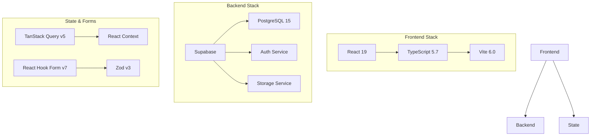
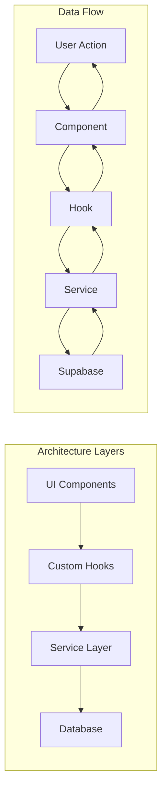
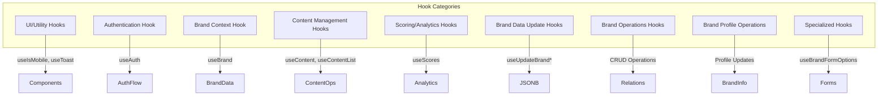
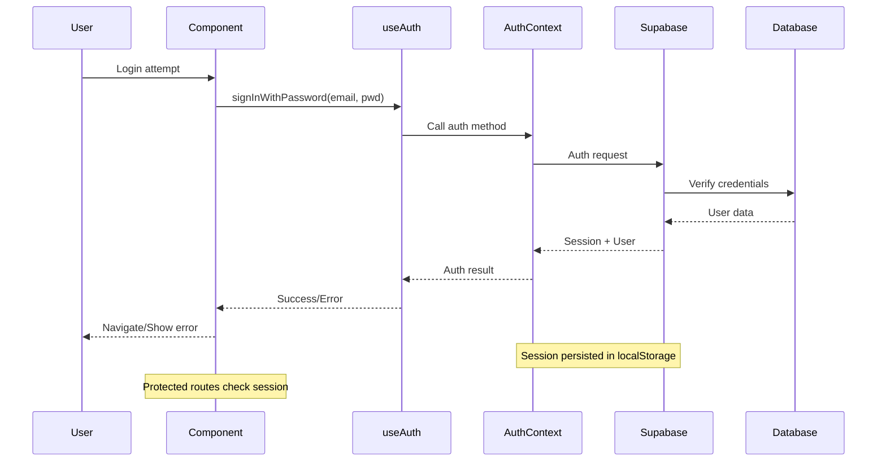
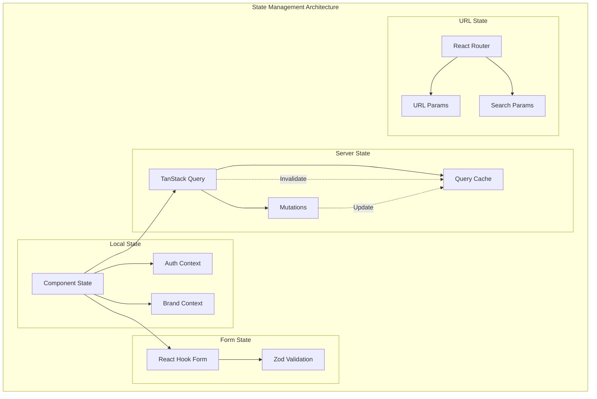
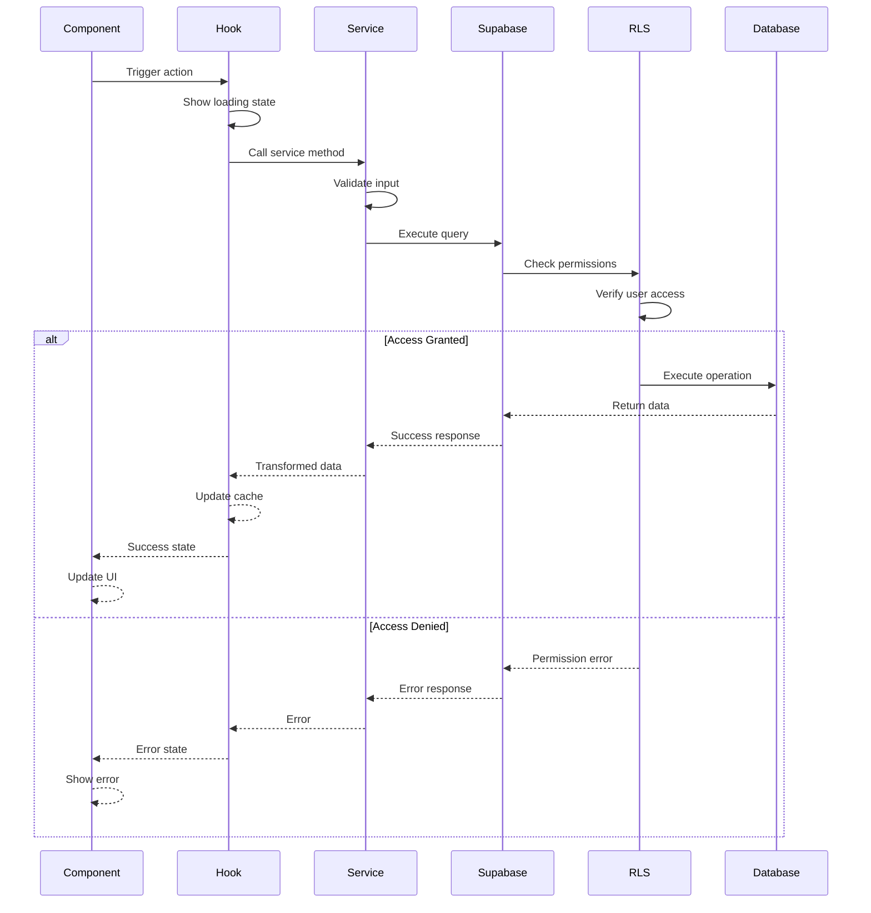

# Change Influence MVP Dashboard - Developer Guide

## Table of Contents

1. [Introduction](#introduction)
2. [Architecture Overview](#architecture-overview)
3. [Hooks Documentation](#hooks-documentation)
4. [Service Layer Documentation](#service-layer-documentation)
5. [Component Architecture](#component-architecture)
6. [Authentication & Security](#authentication--security)
7. [State Management](#state-management)
8. [Database Schema](#database-schema)
9. [API Patterns & Data Flow](#api-patterns--data-flow)
10. [Development Workflow](#development-workflow)
11. [Testing Strategy](#testing-strategy)
12. [Deployment Guide](#deployment-guide)

---

## Introduction

The Change Influence MVP Dashboard is a comprehensive content management and analytics platform built with modern web technologies. This guide provides detailed documentation for developers working on the codebase.

### Tech Stack Overview
- **Frontend**: React 19 + TypeScript 5.7 + Vite 6.0
- **Backend**: Supabase (PostgreSQL 15 + Auth + Storage)
- **Styling**: Tailwind CSS v4 + shadcn/ui
- **State Management**: TanStack Query v5 + React Context
- **Forms**: React Hook Form v7 + Zod v3
- **Routing**: React Router v6



---

## Architecture Overview

The application follows a hybrid architectural pattern combining feature-based and layer-based organization:

```
src/
├── components/          # UI components
├── contexts/           # React Context providers
├── hooks/              # Custom React hooks
├── lib/                # Utilities and Supabase client
├── pages/              # Route page components
├── services/           # API service layer
├── types/              # TypeScript definitions
└── utils/              # Utility functions
```

### Key Principles
1. **Separation of Concerns**: Business logic in services, UI logic in components
2. **Type Safety**: Comprehensive TypeScript usage throughout
3. **Performance**: Lazy loading, optimized queries, and caching
4. **Security**: Row-level security, input validation, and secure auth



---

## Hooks Documentation

### Overview
The application uses 40+ custom hooks organized into categories for different functionality areas. All hooks follow consistent patterns and integrate with TanStack Query for optimal performance.

### Hook Categories



#### 1. UI/Utility Hooks

##### `useIsMobile()`
**Location**: `/src/hooks/use-mobile.ts`  
**Purpose**: Detects mobile viewport for responsive design  
**Usage**:
```typescript
const isMobile = useIsMobile();
if (isMobile) {
  // Render mobile-specific UI
}
```

##### `useToast()`
**Location**: `/src/hooks/use-toast.ts`  
**Purpose**: Toast notifications using Sonner  
**Usage**:
```typescript
const { toast } = useToast();
toast({
  title: "Success",
  description: "Operation completed",
  variant: "default" // or "destructive"
});
```

#### 2. Authentication Hook

##### `useAuth()`
**Location**: `/src/hooks/useAuth.tsx`  
**Purpose**: Central authentication management  
**Returns**:
```typescript
interface AuthHook {
  session: Session | null;
  user: User | null;
  loading: boolean;
  emailVerified: boolean;
  signOut: () => Promise<void>;
  signInWithPassword: (email: string, password: string) => Promise<AuthResponse>;
  signUp: (email: string, password: string) => Promise<AuthResponse>;
  resetPassword: (email: string) => Promise<void>;
  updatePassword: (newPassword: string) => Promise<void>;
}
```
**Usage**:
```typescript
const { user, signOut } = useAuth();
```

#### 3. Brand Context Hook

##### `useBrand()`
**Location**: `/src/contexts/BrandContext.tsx`  
**Purpose**: Access brand context and data  
**Returns**:
```typescript
interface BrandContext {
  selectedBrand: Brand | null;
  selectedRegion: string | null;
  getBrandData: () => BrandData | null;
}
```

#### 4. Content Management Hooks

##### `useContent()`
**Location**: `/src/hooks/useContent.ts`  
**Purpose**: Comprehensive content management  
**Returns**:
```typescript
{
  useContentQuery: (id: string) => QueryResult<Content>;
  useAllContentQuery: (filters?: ContentFilters) => QueryResult<Content[]>;
  useProcessedContentQuery: (limit?: number) => QueryResult<ProcessedContent[]>;
  useUploadContentMutation: () => MutationResult;
  useDeleteContentMutation: () => MutationResult;
}
```

##### `useContentList()` & `useContentDetail()`
**Purpose**: Standalone content fetching hooks  
**Usage**:
```typescript
const { data: contents, isLoading } = useContentList();
const { data: content } = useContentDetail(contentId);
```

#### 5. Scoring/Analytics Hooks

##### `useScores()`
**Location**: `/src/hooks/useScores.ts`  
**Purpose**: Fetch content scores  
**Usage**:
```typescript
const { data: scores, isLoading } = useScores(contentId);
```

##### `useCategoryReviewSummaries()`
**Purpose**: Get category score averages  
**Usage**:
```typescript
const { data: summaries } = useCategoryReviewSummaries(contentId);
```

#### 6. Brand Data Update Hooks

These hooks handle bulk updates for JSONB fields:

##### JSONB Field Update Hooks
- `useUpdateBrandPersonas()` - Update brand personas
- `useUpdateBrandCustomerSegments()` - Update customer segments
- `useUpdateBrandCustomerJourney()` - Update journey data
- `useUpdateBrandMarketAnalysis()` - Update market analysis
- `useUpdateBrandSwot()` - Update SWOT analysis

**Common Pattern**:
```typescript
const updatePersonas = useUpdateBrandPersonas();
await updatePersonas.mutateAsync({
  brandId: "123",
  personas: [{ id: "1", name: "Tech Enthusiast", ... }]
});
```

#### 7. Brand Operations Hooks (Safe CRUD)

These hooks provide atomic operations to avoid data loss:

##### Message Operations
**Location**: `/src/hooks/useBrandMessageOperations.ts`
- `useAddBrandMessage()` - Add single message
- `useUpdateBrandMessage()` - Update single message
- `useDeleteBrandMessage()` - Delete single message
- `useSafeBatchUpdateMessages()` - Safe bulk update

**Usage Example**:
```typescript
const addMessage = useAddBrandMessage();
const updateMessage = useUpdateBrandMessage();
const deleteMessage = useDeleteBrandMessage();

// Add new message
await addMessage.mutateAsync({
  brandId: "123",
  message: { content: "New message", audience_ids: ["1", "2"] }
});

// Update existing
await updateMessage.mutateAsync({
  messageId: "msg-1",
  updates: { content: "Updated message" }
});

// Delete
await deleteMessage.mutateAsync("msg-1");
```

##### Objective Operations
**Location**: `/src/hooks/useBrandObjectiveOperations.ts`
- Similar pattern to messages with add/update/delete/batch operations

##### Competitor Operations
**Location**: `/src/hooks/useBrandCompetitorOperations.ts`
- Standard CRUD operations plus:
- `useUpdateCompetitorQualitativeProfile()` - Update qualitative data
- `useAddCharacteristicToAllCompetitors()` - Bulk characteristic addition

#### 8. Brand Profile Operations

##### `useBrandProfileOperations`
**Location**: `/src/hooks/useBrandProfileOperations.ts`
- `useUpdateBrandBasicInfo()` - Name, business area, region
- `useUpdateBrandFinancials()` - Revenue, growth metrics
- `useUpdateBrandVoiceAttributes()` - Brand voice characteristics

**Usage**:
```typescript
const updateBasicInfo = useUpdateBrandBasicInfo();
await updateBasicInfo.mutateAsync({
  brandId: "123",
  updates: { name: "New Brand Name", business_area: "Technology" }
});
```

#### 9. Specialized Hooks

##### `useBrandFormOptions()`
**Purpose**: Provides dropdown options from brand data  
**Returns**:
```typescript
{
  campaignOptions: SelectOption[];
  audienceOptions: SelectOption[];
  strategyOptions: SelectOption[];
  objectiveOptions: SelectOption[];
  agencyOptions: SelectOption[];
  funnelAlignmentOptions: SelectOption[];
  formatOptions: SelectOption[];
  typeOptions: SelectOption[];
}
```

### Hook Best Practices

1. **Always handle loading and error states**:
```typescript
const { data, isLoading, error } = useScores(contentId);
if (isLoading) return <LoadingSpinner />;
if (error) return <ErrorDisplay error={error} />;
```

2. **Use optimistic updates for better UX**:
```typescript
const updateMessage = useUpdateBrandMessage();
updateMessage.mutate(data, {
  onSuccess: () => {
    queryClient.invalidateQueries(['brand', brandId]);
  }
});
```

3. **Leverage TanStack Query features**:
- Automatic retries
- Background refetching
- Cache management
- Query invalidation

4. **Follow naming conventions**:
- `use[Entity]` for general hooks
- `useUpdate[Entity]` for updates
- `use[Add/Update/Delete][Entity]` for CRUD

---

## Service Layer Documentation

### Overview
The service layer provides a clean abstraction over Supabase operations, ensuring consistent error handling, type safety, and business logic encapsulation.

### Core Services

#### 1. Brand Service (`brandService.ts`)
The most comprehensive service with 40+ methods for brand management.

##### Core Methods

###### Brand CRUD
```typescript
// Fetch brand with all related data
getBrand(brandId: string): Promise<BrandData>

// Get all brands for a user
getBrands(): Promise<Brand[]>

// Create new brand
createBrand(brand: Partial<Brand>): Promise<Brand>

// Update brand fields
updateBrand(brandId: string, updates: Partial<Brand>): Promise<void>

// Delete brand (cascades to all related data)
deleteBrand(brandId: string): Promise<void>
```

###### Brand Profile Operations
```typescript
// Update basic information
updateBrandBasicInfo(brandId: string, updates: {
  name?: string;
  business_area?: string;
  region?: string;
}): Promise<void>

// Update financial data
updateBrandFinancials(brandId: string, financials: {
  revenue?: number;
  growth_rate?: number;
  market_cap?: number;
}): Promise<void>

// Update voice attributes
updateBrandVoiceAttributes(brandId: string, attributes: VoiceAttribute[]): Promise<void>
```

###### JSONB Field Updates (Safe)
```typescript
// Direct updates to JSONB fields - atomic operations
updateBrandPersonas(brandId: string, personas: Persona[]): Promise<void>
updateBrandCustomerSegments(brandId: string, segments: CustomerSegment[]): Promise<void>
updateBrandCustomerJourney(brandId: string, journey: JourneyStage[]): Promise<void>
updateBrandMarketAnalysis(brandId: string, analysis: MarketAnalysis): Promise<void>
updateBrandSwot(brandId: string, swot: SwotAnalysis): Promise<void>
```

###### Relational Table Operations (Individual)
```typescript
// Messages
addBrandMessage(brandId: string, message: BrandMessage): Promise<void>
updateBrandMessage(messageId: string, updates: Partial<BrandMessage>): Promise<void>
deleteBrandMessage(messageId: string): Promise<void>

// Objectives
addBrandObjective(brandId: string, objective: BrandObjective): Promise<void>
updateBrandObjective(objectiveId: string, updates: Partial<BrandObjective>): Promise<void>
deleteBrandObjective(objectiveId: string): Promise<void>

// Competitors
addBrandCompetitor(brandId: string, competitor: BrandCompetitor): Promise<void>
updateBrandCompetitor(competitorId: string, updates: Partial<BrandCompetitor>): Promise<void>
deleteBrandCompetitor(competitorId: string): Promise<void>
updateCompetitorQualitativeProfile(competitorId: string, profile: QualitativeProfile): Promise<void>
```

###### Batch Operations (Safe)
```typescript
// Safe batch update that compares existing vs new data
safeBatchUpdateMessages(brandId: string, messages: BrandMessage[]): Promise<void>
safeBatchUpdateObjectives(brandId: string, objectives: BrandObjective[]): Promise<void>
safeBatchUpdateCompetitors(brandId: string, competitors: BrandCompetitor[]): Promise<void>
```

###### Analytics & Scoring
```typescript
// Get brand performance metrics
getBrandPerformanceHistory(brandId: string): Promise<PerformanceMetric[]>
getBrandChannelScores(brandId: string): Promise<ChannelScore[]>
getBrandFunnelData(brandId: string): Promise<FunnelData[]>
getBrandOverallScores(brandId: string): Promise<OverallScore>
```

#### 2. Content Service (`contentService.ts`)

##### Core Methods
```typescript
// Fetch all content
getAllContent(filters?: ContentFilters): Promise<Content[]>

// Get single content item
getContent(contentId: string): Promise<Content>

// Create content
createContent(content: Partial<Content>): Promise<Content>

// Update content
updateContent(contentId: string, updates: Partial<Content>): Promise<void>

// Delete content
deleteContent(contentId: string): Promise<void>

// Get processed content
getProcessedContent(limit?: number): Promise<ProcessedContent[]>
```

#### 3. Upload Service (`uploadService.ts`)

##### Core Methods
```typescript
// Upload file to Supabase storage
uploadFile(file: File, bucket: string = 'content'): Promise<{
  path: string;
  url: string;
}>

// Delete file from storage
deleteFile(path: string, bucket: string = 'content'): Promise<void>

// Get public URL for file
getPublicUrl(path: string, bucket: string = 'content'): string
```

#### 4. Score Service (`scoreService.ts`)

##### Core Methods
```typescript
// Get scores for content
getScoresByContent(contentId: string): Promise<Score[]>

// Get category summaries
getCategoryReviewSummaries(contentId: string): Promise<CategorySummary[]>

// Calculate aggregate scores
calculateOverallScore(scores: Score[]): number

// Get check details
getCheckDetails(checkId: string): Promise<CheckDetail>
```

#### 5. Export Service (`exportService.ts`)

##### Core Methods
```typescript
// Export brand data as PDF
exportBrandPDF(brandData: BrandData): Promise<Blob>

// Export brand data as PowerPoint
exportBrandPowerPoint(brandData: BrandData): Promise<Blob>

// Export content report
exportContentReport(content: Content, scores: Score[]): Promise<Blob>
```

### Service Layer Best Practices

1. **Error Handling**:
```typescript
async getBrand(brandId: string): Promise<BrandData> {
  try {
    const { data, error } = await supabase
      .from('brand_full_data')
      .select('*')
      .eq('id', brandId)
      .single();
    
    if (error) throw error;
    return transformToBrandData(data);
  } catch (error) {
    console.error('Error fetching brand:', error);
    throw new Error('Failed to fetch brand data');
  }
}
```

2. **Type Safety**:
- Use generated Supabase types
- Define clear interfaces for parameters and returns
- Validate inputs with Zod when needed

3. **Consistent Patterns**:
- All methods should be async/await
- Return meaningful error messages
- Use transactions for related operations

4. **Performance Optimization**:
- Use database views for complex queries
- Implement proper indexing
- Batch operations when possible

---

## Component Architecture

### Overview
Components are organized by feature and responsibility, following React best practices and composition patterns.

### Component Categories

#### 1. Layout Components
**Location**: `/src/components/layout/`

##### `DashboardLayout`
- Main application layout wrapper
- Handles sidebar, header, and content area
- Manages responsive behavior

##### `AppSidebar`
- Navigation menu component
- Brand switcher integration
- Collapsible on mobile

#### 2. Common Components
**Location**: `/src/components/common/`

##### `LoadingSpinner`
- Consistent loading state indicator
- Props: `size`, `className`

##### `ErrorDisplay`
- Error boundary and error state component
- Props: `error`, `retry`, `className`

##### `EmptyState`
- Placeholder for empty data states
- Props: `title`, `description`, `action`

#### 3. UI Components (shadcn/ui)
**Location**: `/src/components/ui/`

50+ reusable UI components including:
- `Button`, `Input`, `Select`, `Textarea`
- `Card`, `Dialog`, `Sheet`, `Tabs`
- `Table`, `Form`, `Toast`
- All components are customizable and follow design system

#### 4. Feature Components
**Location**: `/src/components/views/`

Organized by business domain:

##### Brand Dashboard Components
```
brand-dashboard/
├── BrandOverview.tsx
├── BrandMetrics.tsx
├── ChannelPerformance.tsx
└── ContentEffectiveness.tsx
```

##### Brand Strategy Components
```
brand-strategy/
├── StrategicObjectives.tsx
├── BrandMessages.tsx
├── CustomerAnalysis.tsx
├── MarketAnalysis.tsx
└── CompetitorAnalysis.tsx
```

##### Campaign Planner Components
```
campaign-planner/
├── CampaignList.tsx
├── CampaignForm.tsx
├── CampaignCalendar.tsx
└── CampaignMetrics.tsx
```

### Component Patterns

#### 1. Composition Pattern
```typescript
// Parent component composes children
function BrandDashboard() {
  return (
    <DashboardLayout>
      <BrandOverview />
      <div className="grid grid-cols-2 gap-4">
        <BrandMetrics />
        <ChannelPerformance />
      </div>
    </DashboardLayout>
  );
}
```

#### 2. Container/Presenter Pattern
```typescript
// Container handles data
function BrandMetricsContainer() {
  const { data, isLoading } = useBrandMetrics();
  return <BrandMetricsView data={data} loading={isLoading} />;
}

// Presenter handles UI
function BrandMetricsView({ data, loading }) {
  // Pure presentation logic
}
```

#### 3. Compound Components
```typescript
// Related components work together
<Form>
  <Form.Field name="email">
    <Form.Label>Email</Form.Label>
    <Form.Input type="email" />
    <Form.Error />
  </Form.Field>
</Form>
```

### Component Best Practices

1. **Keep components focused** - Single responsibility principle
2. **Use TypeScript interfaces** for props
3. **Implement proper loading states**
4. **Handle errors gracefully**
5. **Make components reusable** when it makes sense
6. **Follow naming conventions** - PascalCase for components
7. **Co-locate related files** - styles, tests, types

---

## Authentication & Security

### Authentication Flow



#### 1. Supabase Auth Setup
```typescript
// lib/supabase.ts
export const supabase = createClient(
  import.meta.env.VITE_SUPABASE_URL,
  import.meta.env.VITE_SUPABASE_ANON_KEY
);
```

#### 2. Auth Context Provider
```typescript
// contexts/AuthContext.tsx
const AuthProvider = ({ children }) => {
  // Manages auth state
  // Sets up auth listeners
  // Provides auth methods
};
```

#### 3. Protected Routes
```typescript
// components/ProtectedRoute.tsx
function ProtectedRoute({ children }) {
  const { user, loading } = useAuth();
  
  if (loading) return <LoadingSpinner />;
  if (!user) return <Navigate to="/login" />;
  
  return children;
}
```

### Security Best Practices

#### 1. Row Level Security (RLS)
All database tables have RLS policies:
```sql
-- Example: Users can only see their own brands
CREATE POLICY "Users can view own brands" ON brands
  FOR SELECT USING (auth.uid() = user_id);
```

#### 2. Input Validation
All user inputs validated with Zod:
```typescript
const brandSchema = z.object({
  name: z.string().min(1).max(100),
  business_area: z.string().optional(),
  region: z.string().optional()
});
```

#### 3. API Security
- Never expose service role key
- Use anon key with RLS
- Validate all inputs server-side
- Sanitize user-generated content

#### 4. Environment Variables
```env
VITE_SUPABASE_URL=your_url        # Safe to expose
VITE_SUPABASE_ANON_KEY=your_key   # Safe to expose
SUPABASE_SERVICE_KEY=secret        # NEVER expose
```

---

## State Management

### Overview
The application uses a hybrid approach with TanStack Query for server state and React Context for local state.



### Server State (TanStack Query)

#### Query Client Setup
```typescript
// main.tsx
const queryClient = new QueryClient({
  defaultOptions: {
    queries: {
      staleTime: 5 * 60 * 1000, // 5 minutes
      cacheTime: 10 * 60 * 1000, // 10 minutes
      retry: 3,
      refetchOnWindowFocus: false
    }
  }
});
```

#### Query Keys Pattern
```typescript
// Consistent query key structure
['brand', brandId]                    // Single brand
['brands']                           // All brands
['content', contentId]               // Single content
['content', 'all', filters]          // Filtered content
['scores', 'byContent', contentId]   // Content scores
```

#### Mutations with Optimistic Updates
```typescript
const updateBrand = useMutation({
  mutationFn: (data) => brandService.updateBrand(data),
  onMutate: async (newData) => {
    // Cancel queries
    await queryClient.cancelQueries(['brand', brandId]);
    
    // Snapshot previous value
    const previous = queryClient.getQueryData(['brand', brandId]);
    
    // Optimistically update
    queryClient.setQueryData(['brand', brandId], newData);
    
    return { previous };
  },
  onError: (err, newData, context) => {
    // Rollback on error
    queryClient.setQueryData(['brand', brandId], context.previous);
  },
  onSettled: () => {
    // Always refetch after error or success
    queryClient.invalidateQueries(['brand', brandId]);
  }
});
```

### Local State (React Context)

#### Auth Context
```typescript
interface AuthContextValue {
  session: Session | null;
  user: User | null;
  loading: boolean;
  // ... auth methods
}
```

#### Brand Context
```typescript
interface BrandContextValue {
  selectedBrand: Brand | null;
  selectedRegion: string | null;
  getBrandData: () => BrandData | null;
}
```

### State Management Best Practices

1. **Server State**: Always use TanStack Query
2. **UI State**: Use local component state
3. **Global UI State**: Use Context sparingly
4. **Form State**: Use React Hook Form
5. **URL State**: Use React Router params/search

---

## Database Schema

### Overview
PostgreSQL database with a mix of relational tables and JSONB fields for flexibility.

### Core Tables

#### 1. `brands`
Primary brand table with JSONB fields for flexible data:
```sql
CREATE TABLE brands (
  id UUID PRIMARY KEY DEFAULT gen_random_uuid(),
  name VARCHAR(255) NOT NULL,
  user_id UUID REFERENCES auth.users(id),
  business_area VARCHAR(255),
  region VARCHAR(100),
  
  -- JSONB fields for flexible data
  personas JSONB,
  customer_segments JSONB,
  customer_journey JSONB,
  market_analysis JSONB,
  voice_attributes JSONB,
  
  -- Timestamps
  created_at TIMESTAMPTZ DEFAULT NOW(),
  updated_at TIMESTAMPTZ DEFAULT NOW()
);
```

#### 2. Relational Tables
```sql
-- Strategic objectives
CREATE TABLE brand_objectives (
  id UUID PRIMARY KEY,
  brand_id UUID REFERENCES brands(id) ON DELETE CASCADE,
  objective TEXT NOT NULL,
  description TEXT,
  audience_ids TEXT[],
  order_index INTEGER
);

-- Brand messages
CREATE TABLE brand_messages (
  id UUID PRIMARY KEY,
  brand_id UUID REFERENCES brands(id) ON DELETE CASCADE,
  message TEXT NOT NULL,
  objective_ids TEXT[],
  audience_ids TEXT[],
  order_index INTEGER
);

-- Competitors
CREATE TABLE brand_competitors (
  id UUID PRIMARY KEY,
  brand_id UUID REFERENCES brands(id) ON DELETE CASCADE,
  name VARCHAR(255) NOT NULL,
  description TEXT,
  strengths TEXT[],
  weaknesses TEXT[],
  market_position VARCHAR(100),
  qualitative_profile JSONB
);
```

#### 3. Content Tables
```sql
CREATE TABLE content (
  id UUID PRIMARY KEY,
  brand_id UUID REFERENCES brands(id),
  campaign_id UUID REFERENCES brand_campaigns(id),
  title VARCHAR(255),
  type VARCHAR(100),
  format VARCHAR(100),
  file_path TEXT,
  processed BOOLEAN DEFAULT FALSE,
  metadata JSONB
);
```

#### 4. Analytics Tables
```sql
-- Overall brand scores
CREATE TABLE brand_overall_scores (
  id UUID PRIMARY KEY,
  brand_id UUID REFERENCES brands(id),
  score DECIMAL(5,2),
  period DATE,
  metrics JSONB
);

-- Channel-specific scores
CREATE TABLE brand_channel_scores (
  id UUID PRIMARY KEY,
  brand_id UUID REFERENCES brands(id),
  channel VARCHAR(100),
  score DECIMAL(5,2),
  engagement_rate DECIMAL(5,2),
  conversion_rate DECIMAL(5,2)
);
```

### Database Views

#### `brand_full_data`
Comprehensive view joining all brand-related data:
```sql
CREATE VIEW brand_full_data AS
SELECT 
  b.*,
  -- Aggregate related data
  COALESCE(array_agg(DISTINCT bo.*), '{}') as objectives,
  COALESCE(array_agg(DISTINCT bm.*), '{}') as messages,
  COALESCE(array_agg(DISTINCT bc.*), '{}') as competitors,
  -- Analytics
  bos.score as overall_score,
  -- ... more joins
FROM brands b
LEFT JOIN brand_objectives bo ON b.id = bo.brand_id
LEFT JOIN brand_messages bm ON b.id = bm.brand_id
-- ... more joins
GROUP BY b.id;
```

### Database Best Practices

1. **Use RLS** on all tables
2. **Create indexes** for foreign keys and commonly queried fields
3. **Use JSONB** for flexible, nested data
4. **Use relations** for structured data with relationships
5. **Create views** for complex queries
6. **Use triggers** for updated_at timestamps

---

## API Patterns & Data Flow

### Request Flow
1. **Component** initiates action
2. **Hook** manages state and side effects
3. **Service** handles business logic
4. **Supabase** executes database operation
5. **RLS** enforces security
6. **Response** flows back up the chain



### Error Handling Pattern
```typescript
try {
  // Operation
  const result = await someOperation();
  return result;
} catch (error) {
  // Log for debugging
  console.error('Operation failed:', error);
  
  // User-friendly error
  toast({
    title: "Operation Failed",
    description: "Please try again later",
    variant: "destructive"
  });
  
  // Re-throw for upstream handling
  throw error;
}
```

### Data Transformation Pattern
```typescript
// Transform database data to frontend format
function transformToBrandData(dbData: DatabaseBrand): BrandData {
  return {
    id: dbData.id,
    name: dbData.name,
    // Transform nested data
    personas: dbData.personas || [],
    // Compute derived fields
    hasCompleteProfile: Boolean(
      dbData.name && 
      dbData.business_area && 
      dbData.personas?.length
    )
  };
}
```

### Caching Strategy
1. **Static Data**: Cache indefinitely
2. **User Data**: 5-minute stale time
3. **Real-time Data**: No cache, always fresh
4. **Expensive Queries**: Longer cache, manual invalidation

---

## Development Workflow

### Setup
1. Clone repository
2. Install dependencies: `yarn install`
3. Copy environment variables: `cp .env.example .env.local`
4. Start development server: `yarn dev`

### Daily Workflow
1. Pull latest changes: `git pull origin main`
2. Create feature branch: `git checkout -b feature/your-feature`
3. Make changes following patterns
4. Run linter: `yarn lint`
5. Test thoroughly
6. Commit with conventional commits
7. Push and create PR

### Code Review Checklist
- [ ] TypeScript types are correct
- [ ] Error handling is implemented
- [ ] Loading states are handled
- [ ] Component follows patterns
- [ ] No console.logs in production
- [ ] Tests are updated
- [ ] Documentation is updated

---

## Testing Strategy

### Test Categories

#### Unit Tests
- Service methods
- Utility functions
- Custom hooks
- Pure components

#### Integration Tests
- User flows
- API interactions
- Component interactions

#### E2E Tests
- Critical user journeys
- Authentication flow
- Payment flow

### Testing Best Practices
1. Test behavior, not implementation
2. Use Testing Library queries correctly
3. Mock at the network level with MSW
4. Keep tests focused and fast
5. Use descriptive test names

---

## Deployment Guide

```mermaid
graph LR
    subgraph "Development"
        Dev[Local Dev]
        Test[Run Tests]
        Build[Build Check]
        Dev --> Test
        Test --> Build
    end
    
    subgraph "CI/CD Pipeline"
        PR[Pull Request]
        CI[CI Checks]
        Review[Code Review]
        Merge[Merge to Main]
        PR --> CI
        CI --> Review
        Review --> Merge
    end
    
    subgraph "Deployment"
        Deploy[Deploy]
        Migration[DB Migrations]
        Verify[Verification]
        Monitor[Monitoring]
        Merge --> Deploy
        Deploy --> Migration
        Migration --> Verify
        Verify --> Monitor
    end
    
    Build --> PR
```



### Environment Setup
1. Production environment variables
2. Database migrations
3. Storage buckets
4. RLS policies

### Build Process
```bash
# Type check
yarn tsc --noEmit

# Build
yarn build

# Preview locally
yarn preview
```

### Deployment Checklist
- [ ] Environment variables set
- [ ] Database migrated
- [ ] RLS policies active
- [ ] Storage CORS configured
- [ ] Monitoring enabled
- [ ] Error tracking setup

### Performance Optimization
1. Enable gzip compression
2. Set cache headers
3. Use CDN for assets
4. Optimize images
5. Enable HTTP/2

---

This guide is a living document. Update it as the codebase evolves.