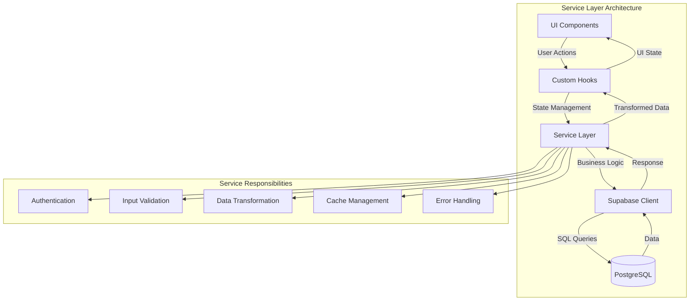
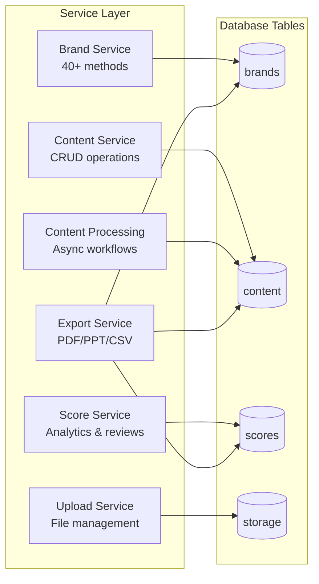
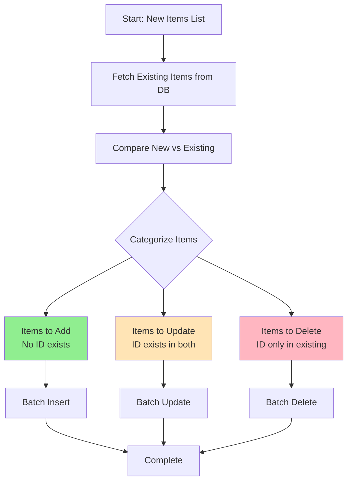
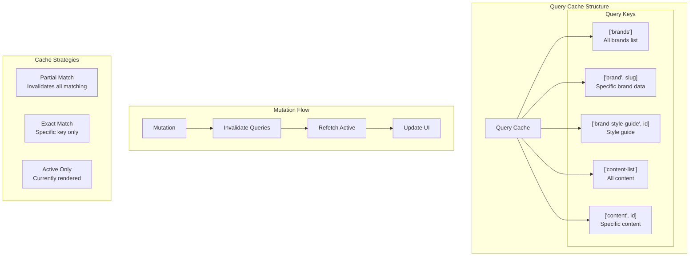

# Service Layer Documentation

## Overview

The service layer provides a clean abstraction over Supabase operations, encapsulating business logic and ensuring consistent patterns across the application. This guide documents all services, their methods, patterns, and best practices.

## Architecture Principles

### 1. Separation of Concerns
- **Services** handle all database operations and business logic
- **Components** handle presentation and user interaction
- **Hooks** manage state and orchestrate service calls

### 2. Type Safety
- All methods use TypeScript interfaces
- Generated Supabase types from database schema
- Avoid `any` types (ongoing refactoring effort)

### 3. Error Handling
- Consistent error patterns across services
- User-friendly error messages
- Proper logging for debugging



## Service Inventory



### 1. Brand Service (`brandService.ts`)

The most comprehensive service handling all brand-related operations. Currently a monolithic service (refactoring planned).

#### Core Brand Operations

##### Get Operations
```typescript
// Fetch all brands for authenticated user
getAllBrands(): Promise<DatabaseBrand[]>

// Get available regions
getAllRegions(): Promise<string[]>

// Get brand by slug
getBrandBySlug(slug: string): Promise<DatabaseBrand | null>

// Get brand ID from slug
getBrandIdBySlug(slug: string): Promise<string | null>

// Get brand with all related data (uses view)
getBrandWithFullData(slug: string): Promise<BrandData | null>

// Get raw database brand data
getDatabaseBrandData(slug: string): Promise<DatabaseBrandData | null>
```

##### Create/Update Operations
```typescript
// Create new brand
createBrand(brandData: {
  slug: string;
  name: string;
  businessArea?: string;
  region?: string;
}): Promise<DatabaseBrand>

// Update basic brand info
updateBrand(slug: string, updates: Partial<{
  name: string;
  businessArea: string;
}>): Promise<DatabaseBrand>

// Update specific brand fields
updateBrandBasicInfo(brandId: string, updates: {
  name?: string;
  business_area?: string;
  region?: string;
}): Promise<void>

// Update financial data
updateBrandFinancials(brandId: string, financials: {
  annualSales?: string;
  targetSales?: string;
  growth?: string;
}): Promise<void>
```

#### Market Analysis Operations

```typescript
// Get market analysis data
getBrandMarketAnalysis(brandId: string): Promise<BrandMarketAnalysis | null>

// Create or update market analysis
upsertBrandMarketAnalysis(
  brandId: string, 
  data: Omit<BrandMarketAnalysis, 'id'>
): Promise<BrandMarketAnalysis>

// Update market analysis (JSONB)
updateMarketAnalysis(
  brandId: string, 
  marketAnalysis: BrandMarketAnalysis
): Promise<void>
```

#### Competitor Operations

```typescript
// Get all competitors
getBrandCompetitors(brandId: string): Promise<BrandCompetitor[]>

// Create new competitor
createBrandCompetitor(
  brandId: string, 
  competitor: Omit<BrandCompetitor, 'id'>
): Promise<BrandCompetitor>

// Safe batch update competitors
safeUpdateCompetitors(
  brandId: string, 
  competitors: BrandCompetitor[]
): Promise<void>

// Individual CRUD operations
addCompetitor(brandId: string, competitor: BrandCompetitor): Promise<any>
updateSingleCompetitor(competitorId: string, updates: Partial<BrandCompetitor>): Promise<void>
deleteCompetitor(competitorId: string): Promise<void>

// Qualitative profiles
updateCompetitorQualitativeProfiles(brandId: string, profiles: Array<{
  competitorId: string;
  qualitativeProfiles: Record<string, string>;
}>): Promise<void>

updateSingleCompetitorQualitativeProfile(
  competitorId: string, 
  qualitativeProfiles: Record<string, string>
): Promise<void>

// Bulk operations
addCharacteristicToAllCompetitors(
  brandId: string, 
  characteristicName: string, 
  defaultValue?: string
): Promise<void>
```

#### Strategic Elements Operations

##### Objectives
```typescript
// Safe batch update with comparison
safeUpdateBrandObjectives(brandId: string, objectives: any[]): Promise<void>

// Individual operations
addBrandObjective(brandId: string, objective: any): Promise<any>
updateSingleBrandObjective(objectiveId: string, updates: any): Promise<void>
deleteBrandObjective(objectiveId: string): Promise<void>
```

##### Messages
```typescript
// Safe batch update
safeUpdateBrandMessages(brandId: string, messages: any[]): Promise<void>

// Individual operations
addBrandMessage(brandId: string, message: any): Promise<any>
updateSingleBrandMessage(messageId: string, updates: any): Promise<void>
deleteBrandMessage(messageId: string): Promise<void>
```

##### Other Strategic Elements
```typescript
// Audiences (uses delete-then-insert pattern - needs refactoring)
updateBrandAudiences(brandId: string, audiences: any[]): Promise<void>

// Strategies (uses delete-then-insert pattern - needs refactoring)
updateBrandStrategies(brandId: string, strategies: any[]): Promise<void>

// Voice attributes
updateBrandVoiceAttributes(brandId: string, voiceAttributes: any[]): Promise<void>
```

#### Customer Analysis Operations

```typescript
// Personas (JSONB field)
getBrandPersonas(brandId: string): Promise<BrandPersona[]>
updateBrandPersonas(brandId: string, personas: any[]): Promise<void>

// Customer segments (JSONB field)
getBrandCustomerSegments(brandId: string): Promise<BrandCustomerSegment[]>
updateBrandCustomerSegments(brandId: string, customerSegments: any[]): Promise<void>

// Customer journey (JSONB field)
getBrandCustomerJourney(brandId: string): Promise<BrandCustomerJourney[]>
updateBrandCustomerJourney(brandId: string, customerJourney: any[]): Promise<void>
```

#### SWOT Analysis Operations

```typescript
// Get SWOT analysis
getBrandSWOT(brandId: string): Promise<BrandSWOT | null>

// Create or update SWOT
upsertBrandSWOT(
  brandId: string, 
  swot: Omit<BrandSWOT, 'id'>
): Promise<BrandSWOT>
```

#### Performance & Analytics

```typescript
// Get performance history
getBrandPerformanceHistory(
  brandId: string, 
  limit?: number
): Promise<BrandPerformanceHistory[]>

// Add performance entry
addBrandPerformanceHistory(
  brandId: string, 
  history: Omit<BrandPerformanceHistory, 'id'>
): Promise<BrandPerformanceHistory>
```

#### Style Guide Operations

```typescript
// Get brand style guide
getBrandStyleGuide(brandId: string): Promise<BrandStyleGuide | null>

// Update style guide
updateBrandStyleGuide(
  brandId: string, 
  styleGuide: BrandStyleGuide
): Promise<void>
```

### 2. Content Service (`contentService.ts`)

Handles all content-related operations.

#### Methods
```typescript
// Get all content with optional filters
getAllContent(filters?: {
  brandId?: string;
  campaignId?: string;
  type?: string;
  processed?: boolean;
}): Promise<Content[]>

// Get single content item
getContent(contentId: string): Promise<Content>

// Create new content
createContent(content: Partial<Content>): Promise<Content>

// Update content
updateContent(contentId: string, updates: Partial<Content>): Promise<void>

// Delete content
deleteContent(contentId: string): Promise<void>

// Get processed content
getProcessedContent(limit?: number): Promise<ProcessedContent[]>

// Search content
searchContent(query: string): Promise<Content[]>

// Get content by campaign
getContentByCampaign(campaignId: string): Promise<Content[]>
```

### 3. Content Processing Service (`contentProcessingService.ts`)

Manages asynchronous content analysis workflows.

#### Methods
```typescript
// Check analysis status
getContentAnalysisStatus(contentId: string): Promise<{
  status: string;
  progress?: number;
  error: Error | null;
}>

// Start analysis process
startContentAnalysis(contentId: string): Promise<{
  success: boolean;
  error: Error | null;
}>

// Get analysis results
getContentAnalysisResults(contentId: string): Promise<{
  data: any | null;
  error: Error | null;
}>

// Cancel ongoing analysis
cancelContentAnalysis(contentId: string): Promise<{
  success: boolean;
  error: Error | null;
}>
```

### 4. Score Service (`scoreService.ts`)

Handles content scoring and review data.

#### Methods
```typescript
// Get scores by content ID
getScoresByContentId(contentId: number): Promise<Score[]>

// Get scores by review ID
getScoresByContentReviewId(contentReviewId: number): Promise<Score[]>

// Get all reviews for content
getContentReviewsByContentId(contentId: number): Promise<ContentReview[]>

// Get category summaries with averages
getCategoryReviewSummaries(contentId: number): Promise<CategoryReviewSummary[]>

// Get detailed check information
getCheckDetails(checkId: number): Promise<CheckDetails | null>
```

#### Type Definitions
```typescript
interface Score {
  id: number;
  content_review_id: number;
  check_id: number;
  score: number;
  review: string;
  // ... other fields
}

interface CategoryReviewSummary {
  id: number;
  categoryId: number;
  categoryName: string;
  averageScore: number;
  reviewCount: number;
}

interface CheckDetails {
  id: number;
  name: string;
  description: string;
  what_it_measures: string;
  category_id: number;
}
```

### 5. Upload Service (`uploadService.ts`)

Manages file uploads to Supabase Storage.

#### Methods
```typescript
// Upload file to storage
uploadFile(file: File, options?: {
  bucket?: string;      // Default: 'content'
  path?: string;        // Custom path within bucket
  upsert?: boolean;     // Overwrite existing file
}): Promise<{
  path: string;
  url: string;
}>

// Delete file from storage
deleteFile(path: string, bucket?: string): Promise<void>

// Get public URL for file
getPublicUrl(path: string, bucket?: string): string

// Upload multiple files
uploadMultipleFiles(files: File[], options?: UploadOptions): Promise<{
  success: Array<{ path: string; url: string }>;
  failed: Array<{ file: File; error: Error }>;
}>

// Get signed URL for temporary access
getSignedUrl(path: string, expiresIn?: number): Promise<string>
```

### 6. Export Service (`exportService.ts`)

Handles data export to various formats.

#### Methods
```typescript
// Export brand strategy as PDF
exportBrandStrategyPDF(brandData: BrandData): Promise<Blob>

// Export brand strategy as PowerPoint
exportBrandStrategyPPT(brandData: BrandData): Promise<Blob>

// Export content report as PDF
exportContentReportPDF(
  content: Content, 
  scores: Score[]
): Promise<Blob>

// Export analytics dashboard
exportAnalyticsDashboard(
  brandId: string, 
  dateRange: { start: Date; end: Date }
): Promise<Blob>

// Export data as CSV
exportDataAsCSV(
  data: any[], 
  filename: string
): Promise<Blob>
```

## Common Patterns

### 1. Error Handling Pattern

```typescript
async someOperation(): Promise<Result> {
  try {
    const { data, error } = await supabase
      .from('table')
      .select('*')
      .single();
    
    if (error) throw error;
    
    return data;
  } catch (error) {
    // Log for debugging
    console.error('Operation failed:', error);
    
    // Throw user-friendly error
    throw new Error('Failed to complete operation');
  }
}
```

### 2. Safe Batch Update Pattern

Used for updating lists of related items without data loss:



```typescript
async safeBatchUpdate<T>(
  tableName: string,
  brandId: string,
  newItems: T[],
  idField: string = 'id'
): Promise<void> {
  // 1. Fetch existing items
  const { data: existing } = await supabase
    .from(tableName)
    .select('*')
    .eq('brand_id', brandId);
  
  // 2. Determine operations
  const toAdd = newItems.filter(item => !item[idField]);
  const toUpdate = newItems.filter(item => 
    item[idField] && existing.some(e => e[idField] === item[idField])
  );
  const toDelete = existing.filter(e => 
    !newItems.some(item => item[idField] === e[idField])
  );
  
  // 3. Execute operations
  // ... perform inserts, updates, deletes
}
```

### 3. Transform Pattern

Converting database models to frontend models:

```typescript
function transformToBrandData(dbData: DatabaseBrand): BrandData {
  return {
    id: dbData.id,
    name: dbData.name,
    // Transform nested data
    personas: dbData.personas || [],
    // Compute derived fields
    isComplete: Boolean(dbData.name && dbData.personas?.length > 0)
  };
}
```

### 4. Upsert Pattern

Create or update in a single operation:

```typescript
async upsertData(key: string, data: Data): Promise<Data> {
  const { data: result, error } = await supabase
    .from('table')
    .upsert(data, { 
      onConflict: key,
      returning: true 
    })
    .single();
  
  if (error) throw error;
  return result;
}
```

## React Query Integration Patterns



### Query Key Structure

**CRITICAL**: Understanding query key structure is essential for proper cache invalidation.

```typescript
// Query keys in the app follow this pattern:
['brands']                    // List of all brands
['brand', brandSlug]          // Specific brand with all data (campaigns, content, etc.)
['brand-style-guide', brandId] // Brand style guide
['content-list']              // All content items
['content', contentId]        // Specific content item
```

### Cache Invalidation After Mutations

When mutating data, you MUST invalidate the correct query keys:

```typescript
// ❌ WRONG - This won't update the UI
await queryClient.invalidateQueries({ queryKey: ['brands'] });

// ✅ CORRECT - Invalidate the specific brand data
await queryClient.invalidateQueries({ queryKey: ['brand', brandSlug] });

// ✅ BETTER - Invalidate all brand queries
await queryClient.invalidateQueries({ queryKey: ['brand'] });
```

### Common Mutation Pattern

```typescript
export const useDeleteCampaign = () => {
  const queryClient = useQueryClient();
  
  return useMutation({
    mutationFn: ({ campaignId }) => brandService.deleteCampaign(campaignId),
    onSuccess: async (data, variables) => {
      // 1. Invalidate specific brand query
      if (variables.brandSlug) {
        await queryClient.invalidateQueries({ 
          queryKey: ['brand', variables.brandSlug]
        });
      }
      
      // 2. Also invalidate all brand queries as fallback
      await queryClient.invalidateQueries({ 
        queryKey: ['brand']
      });
      
      // 3. Force immediate refetch for active queries
      await queryClient.refetchQueries({ 
        queryKey: ['brand'],
        exact: false,
        type: 'active'
      });
    }
  });
};
```

### Query Key Gotchas

1. **Partial Matching**: `invalidateQueries(['brand'])` will invalidate ALL queries starting with `['brand']`, including `['brand', 'eco-solutions']`.

2. **Exact Matching**: Use `exact: true` to invalidate only the exact query key.

3. **Active Queries**: Use `type: 'active'` to only refetch queries currently being used by components.

## Best Practices

### 1. Type Safety
- Define interfaces for all data structures
- Avoid `any` type - use specific types or generics
- Leverage TypeScript's type inference

### 2. Error Handling
- Always catch and handle errors appropriately
- Provide meaningful error messages
- Log detailed errors for debugging

### 3. Performance
- Use database views for complex queries
- Implement proper pagination for large datasets
- Cache expensive operations with React Query

### 4. Security
- Never expose sensitive data in error messages
- Validate all inputs before database operations
- Rely on RLS policies for data access control

### 5. Consistency
- Follow established patterns across all services
- Use consistent naming conventions
- Document complex business logic

### 6. React Query Integration
- Always pass necessary context (brandSlug, etc.) to mutations
- Use consistent query key patterns
- Prefer `refetchQueries` over `invalidateQueries` for immediate UI updates
- Add unique keys to components when data structure changes

## Migration Roadmap

### Phase 1: Type Safety (In Progress)
- Replace all `any` types with proper interfaces
- Create type definitions for all data structures
- Add JSDoc comments to all methods

### Phase 2: Service Decomposition (Planned)
- Break down `brandService.ts` into domain-specific services:
  - `BrandProfileService`
  - `BrandStrategyService`
  - `BrandAnalysisService`
  - `BrandPerformanceService`
- Maintain backward compatibility during transition

### Phase 3: Pattern Standardization
- Migrate all "delete-then-insert" patterns to safe batch updates
- Standardize error handling across all services
- Implement consistent logging strategy

### Phase 4: Performance Optimization
- Identify and optimize N+1 queries
- Implement database connection pooling
- Add caching layer for frequently accessed data

## Testing Strategy

### Unit Tests
```typescript
describe('BrandService', () => {
  it('should create a new brand', async () => {
    const brand = await brandService.createBrand({
      slug: 'test-brand',
      name: 'Test Brand'
    });
    
    expect(brand.id).toBeDefined();
    expect(brand.name).toBe('Test Brand');
  });
});
```

### Integration Tests
- Test service methods against real database
- Verify RLS policies work correctly
- Test error scenarios and edge cases

### Mock Strategies
- Use Supabase's built-in mocking for unit tests
- Create test fixtures for consistent test data
- Mock external dependencies (storage, etc.)

## Debugging Guide

### Common Issues

1. **"Column not found" errors**
   - Check if column exists in correct table
   - Look for dedicated relational tables
   - Verify view definitions are up to date

2. **Type errors after database changes**
   - Regenerate Supabase types
   - Update service method signatures
   - Check transform functions

3. **Performance issues**
   - Enable query logging
   - Check for N+1 queries
   - Review database indexes

### Debugging Tools
- Supabase Dashboard for query inspection
- Browser DevTools Network tab
- React Query DevTools
- Application logs

## Future Enhancements

1. **GraphQL Integration**
   - Consider GraphQL for complex queries
   - Reduce over-fetching
   - Better type safety with codegen

2. **Real-time Features**
   - Leverage Supabase real-time subscriptions
   - Live collaboration features
   - Real-time analytics updates

3. **Offline Support**
   - Implement service worker caching
   - Queue mutations when offline
   - Sync when connection restored

4. **Advanced Caching**
   - Implement Redis for application-level cache
   - Smart cache invalidation strategies
   - Partial cache updates