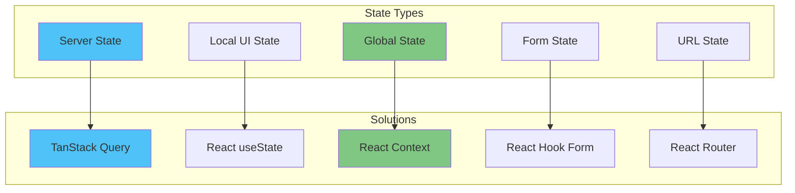
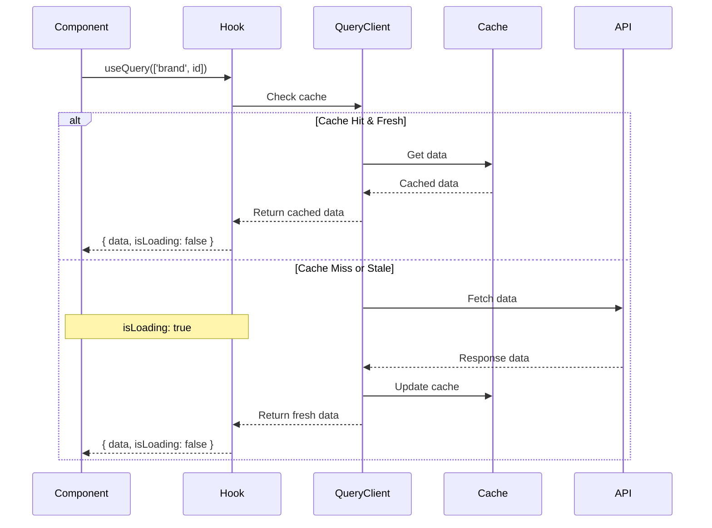
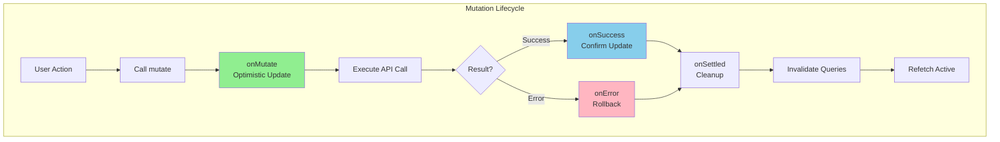
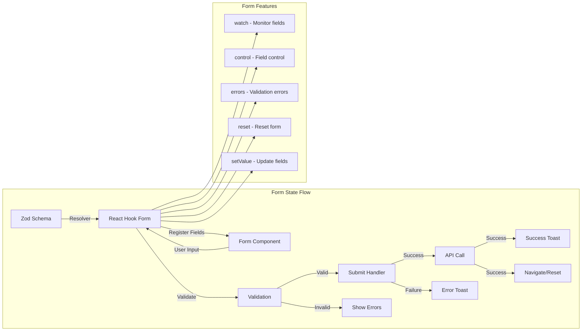

# State Management Guide

## Overview

The Change Influence MVP Dashboard uses a hybrid state management approach optimized for different types of state. This guide documents the patterns, best practices, and implementation details for managing state throughout the application.

## State Categories



## 1. Server State Management

Server state is managed exclusively through TanStack Query (React Query), providing caching, synchronization, and background updates.

### Setup and Configuration

```typescript
// main.tsx
import { QueryClient, QueryClientProvider } from '@tanstack/react-query';
import { ReactQueryDevtools } from '@tanstack/react-query-devtools';

const queryClient = new QueryClient({
  defaultOptions: {
    queries: {
      // Data considered fresh for 5 minutes
      staleTime: 5 * 60 * 1000,
      
      // Keep in cache for 10 minutes
      cacheTime: 10 * 60 * 1000,
      
      // Retry failed requests 3 times
      retry: 3,
      
      // Don't refetch on window focus by default
      refetchOnWindowFocus: false,
      
      // Show previous data while fetching new data
      keepPreviousData: true,
    },
    mutations: {
      // Retry failed mutations once
      retry: 1,
    },
  },
});

function App() {
  return (
    <QueryClientProvider client={queryClient}>
      <RouterProvider router={router} />
      <ReactQueryDevtools initialIsOpen={false} />
    </QueryClientProvider>
  );
}
```

### Query Patterns



#### Basic Query
```typescript
// hooks/useBrandData.ts
export function useBrandData(brandId: string) {
  return useQuery({
    queryKey: ['brand', brandId],
    queryFn: () => brandService.getBrand(brandId),
    enabled: !!brandId, // Only run if brandId exists
  });
}

// Usage in component
function BrandDashboard() {
  const { selectedBrand } = useBrand();
  const { data, isLoading, error } = useBrandData(selectedBrand?.id);
  
  if (isLoading) return <LoadingSpinner />;
  if (error) return <ErrorDisplay error={error} />;
  
  return <BrandMetrics data={data} />;
}
```

#### Dependent Queries
```typescript
// Fetch brand, then fetch related data
function useBrandWithContent(brandId: string) {
  const brandQuery = useQuery({
    queryKey: ['brand', brandId],
    queryFn: () => brandService.getBrand(brandId),
  });
  
  const contentQuery = useQuery({
    queryKey: ['brand', brandId, 'content'],
    queryFn: () => contentService.getContentByBrand(brandId),
    enabled: !!brandQuery.data, // Only run after brand loads
  });
  
  return {
    brand: brandQuery.data,
    content: contentQuery.data,
    isLoading: brandQuery.isLoading || contentQuery.isLoading,
    error: brandQuery.error || contentQuery.error,
  };
}
```

#### Parallel Queries
```typescript
// Fetch multiple data sources simultaneously
function useDashboardData(brandId: string) {
  const results = useQueries({
    queries: [
      {
        queryKey: ['brand', brandId, 'metrics'],
        queryFn: () => brandService.getMetrics(brandId),
      },
      {
        queryKey: ['brand', brandId, 'competitors'],
        queryFn: () => brandService.getCompetitors(brandId),
      },
      {
        queryKey: ['brand', brandId, 'performance'],
        queryFn: () => brandService.getPerformanceHistory(brandId),
      },
    ],
  });
  
  return {
    metrics: results[0].data,
    competitors: results[1].data,
    performance: results[2].data,
    isLoading: results.some(r => r.isLoading),
    error: results.find(r => r.error)?.error,
  };
}
```

### Mutation Patterns



#### Basic Mutation
```typescript
// hooks/useUpdateBrandMessage.ts
export function useUpdateBrandMessage() {
  const queryClient = useQueryClient();
  
  return useMutation({
    mutationFn: ({ messageId, updates }: UpdateMessageParams) =>
      brandService.updateBrandMessage(messageId, updates),
      
    onSuccess: (data, variables) => {
      // Invalidate and refetch brand data
      queryClient.invalidateQueries(['brand']);
      
      toast({
        title: "Message updated",
        description: "Your changes have been saved.",
      });
    },
    
    onError: (error) => {
      toast({
        title: "Update failed",
        description: error.message,
        variant: "destructive",
      });
    },
  });
}
```

#### Optimistic Updates
```typescript
export function useUpdateBrandObjective() {
  const queryClient = useQueryClient();
  
  return useMutation({
    mutationFn: ({ objectiveId, updates }) =>
      brandService.updateBrandObjective(objectiveId, updates),
      
    onMutate: async ({ objectiveId, updates }) => {
      // Cancel any outgoing refetches
      await queryClient.cancelQueries(['brand', brandId]);
      
      // Snapshot the previous value
      const previousBrand = queryClient.getQueryData(['brand', brandId]);
      
      // Optimistically update
      queryClient.setQueryData(['brand', brandId], (old) => ({
        ...old,
        objectives: old.objectives.map(obj =>
          obj.id === objectiveId ? { ...obj, ...updates } : obj
        ),
      }));
      
      // Return context with snapshot
      return { previousBrand };
    },
    
    onError: (err, variables, context) => {
      // Rollback on error
      queryClient.setQueryData(
        ['brand', brandId],
        context.previousBrand
      );
    },
    
    onSettled: () => {
      // Always refetch after error or success
      queryClient.invalidateQueries(['brand', brandId]);
    },
  });
}
```

### Query Key Strategies

```typescript
// Hierarchical query keys for efficient invalidation
const queryKeys = {
  all: ['brands'] as const,
  lists: () => [...queryKeys.all, 'list'] as const,
  list: (filters: string) => [...queryKeys.lists(), { filters }] as const,
  details: () => [...queryKeys.all, 'detail'] as const,
  detail: (id: string) => [...queryKeys.details(), id] as const,
  objectives: (id: string) => [...queryKeys.detail(id), 'objectives'] as const,
  messages: (id: string) => [...queryKeys.detail(id), 'messages'] as const,
};

// Usage
queryClient.invalidateQueries(queryKeys.all); // Invalidate everything
queryClient.invalidateQueries(queryKeys.detail(brandId)); // Specific brand
queryClient.invalidateQueries(queryKeys.objectives(brandId)); // Just objectives
```

## 2. Local UI State

Component-specific UI state using React's built-in hooks.

### Common Patterns

#### Toggle States
```typescript
function CollapsibleSection({ title, children }) {
  const [isOpen, setIsOpen] = useState(false);
  
  return (
    <div>
      <button onClick={() => setIsOpen(!isOpen)}>
        {title} {isOpen ? '▼' : '▶'}
      </button>
      {isOpen && <div>{children}</div>}
    </div>
  );
}
```

#### Edit Mode Management
```typescript
function EditableCard({ data, onSave }) {
  const [isEditing, setIsEditing] = useState(false);
  const [editedData, setEditedData] = useState(data);
  
  const handleSave = async () => {
    await onSave(editedData);
    setIsEditing(false);
  };
  
  const handleCancel = () => {
    setEditedData(data); // Reset to original
    setIsEditing(false);
  };
  
  if (isEditing) {
    return (
      <EditForm
        data={editedData}
        onChange={setEditedData}
        onSave={handleSave}
        onCancel={handleCancel}
      />
    );
  }
  
  return (
    <DisplayCard
      data={data}
      onEdit={() => setIsEditing(true)}
    />
  );
}
```

#### Complex State with useReducer
```typescript
type Action =
  | { type: 'START_UPLOAD' }
  | { type: 'UPLOAD_PROGRESS'; progress: number }
  | { type: 'UPLOAD_SUCCESS'; url: string }
  | { type: 'UPLOAD_ERROR'; error: string }
  | { type: 'RESET' };

interface UploadState {
  status: 'idle' | 'uploading' | 'success' | 'error';
  progress: number;
  url?: string;
  error?: string;
}

function uploadReducer(state: UploadState, action: Action): UploadState {
  switch (action.type) {
    case 'START_UPLOAD':
      return { status: 'uploading', progress: 0 };
    case 'UPLOAD_PROGRESS':
      return { ...state, progress: action.progress };
    case 'UPLOAD_SUCCESS':
      return { status: 'success', progress: 100, url: action.url };
    case 'UPLOAD_ERROR':
      return { status: 'error', progress: 0, error: action.error };
    case 'RESET':
      return { status: 'idle', progress: 0 };
    default:
      return state;
  }
}

function FileUploader() {
  const [state, dispatch] = useReducer(uploadReducer, {
    status: 'idle',
    progress: 0,
  });
  
  const handleUpload = async (file: File) => {
    dispatch({ type: 'START_UPLOAD' });
    
    try {
      const url = await uploadFile(file, (progress) => {
        dispatch({ type: 'UPLOAD_PROGRESS', progress });
      });
      
      dispatch({ type: 'UPLOAD_SUCCESS', url });
    } catch (error) {
      dispatch({ type: 'UPLOAD_ERROR', error: error.message });
    }
  };
  
  return (
    <div>
      {state.status === 'uploading' && (
        <Progress value={state.progress} />
      )}
      {/* Rest of UI */}
    </div>
  );
}
```

## 3. Global State (Context API)

Shared state across components using React Context.

### Auth Context
```typescript
// contexts/AuthContext.tsx
interface AuthContextValue {
  session: Session | null;
  user: User | null;
  loading: boolean;
  emailVerified: boolean;
  signOut: () => Promise<void>;
  signInWithPassword: (email: string, password: string) => Promise<AuthResponse>;
}

const AuthContext = createContext<AuthContextValue | undefined>(undefined);

export function AuthProvider({ children }: { children: ReactNode }) {
  const [session, setSession] = useState<Session | null>(null);
  const [loading, setLoading] = useState(true);

  // ... implementation

  return (
    <AuthContext.Provider value={value}>
      {children}
    </AuthContext.Provider>
  );
}

export function useAuth() {
  const context = useContext(AuthContext);
  if (!context) {
    throw new Error('useAuth must be used within AuthProvider');
  }
  return context;
}
```

### Brand Context
```typescript
// contexts/BrandContext.tsx
interface BrandContextValue {
  selectedBrand: Brand | null;
  selectedRegion: string | null;
  setSelectedBrand: (brand: Brand | null) => void;
  setSelectedRegion: (region: string | null) => void;
  getBrandData: () => BrandData | null;
}

const BrandContext = createContext<BrandContextValue | undefined>(undefined);

export function BrandProvider({ children }: { children: ReactNode }) {
  const [selectedBrand, setSelectedBrand] = useState<Brand | null>(null);
  const [selectedRegion, setSelectedRegion] = useState<string | null>(null);
  
  // Load from localStorage on mount
  useEffect(() => {
    const saved = localStorage.getItem('selectedBrand');
    if (saved) {
      setSelectedBrand(JSON.parse(saved));
    }
  }, []);
  
  // Persist to localStorage
  useEffect(() => {
    if (selectedBrand) {
      localStorage.setItem('selectedBrand', JSON.stringify(selectedBrand));
    } else {
      localStorage.removeItem('selectedBrand');
    }
  }, [selectedBrand]);
  
  const getBrandData = useCallback(() => {
    if (!selectedBrand) return null;
    
    // Transform and return brand data
    return transformBrandData(selectedBrand);
  }, [selectedBrand]);
  
  return (
    <BrandContext.Provider value={{
      selectedBrand,
      selectedRegion,
      setSelectedBrand,
      setSelectedRegion,
      getBrandData,
    }}>
      {children}
    </BrandContext.Provider>
  );
}
```

### Theme Context
```typescript
// contexts/ThemeContext.tsx
type Theme = 'light' | 'dark' | 'system';

interface ThemeContextValue {
  theme: Theme;
  setTheme: (theme: Theme) => void;
  resolvedTheme: 'light' | 'dark';
}

export function ThemeProvider({ children }: { children: ReactNode }) {
  const [theme, setTheme] = useState<Theme>('system');
  
  const resolvedTheme = useMemo(() => {
    if (theme === 'system') {
      return window.matchMedia('(prefers-color-scheme: dark)').matches
        ? 'dark'
        : 'light';
    }
    return theme;
  }, [theme]);
  
  useEffect(() => {
    document.documentElement.classList.toggle('dark', resolvedTheme === 'dark');
  }, [resolvedTheme]);
  
  return (
    <ThemeContext.Provider value={{ theme, setTheme, resolvedTheme }}>
      {children}
    </ThemeContext.Provider>
  );
}
```

## 4. Form State Management

Using React Hook Form with Zod validation.



### Basic Form Setup
```typescript
// schemas/brand.schema.ts
import { z } from 'zod';

export const brandFormSchema = z.object({
  name: z.string()
    .min(1, 'Brand name is required')
    .max(100, 'Brand name is too long'),
  businessArea: z.string().optional(),
  region: z.string().optional(),
  annualRevenue: z.number()
    .positive('Revenue must be positive')
    .optional(),
});

export type BrandFormData = z.infer<typeof brandFormSchema>;
```

### Form Component
```typescript
import { useForm } from 'react-hook-form';
import { zodResolver } from '@hookform/resolvers/zod';

function BrandForm({ brand, onSubmit }: BrandFormProps) {
  const form = useForm<BrandFormData>({
    resolver: zodResolver(brandFormSchema),
    defaultValues: {
      name: brand?.name || '',
      businessArea: brand?.businessArea || '',
      region: brand?.region || '',
      annualRevenue: brand?.annualRevenue || undefined,
    },
  });
  
  const handleSubmit = form.handleSubmit(async (data) => {
    try {
      await onSubmit(data);
      toast({ title: 'Brand saved successfully' });
    } catch (error) {
      toast({
        title: 'Failed to save brand',
        description: error.message,
        variant: 'destructive',
      });
    }
  });
  
  return (
    <Form {...form}>
      <form onSubmit={handleSubmit} className="space-y-4">
        <FormField
          control={form.control}
          name="name"
          render={({ field }) => (
            <FormItem>
              <FormLabel>Brand Name</FormLabel>
              <FormControl>
                <Input {...field} />
              </FormControl>
              <FormMessage />
            </FormItem>
          )}
        />
        
        <FormField
          control={form.control}
          name="businessArea"
          render={({ field }) => (
            <FormItem>
              <FormLabel>Business Area</FormLabel>
              <FormControl>
                <Select
                  value={field.value}
                  onValueChange={field.onChange}
                >
                  <SelectTrigger>
                    <SelectValue placeholder="Select business area" />
                  </SelectTrigger>
                  <SelectContent>
                    <SelectItem value="technology">Technology</SelectItem>
                    <SelectItem value="retail">Retail</SelectItem>
                    <SelectItem value="finance">Finance</SelectItem>
                  </SelectContent>
                </Select>
              </FormControl>
              <FormMessage />
            </FormItem>
          )}
        />
        
        <Button 
          type="submit" 
          disabled={form.formState.isSubmitting}
        >
          {form.formState.isSubmitting ? (
            <LoadingSpinner />
          ) : (
            'Save Brand'
          )}
        </Button>
      </form>
    </Form>
  );
}
```

### Dynamic Form Arrays
```typescript
function ObjectivesForm({ objectives, onSave }) {
  const { fields, append, remove, move } = useFieldArray({
    control: form.control,
    name: 'objectives',
  });
  
  return (
    <div className="space-y-4">
      {fields.map((field, index) => (
        <div key={field.id} className="flex gap-2">
          <FormField
            control={form.control}
            name={`objectives.${index}.title`}
            render={({ field }) => (
              <FormItem className="flex-1">
                <FormControl>
                  <Input {...field} placeholder="Objective title" />
                </FormControl>
                <FormMessage />
              </FormItem>
            )}
          />
          
          <Button
            type="button"
            variant="ghost"
            size="icon"
            onClick={() => remove(index)}
          >
            <X className="h-4 w-4" />
          </Button>
          
          <Button
            type="button"
            variant="ghost"
            size="icon"
            onClick={() => move(index, index - 1)}
            disabled={index === 0}
          >
            <ArrowUp className="h-4 w-4" />
          </Button>
        </div>
      ))}
      
      <Button
        type="button"
        variant="outline"
        onClick={() => append({ title: '', description: '' })}
      >
        Add Objective
      </Button>
    </div>
  );
}
```

## 5. URL State Management

Using React Router for state that should persist in URLs.

### Search Parameters
```typescript
function ProductList() {
  const [searchParams, setSearchParams] = useSearchParams();
  
  // Read from URL
  const currentPage = Number(searchParams.get('page')) || 1;
  const sortBy = searchParams.get('sort') || 'name';
  const filter = searchParams.get('filter') || 'all';
  
  // Update URL
  const handlePageChange = (page: number) => {
    setSearchParams(prev => {
      prev.set('page', page.toString());
      return prev;
    });
  };
  
  const handleSortChange = (sort: string) => {
    setSearchParams(prev => {
      prev.set('sort', sort);
      prev.delete('page'); // Reset to page 1
      return prev;
    });
  };
  
  // Use in query
  const { data } = useQuery({
    queryKey: ['products', { page: currentPage, sort: sortBy, filter }],
    queryFn: () => productService.getProducts({ 
      page: currentPage, 
      sort: sortBy, 
      filter 
    }),
  });
  
  return (
    <div>
      <SortControls value={sortBy} onChange={handleSortChange} />
      <ProductGrid products={data?.items} />
      <Pagination 
        current={currentPage} 
        total={data?.totalPages}
        onChange={handlePageChange}
      />
    </div>
  );
}
```

### Route State
```typescript
// Pass state through navigation
function LoginPage() {
  const location = useLocation();
  const navigate = useNavigate();
  
  const handleLogin = async (credentials) => {
    await login(credentials);
    
    // Redirect to attempted page or dashboard
    const from = location.state?.from?.pathname || '/dashboard';
    navigate(from, { replace: true });
  };
}

// Protect routes and save attempted location
function ProtectedRoute({ children }) {
  const { user } = useAuth();
  const location = useLocation();
  
  if (!user) {
    return <Navigate to="/login" state={{ from: location }} replace />;
  }
  
  return children;
}
```

## State Management Best Practices

### 1. Choose the Right State Type
```typescript
// Server state - Use React Query
const { data: products } = useQuery(['products'], fetchProducts);

// Local UI state - Use useState
const [isModalOpen, setIsModalOpen] = useState(false);

// Global app state - Use Context
const { theme } = useTheme();

// Form state - Use React Hook Form
const form = useForm({ resolver: zodResolver(schema) });

// URL state - Use search params
const [searchParams] = useSearchParams();
```

### 2. Avoid State Duplication
```typescript
// Bad - Duplicating server state
function ProductList() {
  const { data } = useQuery(['products'], fetchProducts);
  const [products, setProducts] = useState(data || []); // ❌ Duplicated
  
  useEffect(() => {
    if (data) setProducts(data); // ❌ Sync nightmare
  }, [data]);
}

// Good - Use server state directly
function ProductList() {
  const { data: products = [] } = useQuery(['products'], fetchProducts);
  // Use products directly ✅
}
```

### 3. Colocation of State
```typescript
// Keep state as close to where it's used as possible
function App() {
  // Don't lift state that's only used in one place
  const [productFilter, setProductFilter] = useState(''); // ❌
  
  return <ProductList filter={productFilter} />;
}

// Better
function ProductList() {
  // State used only here
  const [filter, setFilter] = useState(''); // ✅
  
  return (
    <>
      <FilterInput value={filter} onChange={setFilter} />
      <Products filter={filter} />
    </>
  );
}
```

### 4. Derive State When Possible
```typescript
// Bad - Storing derived state
function Cart({ items }) {
  const [totalPrice, setTotalPrice] = useState(0); // ❌
  
  useEffect(() => {
    setTotalPrice(items.reduce((sum, item) => sum + item.price, 0));
  }, [items]);
}

// Good - Calculate on render
function Cart({ items }) {
  const totalPrice = useMemo(
    () => items.reduce((sum, item) => sum + item.price, 0),
    [items]
  ); // ✅
}
```

## Performance Optimization

### 1. Query Optimization
```typescript
// Prefetch data on hover
function BrandList() {
  const queryClient = useQueryClient();
  
  const handleMouseEnter = (brandId: string) => {
    queryClient.prefetchQuery({
      queryKey: ['brand', brandId],
      queryFn: () => brandService.getBrand(brandId),
      staleTime: 10 * 1000, // Only prefetch if data is older than 10s
    });
  };
  
  return brands.map(brand => (
    <Link
      key={brand.id}
      to={`/brands/${brand.id}`}
      onMouseEnter={() => handleMouseEnter(brand.id)}
    >
      {brand.name}
    </Link>
  ));
}
```

### 2. Selective Subscriptions
```typescript
// Only re-render when specific fields change
function BrandName({ brandId }) {
  const name = useQuery({
    queryKey: ['brand', brandId],
    queryFn: () => brandService.getBrand(brandId),
    select: (data) => data.name, // Only subscribe to name changes
  });
  
  return <h1>{name}</h1>;
}
```

### 3. Suspense Integration
```typescript
// Enable suspense mode for cleaner loading states
const queryClient = new QueryClient({
  defaultOptions: {
    queries: {
      suspense: true,
    },
  },
});

// Component with suspense
function BrandDetails({ brandId }) {
  const { data } = useBrandData(brandId); // Will suspend
  return <div>{data.name}</div>;
}

// Parent with error boundary and suspense
function BrandPage() {
  return (
    <ErrorBoundary fallback={<ErrorDisplay />}>
      <Suspense fallback={<LoadingSpinner />}>
        <BrandDetails brandId={brandId} />
      </Suspense>
    </ErrorBoundary>
  );
}
```

## Testing State Management

### Testing React Query
```typescript
import { QueryClient, QueryClientProvider } from '@tanstack/react-query';
import { renderHook, waitFor } from '@testing-library/react';

const createWrapper = () => {
  const queryClient = new QueryClient({
    defaultOptions: {
      queries: { retry: false },
    },
  });
  
  return ({ children }) => (
    <QueryClientProvider client={queryClient}>
      {children}
    </QueryClientProvider>
  );
};

describe('useBrandData', () => {
  it('fetches brand data successfully', async () => {
    const { result } = renderHook(
      () => useBrandData('123'),
      { wrapper: createWrapper() }
    );
    
    expect(result.current.isLoading).toBe(true);
    
    await waitFor(() => {
      expect(result.current.isSuccess).toBe(true);
    });
    
    expect(result.current.data).toEqual({
      id: '123',
      name: 'Test Brand',
    });
  });
});
```

### Testing Context
```typescript
describe('BrandContext', () => {
  it('persists selected brand to localStorage', () => {
    const { result } = renderHook(() => useBrand(), {
      wrapper: BrandProvider,
    });
    
    const testBrand = { id: '123', name: 'Test Brand' };
    
    act(() => {
      result.current.setSelectedBrand(testBrand);
    });
    
    expect(localStorage.getItem('selectedBrand')).toBe(
      JSON.stringify(testBrand)
    );
  });
});
```

## Debugging State

### React Query DevTools
```typescript
// Always include in development
import { ReactQueryDevtools } from '@tanstack/react-query-devtools';

function App() {
  return (
    <>
      <Routes />
      <ReactQueryDevtools initialIsOpen={false} />
    </>
  );
}
```

### Custom DevTools
```typescript
// Create a state inspector for debugging
function StateInspector() {
  const { selectedBrand } = useBrand();
  const { user } = useAuth();
  
  if (process.env.NODE_ENV !== 'development') return null;
  
  return (
    <div className="fixed bottom-0 right-0 p-4 bg-black text-white text-xs">
      <pre>{JSON.stringify({ selectedBrand, user }, null, 2)}</pre>
    </div>
  );
}
```

## Migration Guide

### Moving from useState to React Query
```typescript
// Before - Local state with useEffect
function BrandList() {
  const [brands, setBrands] = useState([]);
  const [loading, setLoading] = useState(true);
  const [error, setError] = useState(null);
  
  useEffect(() => {
    fetchBrands()
      .then(setBrands)
      .catch(setError)
      .finally(() => setLoading(false));
  }, []);
  
  if (loading) return <LoadingSpinner />;
  if (error) return <ErrorDisplay error={error} />;
  return <List items={brands} />;
}

// After - React Query
function BrandList() {
  const { data: brands, isLoading, error } = useQuery({
    queryKey: ['brands'],
    queryFn: brandService.getAllBrands,
  });
  
  if (isLoading) return <LoadingSpinner />;
  if (error) return <ErrorDisplay error={error} />;
  return <List items={brands} />;
}
```

### Moving from prop drilling to Context
```typescript
// Before - Prop drilling
function App() {
  const [user, setUser] = useState(null);
  return <Dashboard user={user} setUser={setUser} />;
}

function Dashboard({ user, setUser }) {
  return <Profile user={user} setUser={setUser} />;
}

function Profile({ user, setUser }) {
  return <div>{user.name}</div>;
}

// After - Context
function App() {
  return (
    <AuthProvider>
      <Dashboard />
    </AuthProvider>
  );
}

function Dashboard() {
  return <Profile />;
}

function Profile() {
  const { user } = useAuth();
  return <div>{user.name}</div>;
}
```

## Common Pitfalls

### 1. Over-fetching
```typescript
// Bad - Fetching everything
const { data } = useQuery(['brand', id], () => 
  brandService.getEverything(id) // Returns 10MB of data
);

// Good - Fetch what you need
const { data } = useQuery(['brand', id, 'summary'], () => 
  brandService.getBrandSummary(id) // Returns only needed fields
);
```

### 2. Stale Closure
```typescript
// Bad - Stale closure in callback
function Counter() {
  const [count, setCount] = useState(0);
  
  const handleClick = () => {
    setTimeout(() => {
      setCount(count + 1); // Always adds to initial count
    }, 1000);
  };
}

// Good - Use function update
function Counter() {
  const [count, setCount] = useState(0);
  
  const handleClick = () => {
    setTimeout(() => {
      setCount(c => c + 1); // Always uses current value
    }, 1000);
  };
}
```

### 3. Missing Dependencies
```typescript
// Bad - Missing dependency
function BrandDetails({ brandId }) {
  const [brand, setBrand] = useState(null);
  
  useEffect(() => {
    fetchBrand(brandId).then(setBrand);
  }, []); // Missing brandId dependency
}

// Good - Include all dependencies
function BrandDetails({ brandId }) {
  const { data: brand } = useQuery({
    queryKey: ['brand', brandId],
    queryFn: () => fetchBrand(brandId),
  }); // React Query handles dependencies
}
```

## Future Improvements

1. **State Machines** - Consider XState for complex UI flows
2. **Offline Support** - Implement offline queue for mutations
3. **Real-time Updates** - WebSocket integration with React Query
4. **State Persistence** - Enhanced localStorage sync strategies
5. **Time Travel** - Development tools for state debugging