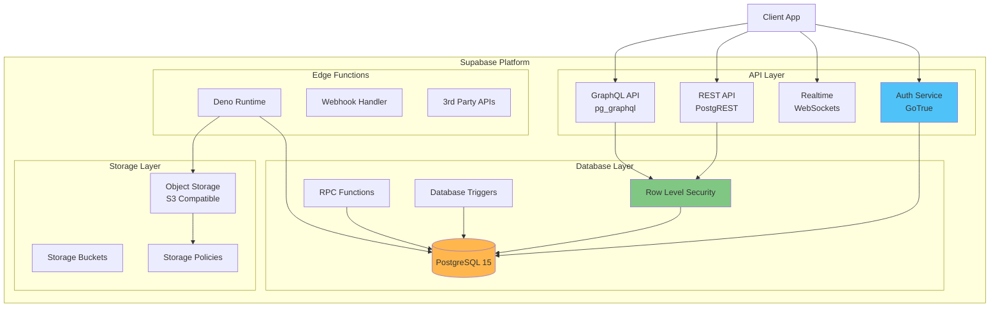
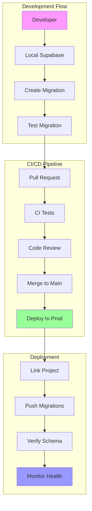
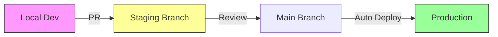
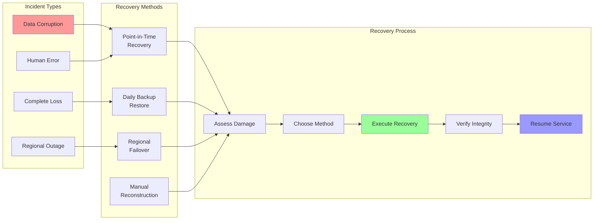

# Supabase Database Guide

## Overview

This guide provides comprehensive documentation for the Supabase implementation of the Change Influence MVP Dashboard. It covers Supabase-specific features, operational procedures, security configurations, and best practices for maintaining a production-ready database.

## Table of Contents

1. [Introduction & Core Principles](#introduction--core-principles)
2. [Supabase Features & Configuration](#supabase-features--configuration)
3. [Security Model & Best Practices](#security-model--best-practices)
4. [Development & Deployment Workflow](#development--deployment-workflow)
5. [Performance & Optimization](#performance--optimization)
6. [Monitoring & Maintenance](#monitoring--maintenance)
7. [Backup & Disaster Recovery](#backup--disaster-recovery)
8. [Supabase-Specific Gotchas](#supabase-specific-gotchas)
9. [Migration Guide](#migration-guide)
10. [Emergency Procedures](#emergency-procedures)

---

## Introduction & Core Principles

### Purpose
This document serves as the authoritative guide for all Supabase-related operations, from local development to production deployment and maintenance.

### Core Principles
1. **Migrations-First Development**: All schema changes MUST go through migrations
2. **Security by Default**: RLS enabled on all tables with restrictive policies
3. **Service Layer Isolation**: Database operations only through service layer (preparing for Azure migration)
4. **Performance Monitoring**: Regular review of query performance and resource usage
5. **Automated Deployment**: CI/CD for all database changes

### Related Documentation
- [Database Schema Guide](./DATABASE_SCHEMA_GUIDE.md) - Table structures and relationships
- [Service Layer Guide](./SERVICE_LAYER_GUIDE.md) - API patterns
- [Authentication Guide](./AUTHENTICATION_SECURITY_GUIDE.md) - Auth implementation

---

## Supabase Features & Configuration



### 1. Authentication Setup

#### Current Configuration
- **Providers Enabled**: Email/Password only
- **Email Verification**: Required
- **Password Requirements**: 
  - Minimum 8 characters
  - Must contain uppercase, lowercase, and number
- **Session Duration**: 7 days (default)

#### JWT Custom Claims
Currently using default claims. Future enhancement planned for role-based access:
```sql
-- Future: Add user role to JWT
CREATE OR REPLACE FUNCTION auth.custom_access_token_hook(event jsonb)
RETURNS jsonb AS $$
BEGIN
  event := jsonb_set(event, '{claims,user_role}', 
    to_jsonb((SELECT role FROM user_profiles WHERE id = (event->>'user_id')::uuid))
  );
  RETURN event;
END;
$$ LANGUAGE plpgsql;
```

### 2. Database Configuration

#### Installed Extensions
```sql
-- Core extensions in use
pg_stat_statements  -- Query performance monitoring
uuid-ossp          -- UUID generation
pgcrypto           -- Cryptographic functions
pgjwt              -- JWT handling
pg_graphql         -- GraphQL API (enabled)
pgsodium           -- Encryption functions
supabase_vault     -- Secret management
wrappers           -- Foreign data wrappers
pg_net             -- Async HTTP requests
```

#### Database Functions (RPC)
Key functions exposed via RPC:
```sql
-- Example: Get check details with related data
CREATE OR REPLACE FUNCTION get_check_details(check_id_param integer)
RETURNS TABLE (/* columns */)
LANGUAGE plpgsql
AS $$
BEGIN
  RETURN QUERY
  SELECT /* query */
  FROM checks
  WHERE check_id = check_id_param;
END;
$$;
```

#### Database Triggers
Active triggers for data integrity:
```sql
-- Updated_at timestamp trigger
CREATE TRIGGER set_updated_at
  BEFORE UPDATE ON brands
  FOR EACH ROW
  EXECUTE FUNCTION update_updated_at_column();

-- Content sync trigger
CREATE TRIGGER sync_content_on_insert
  AFTER INSERT ON content
  FOR EACH ROW
  EXECUTE FUNCTION create_brand_content_for_content();
```

### 3. Storage Configuration

#### Bucket Strategy
| Bucket | Purpose | Access | Size Limit | Path Pattern |
|--------|---------|--------|------------|--------------|
| content | Content files | Private | 10MB | `{user_id}/{content_id}/{filename}` |
| avatars | User avatars | Public | 2MB | `{user_id}/avatar.{ext}` |
| exports | Generated reports | Private | 50MB | `{user_id}/exports/{timestamp}_{type}.{ext}` |

#### RLS Policies for Storage
```sql
-- Content bucket: Users can only access their own files
CREATE POLICY "Users can upload own content"
ON storage.objects FOR INSERT
WITH CHECK (bucket_id = 'content' AND auth.uid()::text = (storage.foldername(name))[1]);

CREATE POLICY "Users can view own content"
ON storage.objects FOR SELECT
USING (bucket_id = 'content' AND auth.uid()::text = (storage.foldername(name))[1]);
```

### 4. Edge Functions
Currently no Edge Functions deployed. Future plans for:
- Webhook processing
- Third-party API integrations
- Background job processing

### 5. Realtime Configuration
Realtime is currently DISABLED on all tables for performance. To enable selectively:
```sql
-- Enable realtime on specific table
ALTER PUBLICATION supabase_realtime ADD TABLE brand_campaigns;
```

---

## Security Model & Best Practices

### 1. Row Level Security (RLS)

#### Security Issues Found
⚠️ **CRITICAL SECURITY ISSUES DETECTED**:
1. **SECURITY DEFINER Views** without proper security context:
   - `public.brand_full_data`
   - `public.checks`
2. **Tables without RLS** in backend schema:
   - All tables in `backend` schema lack RLS policies
3. **Functions with mutable search_path** (10 functions affected)

#### RLS Implementation Strategy
```sql
-- Default deny-all approach
ALTER TABLE table_name ENABLE ROW LEVEL SECURITY;
ALTER TABLE table_name FORCE ROW LEVEL SECURITY;

-- Base pattern for user-owned resources
CREATE POLICY "Users can view own data"
ON table_name FOR SELECT
USING (user_id = auth.uid() OR client_id = auth.uid());

-- Cascade pattern for related data
CREATE POLICY "Users can manage brand data"
ON brand_related_table FOR ALL
USING (
  brand_id IN (
    SELECT id FROM brands 
    WHERE client_id = auth.uid()
  )
);
```

#### Fixing Security Issues
```sql
-- Fix SECURITY DEFINER views
ALTER VIEW public.brand_full_data SET (security_invoker = true);
ALTER VIEW public.checks SET (security_invoker = true);

-- Fix function search paths
CREATE OR REPLACE FUNCTION function_name()
RETURNS return_type
SECURITY DEFINER
SET search_path = ''
AS $$ /* function body */ $$;
```

### 2. API Security

#### Key Management
- **anon key**: Used in frontend, safe to expose
- **service_role key**: NEVER expose, server-side only
- **Storage**: Environment variables in deployment platform

#### Network Restrictions
**Not currently configured** - Recommended to enable:
1. Go to Supabase Dashboard → Settings → API
2. Enable "Restrict API access to specific IP addresses"
3. Add allowed IPs:
   - Production server IPs
   - CI/CD runner IPs
   - Office/VPN IPs for development

### 3. Authentication Security

#### Current Issues
⚠️ **Security Warnings**:
1. **OTP Expiry**: Currently set to > 1 hour (should be < 1 hour)
2. **Leaked Password Protection**: Currently DISABLED

#### Recommended Fixes
```javascript
// Enable leaked password protection
await supabase.auth.admin.updateConfig({
  security: {
    leaked_password_protection: true
  }
});

// Set OTP expiry to 30 minutes
await supabase.auth.admin.updateConfig({
  email: {
    otp_expiry: 1800 // 30 minutes in seconds
  }
});
```

---

## Development & Deployment Workflow

### 1. Local Development Setup

#### Initial Setup
```bash
# Install Supabase CLI
npm install -g supabase

# Initialize project
supabase init

# Link to remote project
supabase link --project-ref your-project-ref

# Start local development
supabase start
```

#### Environment Variables
```env
# .env.local
VITE_SUPABASE_URL=http://localhost:54321
VITE_SUPABASE_ANON_KEY=your-local-anon-key
SUPABASE_PROJECT_ID=your-project-id

# .env.production (DO NOT COMMIT)
VITE_SUPABASE_URL=https://your-project-ref.supabase.co
VITE_SUPABASE_ANON_KEY=your-production-anon-key
SUPABASE_SERVICE_ROLE_KEY=your-service-role-key
```

### 2. Migration Workflow

#### Creating Migrations
```bash
# Make changes in local database or create migration file
supabase migration new feature_name

# Generate migration from local changes
supabase db diff -f feature_name

# Test migration
supabase db reset

# Commit migration file
git add supabase/migrations/*.sql
git commit -m "feat: Add feature_name migration"
```

#### Migration Best Practices
1. **Always use transactions**:
```sql
BEGIN;
-- Your migration statements
COMMIT;
```

2. **Make migrations reversible**:
```sql
-- Up migration
CREATE TABLE new_table (...);

-- Down migration (in separate file)
DROP TABLE IF EXISTS new_table;
```

3. **Test data integrity**:
```sql
-- After structural changes, verify data
DO $$
BEGIN
  IF NOT EXISTS (SELECT 1 FROM new_table) THEN
    RAISE EXCEPTION 'Migration failed: new_table is empty';
  END IF;
END $$;
```

### 3. CI/CD Pipeline



#### GitHub Actions Workflow
```yaml
name: Deploy Database
on:
  push:
    branches:
      - main
  pull_request:
    branches:
      - main

jobs:
  test:
    runs-on: ubuntu-latest
    steps:
      - uses: actions/checkout@v4
      - uses: supabase/setup-cli@v1
      - run: supabase db test

  deploy:
    needs: test
    if: github.ref == 'refs/heads/main'
    runs-on: ubuntu-latest
    env:
      SUPABASE_ACCESS_TOKEN: ${{ secrets.SUPABASE_ACCESS_TOKEN }}
      SUPABASE_PROJECT_ID: ${{ secrets.SUPABASE_PROJECT_ID }}
    steps:
      - uses: actions/checkout@v4
      - uses: supabase/setup-cli@v1
      - run: |
          supabase link --project-ref $SUPABASE_PROJECT_ID
          supabase db push
```

#### Environment Strategy


---

## Performance & Optimization

### 1. Query Performance

#### Current Performance Analysis
Using `pg_stat_statements` to monitor slow queries:
```sql
-- Find slowest queries
SELECT 
  query,
  mean_exec_time,
  calls,
  total_exec_time
FROM pg_stat_statements
ORDER BY mean_exec_time DESC
LIMIT 10;
```

#### Indexing Strategy
```sql
-- Required indexes for foreign keys
CREATE INDEX idx_brand_objectives_brand_id ON brand_objectives(brand_id);
CREATE INDEX idx_brand_messages_brand_id ON brand_messages(brand_id);
CREATE INDEX idx_brand_content_brand_id ON brand_content(brand_id);

-- Performance indexes for common queries
CREATE INDEX idx_content_status ON content(status) WHERE status != 'completed';
CREATE INDEX idx_brands_client_id ON brands(client_id);

-- JSONB indexes for nested queries
CREATE INDEX idx_brands_personas ON brands USING GIN (personas);
CREATE INDEX idx_brands_market_analysis ON brands USING GIN (market_analysis);
```

### 2. Connection Pooling (PgBouncer)

#### Current Configuration
- **Pool Mode**: Transaction
- **Default Pool Size**: 15
- **Max Client Connections**: 100

#### Implications for Code
```typescript
// ❌ Cannot use these in transaction pooling mode:
// - Session-level SET commands
// - Prepared statements
// - Advisory locks
// - LISTEN/NOTIFY

// ✅ Safe patterns:
// - All queries within single transaction
// - Use RPC functions for complex operations
// - Avoid long-running transactions
```

### 3. Resource Monitoring

#### Key Metrics to Watch
- **CPU Usage**: Alert if > 80% for 5 minutes
- **Memory Usage**: Alert if > 90%
- **Disk I/O**: Monitor for sustained high usage
- **Connection Count**: Alert if > 80% of max

#### Query Optimization Checklist
- [ ] All foreign keys have indexes
- [ ] EXPLAIN ANALYZE shows index usage
- [ ] No sequential scans on large tables
- [ ] Queries complete in < 100ms (p95)
- [ ] No N+1 query patterns

---

## Monitoring & Maintenance

### 1. Monitoring Setup

#### Supabase Dashboard Metrics
- **API Metrics**: Request count, latency, errors
- **Database Metrics**: CPU, memory, connections
- **Auth Metrics**: Sign-ups, logins, failures
- **Storage Metrics**: Bandwidth, file count

#### Custom Monitoring Queries
```sql
-- Active connections by application
SELECT 
  application_name,
  count(*) as connection_count
FROM pg_stat_activity
GROUP BY application_name;

-- Table sizes
SELECT 
  schemaname,
  tablename,
  pg_size_pretty(pg_total_relation_size(schemaname||'.'||tablename)) as size
FROM pg_tables
WHERE schemaname = 'public'
ORDER BY pg_total_relation_size(schemaname||'.'||tablename) DESC;

-- Unused indexes
SELECT 
  schemaname,
  tablename,
  indexname,
  idx_scan
FROM pg_stat_user_indexes
WHERE idx_scan = 0
AND indexname NOT LIKE 'pg_toast%';
```

### 2. Regular Maintenance Tasks

#### Weekly Tasks
- [ ] Review slow query log
- [ ] Check for unused indexes
- [ ] Monitor table bloat
- [ ] Review security advisors

#### Monthly Tasks
- [ ] Analyze query patterns
- [ ] Update table statistics
- [ ] Review and optimize indexes
- [ ] Check for schema drift

#### Maintenance Commands
```sql
-- Update statistics
ANALYZE;

-- Vacuum tables (automatic, but can force)
VACUUM ANALYZE table_name;

-- Reindex if needed (causes lock)
REINDEX TABLE table_name;
```

---

## Backup & Disaster Recovery

### 1. Backup Configuration

#### Automatic Backups
- **Frequency**: Daily at 00:00 UTC
- **Retention**: 7 days (free tier), 30 days (pro)
- **Type**: Logical backups (pg_dump)

#### Point-in-Time Recovery (PITR)
- **Available on**: Pro plan and above
- **Recovery window**: Up to 7 days
- **RPO**: ~5 minutes
- **RTO**: ~2 hours (depends on database size)

### 2. Backup Verification

#### Monthly Backup Test
```bash
# Download latest backup
supabase db dump -f backup_$(date +%Y%m%d).sql

# Test restore to local
supabase db reset
psql -f backup_$(date +%Y%m%d).sql

# Verify data integrity
supabase db test
```

### 3. Disaster Recovery Plan



#### Recovery Procedures
1. **Data Corruption**:
   ```bash
   # Request PITR from Supabase support
   # Specify exact timestamp before corruption
   ```

2. **Regional Outage**:
   - Monitor status.supabase.com
   - Activate read-only mode in application
   - Wait for Supabase failover

3. **Complete Loss**:
   - Restore from latest backup
   - Apply migrations since backup
   - Verify data integrity

#### Business Continuity
- **RPO Target**: 1 hour
- **RTO Target**: 4 hours
- **Communication Plan**: Notify users via status page
- **Rollback Plan**: Previous version + backup

---

## Supabase-Specific Gotchas

### 1. Common Pitfalls

#### Dashboard Schema Changes
⚠️ **NEVER** make schema changes through the dashboard in staging/production:
- Bypasses migration tracking
- Causes schema drift
- Can break deployments

#### Connection Limits
- Free tier: 50 concurrent connections
- Pro tier: 200 concurrent connections
- Use connection pooling in application

#### Storage Gotchas
- 1GB limit on free tier
- No automatic file cleanup
- Implement retention policies

### 2. Performance Gotchas

#### JSONB Performance
```sql
-- ❌ Slow: Scanning entire JSONB
SELECT * FROM brands 
WHERE personas @> '[{"name": "Tech Enthusiast"}]';

-- ✅ Fast: Using GIN index
CREATE INDEX idx_personas_name ON brands 
USING GIN ((personas -> 'name'));
```

#### View Performance
- Views don't have statistics
- Complex views can be slow
- Consider materialized views for reports

### 3. Security Gotchas

#### RLS and Views
- Views execute with definer's permissions by default
- Always use `security_invoker = true` for views
- Test RLS policies thoroughly

#### Function Security
```sql
-- ❌ Vulnerable to search path attacks
CREATE FUNCTION my_function() RETURNS void AS $$
BEGIN
  -- function body
END;
$$ LANGUAGE plpgsql SECURITY DEFINER;

-- ✅ Safe function definition
CREATE FUNCTION my_function() RETURNS void
SECURITY DEFINER
SET search_path = ''
AS $$
BEGIN
  -- function body
END;
$$ LANGUAGE plpgsql;
```

---

## Migration Guide

### From Supabase to Azure (Future)

#### Preparation Phase
1. **Audit Service Layer**:
   - Ensure ALL database calls go through services
   - No direct Supabase imports in components

2. **Document Dependencies**:
   - List all Supabase-specific features
   - Plan replacements in Azure

3. **Data Export Strategy**:
   ```bash
   # Full database export
   supabase db dump --data-only -f data.sql
   supabase db dump --schema-only -f schema.sql
   ```

#### Migration Steps
1. Set up Azure PostgreSQL
2. Import schema and data
3. Implement auth with Azure AD
4. Replace Supabase client with Azure SDK
5. Update environment variables
6. Test thoroughly
7. Gradual rollout with feature flags

---

## Emergency Procedures

### 1. Database Locked/Slow

```sql
-- Find blocking queries
SELECT 
  pid,
  usename,
  pg_blocking_pids(pid) as blocked_by,
  query as blocked_query
FROM pg_stat_activity
WHERE pg_blocking_pids(pid)::text != '{}';

-- Kill blocking query (use carefully)
SELECT pg_terminate_backend(pid);
```

### 2. Out of Connections

```sql
-- See current connections
SELECT count(*) FROM pg_stat_activity;

-- Kill idle connections
SELECT pg_terminate_backend(pid)
FROM pg_stat_activity
WHERE state = 'idle'
AND state_change < CURRENT_TIMESTAMP - INTERVAL '10 minutes';
```

### 3. Storage Full

1. Check large tables:
```sql
SELECT 
  nspname || '.' || relname AS "relation",
  pg_size_pretty(pg_total_relation_size(C.oid)) AS "total_size"
FROM pg_class C
LEFT JOIN pg_namespace N ON (N.oid = C.relnamespace)
WHERE nspname NOT IN ('pg_catalog', 'information_schema')
ORDER BY pg_total_relation_size(C.oid) DESC
LIMIT 20;
```

2. Clean up:
   - Delete old logs
   - Archive old data
   - Vacuum tables

### 4. Emergency Contacts

- **Supabase Support**: support.supabase.com
- **Status Page**: status.supabase.com
- **Internal Escalation**: [Your escalation process]

---

## Appendix: Useful Queries

### Health Check Queries
```sql
-- Database size
SELECT pg_database_size(current_database());

-- Cache hit ratio (should be > 90%)
SELECT 
  sum(heap_blks_hit) / (sum(heap_blks_hit) + sum(heap_blks_read)) as cache_hit_ratio
FROM pg_statio_user_tables;

-- Index usage ratio (should be > 90%)
SELECT 
  100 * (sum(idx_scan) / (sum(seq_scan) + sum(idx_scan))) as index_usage_ratio
FROM pg_stat_user_tables;
```

### Data Validation Queries
```sql
-- Find orphaned records
SELECT bc.* FROM brand_content bc
LEFT JOIN brands b ON bc.brand_id = b.id
WHERE b.id IS NULL;

-- Check for missing indexes on foreign keys
SELECT
  c.conname AS constraint_name,
  c.conrelid::regclass AS table_name,
  a.attname AS column_name
FROM pg_constraint c
JOIN pg_attribute a ON a.attnum = ANY(c.conkey) AND a.attrelid = c.conrelid
WHERE c.contype = 'f'
AND NOT EXISTS (
  SELECT 1 FROM pg_index i
  WHERE i.indrelid = c.conrelid
  AND a.attnum = ANY(i.indkey)
);
```

---

This guide is a living document. Update it whenever you:
- Discover new gotchas
- Implement new patterns
- Change configurations
- Learn from incidents